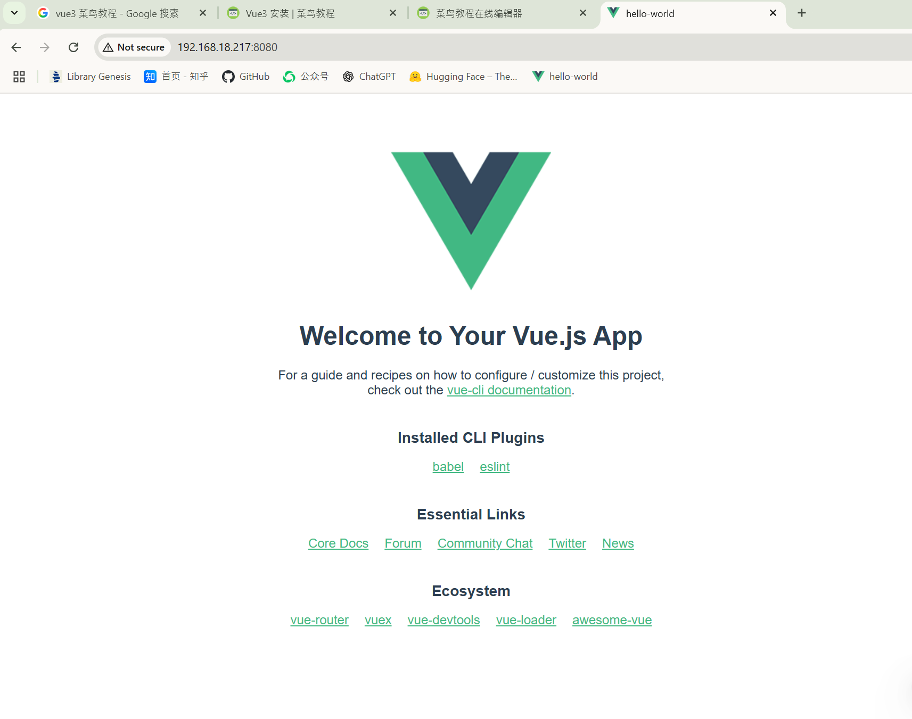
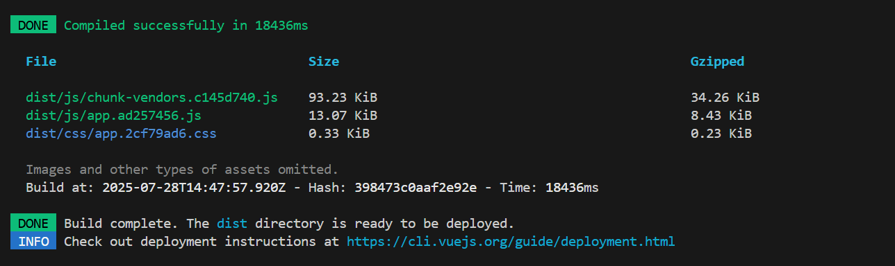
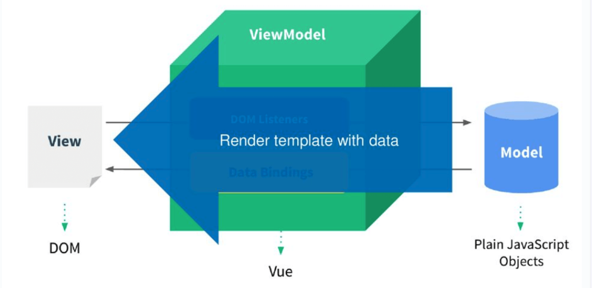
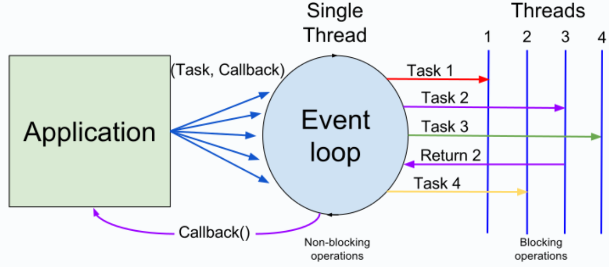

# web大前端

2025年7月20号，作为写了七八年代码的人，我还不知道html到底是啥，js到底咋回事，web前端到底是什么东西。


# 0.感悟和总结


## 0.1.结合web前端的感悟

感悟和总结一般都是写在一篇文章末尾，我之所以写在最前面，是因为后面内容的确非常多，而且全部都是技术性的东西。如果按照常规那么干，基本没有人能读完。


因为几天前我是一点前端都不懂，甚至html都不知道怎么看，虽然我做技术或者说写代码差不多六七年了。因为我主要做机器人c++或者自动驾驶这种很底层的东西居多，界面最多用qt写一下，所以基本跟web技术栈绝缘。即使项目中用web，我最多写一些后端组件。


在我过去的认知里面，我一直觉得web属于比较完善的领域，不论前端还是后端，毕竟互联网流量在我刚开始工作的时候就见顶了。所以我在选择第一份工作的时候就选择机器人AI，而不是人人向往的互联网。后面虽然用c++和golang写过一些云端和服务端应用，但是也不是直接跟web对接，而是单独的服务模块。


虽然我不懂web前端，我一直觉得web前端门槛比较低，尤其不能自己独立写出框架或者编译器的。社会上有一种观点是你不是很懂就不要乱评价，但是我想说的是，对于一些事物的认识，如果什么都得精通了才能评价决策，那无疑是十分愚蠢的，也不惧现实可行性。很多认识，即使自己不懂，但是可以通过与目标伴生的附属现象观察并快速做出判断。因为现实机会稍纵即逝。


之所以在32岁的年龄才去要专门画几天零散时间学习一下web前后端，主要是现在的AI agent的开源项目大多数都是以web技术栈为主，我一点不懂，看他们的源代码的确是有点困难，而且也不好改动。所以从7/20开始我从零开始学习web前端。另外还有一个原因我在自己的送书群送书，之前送书，基本发出去就很快就被抢没了。至今已经送出去五十多本书。但是那天我发的书里面有一本讲javascript的，没人要。那本书是2011年出版的一本外国书。我就奇怪，我有的书都是上个世纪90年代的操作系统的书都很抢手，甚至一百多年前的书都很抢手，怎么没人要这本。后来在群里跟网友沟通才知道web前端发展非常快，这本书已经严重落伍了。本来我是要看一下这本书的，但是看到这个信息，就打算直接看一些在线文档，快速进入学习一下。也不在买这方面的纸质书了。


几天下来，我把自己规划的内容都学完了，当前的状态，如果我需要自己实现一些web的应用，我基本可以去实现自己的想法，只不过复杂的功能会多用一些时间。我当然不是所有内容都能背诵下来，我学习的目的也不是为了应试，如果你直接问我一些背诵的内容，我大概率回答不上来，但是现在基本可以看懂大多数web项目的开源代码，不懂的地方结合AI也可以快速搞定。这对我来讲已经够用了。整体感受下来，web前端学习难度是真的低。举个例子，如果没有完善的基础设施，用纯C实现一个mp3或者视频播放可麻烦的要死，就算直接引用库，也要写一下编译链接的项目文件，有时候还可能编译出问题。比如libc版本崩溃啥的，缺库啥的。但是在web前端html里面一行代码的事情。之所以web前端可以这块快的开发速度，核心的我前面说的这些基础的东西都融合到浏览器里面去了。一个商业化常用的浏览器，几千万行c++代码，里面涉及渲染显示，涉及语言编译翻译，涉及底层操作系统的各种多线程多进程并发并行，涉及大量的库的融合。也就是说，我曾经做的大量的c++和计算机底层技术，实际上都是浏览器中一部分功能。而作为成熟产品的浏览器，如果使用web前端，就可以不需要处理那么多那么麻烦的底层，直接调用html和js代码即可。这就是降低门槛了。也极大提升了开发速度。也因此，前端这块框架极多，做前端开发的人，很可能要频繁变更开发框架。因为门槛低，大家都是用几个常用框架，所以人也多，等互联网流量见顶，就发生了前几年的web前端大崩溃。伴随AI发展，更是只需要很少的人，就可以完成web前端开发任务了。而且现在比较先进的ai甚至可以直接根据你的设计图给你写一个一样的页面出来，虽然代码多了可能有一些小bug。


web前端这块，或者说界面相关的开发这块，不论使用什么技术栈，以后大概率是没有多少开发岗位的。不管你愿意不愿意承认，但是AI开发出来的代码，本质上也是使用这些技术。只要你用AI，还是得懂他使用的这些技术，否则AI错了，你不知怎么改，在未来是没有竞争力的。


这几天对web前端的接触，或者说对web的接触，我才发现，为啥程序员被叫做码农。因为不论web前端还是后端，技术已经相当成熟，只要智商正常好好学习一下，就能做。后端如果做大规模并发这种用分布式啥的门槛会高一些，但是常规岗位真没太多技术门槛而言。二十年前那种程序员轻轻松松年薪百万或者一线城市买房，纯纯就是行业红利，那个时代互联网在全世界快速发展，巨大的市场而极少的人次供应，让做互联网的程序员收入暴涨。我也理解了为啥互联网大厂能整出35岁这种。你一个25岁甚至更早工作，其实工作前三年基本就可以保证你日常工作的技能了。后面绝大多数时间，那纯纯就是每日重复。怪不得现在的互联网产品，连一个外卖软件都能打游戏，一个成熟app哪有啥开发工作量了，都是硬往里面加。各个十分臃肿，整出一堆鸡肋功能。


说这种程序员是青春饭，那可不就是这样么。换了一批年轻人，照样能做啊。还便宜。尤其AI现在发展这么快，之前的互联网大厂其实更不需要那么多的程序员了。就像传统社会，种地需要大量农民，所以中国古代搞了很多政策都是让人固定到一个地方老老实实种地，人丁兴旺就可以多种地，因为每个劳动力都是基本固定的，人多，能干的活就多。所以在那个时候，人口多就是好事。可是到了工业时代，种地可以用机器了，之前一个村子人种的地，现在只需要几个人。整个村子里面绝大多数人都不真的在这个村子需要了。所以大量农村剩余人口就要去城市里面做服务业。


现在几乎所有中国人都认识字，不论学习咋样，也都知道一百多年前的百年屈辱。那对于中华民族来说是的确是屈辱的，在农业时代成就越深，越难向工业社会转型。所以几乎所有中国人都认为只要抓住了产业革命的机会就是好的。但是作为欧洲人日本人美国人，他们都是工业时代崛起的强国，每一次工业革命他们都利用上了，他们没有那种屈辱，可是处于产业革命时代的大多数人也不好过。尤其第二次产业革命，电气化，在带来巨大生产力提升的同时，带来了巨大的失业和经济衰退。为了消耗过程产能和人口，打了两次世界大战。参考俄乌冲突中东战争非洲动荡巴以冲突，事实上已经有几十个国家卷入当前的战争了或者准战争了。未来可能还会有更高烈度的冲突出现。当前所谓的AI，比如大模型、Agent、无人驾驶、机器人、AI FOR SCIENCE等各个行业的无人化已经大规模开始替代了。


每一次生产力的跃升一定会冲击原有的世界秩序。真正能掌握先进生产力并取得优势的群体，的确可以在这次变革获得更高的社会地位，但是对于绝大多数人，一定是非常痛苦的。社会关系和社会运作模式都要根据生产力去做改变，这里面一定存在巨大机会。


## 0.2.个人的一些反思

在一周左右的时间，我基本从零学了一下web相关的前后端技术。基本上只要我想要实现得到功能，结合AI和一些网上资料，很快就可以做出来了。也许不完美，比如我基本没思考学习网络安全相关的东西，如果这样去做一个成熟软件产品可能会很坑。但是我基本拿到了自己想要的东西。但这不值得炫耀。因为在过去的十五年中，一共有780个星期。也许我年轻的时候技术计算机的基础功底不行，不会像现在这样扫一眼就会甚至能直接想出来这些特性如何实现的。但是我直到32岁，才真正认真的花这么一周的时间去做这个事情。

在我读大学的年轻的时候，那是2011年我随便拿出一周时间也能做到。当时更年轻，更能熬夜。而我学校一条马路对面的小区张一鸣就在刚刚创建了字节跳动。如果真的能早期加入，我个人身家应该很容易上亿。而且那个时候我平时大多数时间也不去上课，而是闲逛看一些哲学历史杂七杂八的书或者玩游戏。我这里并不是后悔什么，毕竟那个时间点我的意识里面并没有互联网，还满脑子毕业读研进研究所，稀里糊涂混一辈子。我读研的时候也有大把大把的时间，我在研究地球外面的东西，甚至及时光年远的光线到地球会发生多大的角度偏折。如果我拿出一周时间，按我自己的能力，在好好包装完善一下，在那个移动互联网爆发的年代，也可以混出一些资历吧。但是其实我完全不知道这些，那个时候满天都在想读博士做课题的事情，跟国外教授套磁联系，结果研究生都没读完就退学跑出来了，更不要说读博士。

我觉得我是一个骨子里散漫的人，在现实社会中表现的极难管教，很难让我感到服气的人，我也很少低头。所以在现实中几乎天天被穿小鞋。当然不同的地方不同的人，严重程度不一样。被人排挤打压更是家常便饭，就这一块，我经历的事情，以我现在的阅历，基本扫一眼我都能猜出来别人打压我的动作手段。我当然知道如何低头，也知道低头就能混口饭吃。我之所以选择不想低头，完全是我认为当前所谓的低头，仅仅只能混口饭吃。无法帮助我实现我的想法。如果我低头融入，我是失去的不仅仅是尊严，因为尊严我自己也没觉得怎么重要，而是我将因此得过且过。我不是喜欢苦难，更不是没苦硬吃，而是需要这种刺激来让自己保持一种不断地进取之心。这样做不算真正的内心强大。我也决心彻底改变这种境遇。

要让自己不依赖外界的刺激，保持进取之心。

一个星期可以改变很多事情，我现在要做的就是把握好每一个星期。让自己每一个星期都有突飞猛进般的发展。想一件事情，就让这件事情在一个星期结束！这个世界正在经历AI变革、能源变革、航天变革。我要坚定自己的信念，能成为执牛耳者。在此之前，我能做的，就是珍惜每一秒钟去吸取养分。


比如二十几年前，你说一个公司能超越绝大多数国家垄断几乎全世界的航天商业发射任务，不会有人相信，但是今天spacex就做到了。十年前你说一个人能超越一个团队开发一个软件，基本也是天方夜谭，但是现在AI辅助编程已经正在接近这个目标了。


所以我的感悟并不是抱怨为什么自己以前不去做web，快速赚钱，毕竟我的胃口从来不是开发一个互联网app就能满足得。我想说，要把握住当下，想做一件事情就要快速去实现，去验证自己的一些想法，如果跟预期不符，立刻转向。就算一个人能把握住未来发展的大方向，现实想要实现自己的目标也要去躲避各种细节的坑。而且要勇敢的去挑战自己以前不会的事情，不能被年龄束缚自己的思想。


# 1.HTML

## 1.1.基本概念

hello world代码

```html
<!DOCTYPE html>
<html>
<head>
<meta charset="utf-8">
<title>菜鸟教程(runoob.com)</title>
</head>
<body>
 
<h1>我的第一个标题</h1>
 
<p>我的第一个段落。</p>
 
</body>
</html>
```

* **\<!DOCTYPE html>** 声明为 HTML5 文档
* **\<html>** 元素是 HTML 页面的根元素
* **\<head>** 元素包含了文档的元（meta）数据，如 \<meta charset="utf-8"> 定义网页编码格式为 **utf-8**。
* **\<title>** 元素描述了文档的标题
* **\<body>** 元素包含了可见的页面内容
* **\<h1>** 元素定义一个大标题
* **\<p>** 元素定义一个段落


html中基本的语法模式: <标签> 内容\</标签>


| 标题   | html标题一共分为6个层级，分别\<h1>---\<h6>                          | 其实我写这个文档所使用的AFFINE标题也是这样，因为这个编辑器使用哥德尔就是web技术栈。只不过这种基于web技术栈实现的编辑器在前端呈现上会跟直接看html文本不一样。 |
| ---- | ------------------------------------------------------- | -------------------------------------------------------------------------------------- |
| 段落   | html段落用\<p> 文字 \</p>来标记                                 |                                                                                        |
| 链接   | 通过\<a href="实际链接网址">链接显示文字\</a>                         |                                                                                        |
| 显示图像 | \ | 这图像显示也太简单了，我之前用qt还得摆楞一下指针，我要是用更底层opengl还得指定着色器                                         |
| 换行   | \<br>                                                   |                                                                                        |
| 分割线  | \<hr>                                                   |                                                                                        |
| 注释   |                                                         |                                                                                        |


html属性值就是包含在引号中的,就是key/value形式,href是key,https://www.runoob.com?q='search'就是value

```html
<a href="https://www.runoob.com?q='search'">Link</a>
```

### 全局属性

全局属性是所有 HTML 元素都可以使用的属性。

id：为元素指定唯一的标识符。

```html
<div id="header">This is the header</div>
```

class：为元素指定一个或多个类名，用于 CSS 或 JavaScript 选择。

```html
<p class="text highlight">This is a highlighted text.</p>
```

style：用于直接在元素上应用 CSS 样式。

```html
<p style="color: blue; font-size: 14px;">This is a styled paragraph.</p>
```

title：为元素提供额外的提示信息，通常在鼠标悬停时显示。

```html
<abbr title="HyperText Markup Language">HTML</abbr>
```

data-\*：用于存储自定义数据，通常通过 JavaScript 访问。

```html
<div data-user-id="12345">User Info</div>
```

### 特定元素的属性

某些属性仅适用于特定的 HTML 元素。

**`href`**（用于 `<a>` 和 `<link>` 元素）：指定链接的目标 URL。

```html
<a href="https://www.example.com">Visit Example</a>
```

**`src`**（用于 ``, `<script>`, `<iframe>` 等元素）：指定外部资源的 URL

```html

```

alt（用于 `` 元素）：为图像提供替代文本，当图像无法显示时显示。

**`type`**（用于 `<input>` 和 `<button>` 元素）：指定输入控件的类型。

```html
<input type="text" placeholder="Enter your name">
```

**`value`**（用于 `<input>`, `<button>`, `<option>` 等元素）：指定元素的初始值。

```html
<input type="text" value="Default Value">
```

disabled（用于表单元素）：禁用元素，使其不可交互。

```html
<input type="text" disabled>
```

**`checked`**（用于 `<input type="checkbox">` 和 `<input type="radio">`）：指定复选框或单选按钮是否被选中。

```html
<input type="checkbox" checked>
```

**`placeholder`**（用于 `<input>` 和 `<textarea>` 元素）：在输入框中显示提示文本。

```html
<input type="text" placeholder="Enter your email">
```

**`target`**（用于 `<a>` 和 `<form>` 元素）：指定链接或表单提交的目标窗口或框架。

```html
<a href="https://www.example.com" target="_blank">Open in new tab</a>
```

### 布尔属性

布尔属性是指不需要值的属性，它们的存在即表示 true，不存在则表示 false。

disabled：禁用元素。

```html
<input type="text" disabled>
```

readonly：使输入框只读。

```html
<input type="text" readonly>
```

required：指定输入字段为必填项。

```html
<input type="text" required>
```

**`autoplay`**（用于 `<audio>` 和 `<video>` 元素）：自动播放媒体。

```html
<video src="test.mp4" autoplay controls></video>
```

### 自定义属性

HTML5 引入了 data-\* 属性，允许开发者自定义属性来存储额外的数据。

data-\*：用于存储自定义数据，通常通过 JavaScript 访问。

```html
<div data-user-id="12345" data-role="admin">User Info</div>
```

### 事件处理属性

HTML 元素可以通过事件处理属性来响应特定的事件，如点击、鼠标悬停等。

onclick：当用户点击元素时触发。

```html
<button onclick="alert('Button clicked!')">Click Me</button>
```

onmouseover：当用户将鼠标悬停在元素上时触发。

```html
<div onmouseover="this.style.backgroundColor='yellow'">Hover over me</div>
```

onchange：当元素的值发生变化时触发。

```html
<input type="text" onchange="alert('Value changed!')">
```


**文本格式化**

| \<b>      | 定义粗体文本 |
| --------- | ------ |
| \<em>     | 定义着重文字 |
| \<i>      | 定义斜体字  |
| \<small>  | 定义小号字  |
| \<strong> | 定义加重语气 |
| \<sub>    | 定义下标字  |
| \<sup>    | 定义上标字  |
| \<ins>    | 定义插入字  |
| \<del>    | 定义删除字  |

这块就跟文本编辑软件里面工具栏那些文本属性设置差不多。


**CSS样式表**

这个用来设置界面组件各种样式，qt的qss就是抄的这个。

```html
<!DOCTYPE html>
<html>

<head>
<style type="text/css">
p{
    color:blue
}
</style>
</head>

<body style="background-color:rgb(0, 255, 238);">

<h2 style="background-color:red;">这是一个标题</h2>
<p style="background-color:green;">这是一个段落。</p>

<a href="https://www.example.com">Visit Example</a>

<h1 style="font-family:verdana;">一个标题</h1>
<p style="font-family:arial;color:red;font-size:20px;">一个段落。</p>

<h1 style="text-align:center;">居中对齐的标题</h1>
<p>这是一个段落。</p>

</body>

</html>
```


**表格**

* **tr**：tr 是 table row 的缩写，表示表格的一行。
* **td**：td 是 table data 的缩写，表示表格的数据单元格。
* **th**：th 是 table header的缩写，表示表格的表头单元格。

```html
<h4>一行三列:</h4>
<table border="1">
  <tr>
    <td>100</td>
    <td>200</td>
    <td>300</td>
  </tr>
</table>
 
<h4>两行三列:</h4>
<table border="1">
  <tr>
    <td>100</td>
    <td>200</td>
    <td>300</td>
  </tr>
  <tr>
    <td>400</td>
    <td>500</td>
    <td>600</td>
  </tr>
</table>
```


**列表**

分为有序列表和无序列表。就类似于ppt里面列举的标题项。ul和ol命令

无序列表

```html
<ul>
<li>Coffee</li>
<li>Milk</li>
</ul>
```

**有序列表**

```html
<ol>
<li>Coffee</li>
<li>Milk</li>
</ol>
```


**布局**

页面各种组件的布局关系 div单独或者配合table，跟qt的很类似了

```html
<!DOCTYPE html>
<html>
<head> 
<meta charset="utf-8"> 
<title>菜鸟教程(runoob.com)</title> 
</head>
<body>
 
<div id="container" style="width:500px">
 
<div id="header" style="background-color:#FFA500;">
<h1 style="margin-bottom:0;">主要的网页标题</h1></div>
 
<div id="menu" style="background-color:#FFD700;height:200px;width:100px;float:left;">
<b>菜单</b><br>
HTML<br>
CSS<br>
JavaScript</div>
 
<div id="content" style="background-color:#EEEEEE;height:200px;width:400px;float:left;">
内容在这里</div>
 
<div id="footer" style="background-color:#FFA500;clear:both;text-align:center;">
版权 © runoob.com</div>
 
</div>
 
</body>
</html>
```

**表单**

收集用户信息并把信息发送到后端web服务器。伴随着一堆交互组件

```html
<!DOCTYPE html>
<html>
<head>
<meta charset="utf-8"> 
<title>菜鸟教程(runoob.com)</title> 
</head>
<body>

    <h2>表单</h2>

    <form action="/" method="post">
        <!-- 文本输入框 -->
        <label for="name">用户名:</label>
        <input type="text" id="name" name="name" required>

        <br>

        <!-- 密码输入框 -->
        <label for="password">密码:</label>
        <input type="password" id="password" name="password" required>

        <br>

        <!-- 单选按钮 -->
        <label>性别:</label>
        <input type="radio" id="male" name="gender" value="male" checked>
        <label for="male">男</label>
        <input type="radio" id="female" name="gender" value="female">
        <label for="female">女</label>

        <br>

        <!-- 复选框 -->
        <input type="checkbox" id="subscribe" name="subscribe" checked>
        <label for="subscribe">订阅推送信息</label>

        <br>

        <!-- 下拉列表 -->
        <label for="country">国家:</label>
        <select id="country" name="country">
            <option value="cn">CN</option>
            <option value="usa">USA</option>
            <option value="uk">UK</option>
        </select>

        <br>

        <!-- 提交按钮 -->
        <input type="submit" value="提交">
    </form>

</body>
</html>
```

**框架(html内部的组件而不是语言应用框架)iframe**

就是一个显示的独立区域组件，可以吧其他html扔进去在那个区域显示。

还可以设置一些边框显示属性之类的东西，\<iframe src="form.html" frameborder="0" width="200" height="200">\</iframe>


**颜色和颜色名**

跟常规的编程语言一样，而且有一些颜色被特定单词命名好了


**脚本**

可以内嵌javescript脚本，这样页面只需要通过js做出局部相应即可，不用每次都重新传输html文件。这也是现在前端动态页面的主要用法。

```html
<!DOCTYPE html>
<html>
<head> 
<meta charset="utf-8"> 
<title>菜鸟教程(runoob.com)</title> 
</head>
<body>
	
<h1>我的第一段 JavaScript</h1>
<p id="demo">
JavaScript 能改变 HTML 元素的样式。
</p>
<script>
function myFunction()
{
	x=document.getElementById("demo") // 找到元素
	x.style.color="#ff0000";          // 改变样式
}
</script>
<button type="button" onclick="myFunction()">点击这里</button>
	
</body>
</html>
```


**url**

Web浏览器通过URL从Web服务器请求页面。

当您点击 HTML 页面中的某个链接时，对应的 \<a> 标签指向万维网上的一个地址。

一个统一资源定位器(URL) 用于定位万维网上的文档。

一个网页地址实例: http://www.runoob.com/html/html-tutorial.html 语法规则:

**scheme://host.domain:port/path/filename**

说明:

* scheme - 定义因特网服务的类型。最常见的类型是 http
* host - 定义域主机（http 的默认主机是 www）
* domain - 定义因特网域名，比如 runoob.com
* :port - 定义主机上的端口号（http 的默认端口号是 80）
* path - 定义服务器上的路径（如果省略，则文档必须位于网站的根目录中）。
* filename - 定义文档/资源的名称


# 2.HTML5

html5是html的新标准，加了一些新的语言特性。

新加入的元素

| \<canvas>     | 标签定义图形，比如图表和其他图像。该标签基于 JavaScript 的绘图 API |
| ------------- | ----------------------------------------- |
| \<audio>      | 定义音频内容                                    |
| \<video>      | 定义视频（video 或者 movie）                      |
| \<source>     | 定义多媒体资源 \<video> 和 \<audio>               |
| \<embed>      | 定义嵌入的内容，比如插件。                             |
| \<track>      | 为诸如 \<video> 和 \<audio> 元素之类的媒介规定外部文本轨道。  |
| \<datalist>   | 定义选项列表。请与 input 元素配合使用该元素，来定义 input 可能的值。 |
| \<keygen>     | 规定用于表单的密钥对生成器字段。                          |
| \<output>     | 定义不同类型的输出，比如脚本的输出。                        |
| \<canvas>     | 定义页面独立的内容区域。                              |
| \<aside>      | 定义页面的侧边栏内容。                               |
| \<bdi>        | 允许您设置一段文本，使其脱离其父元素的文本方向设置。                |
| \<command>    | 定义命令按钮，比如单选按钮、复选框或按钮                      |
| \<details>    | 用于描述文档或文档某个部分的细节                          |
| \<dialog>     | 定义对话框，比如提示框                               |
| \<summary>    | 标签包含 details 元素的标题                        |
| \<figure>     | 规定独立的流内容（图像、图表、照片、代码等等）。                  |
| \<figcaption> | 定义 \<figure> 元素的标题                        |
| \<footer>     | 定义 section 或 document 的页脚。                |
| \<header>     | 定义了文档的头部区域                                |
| \<mark>       | 定义带有记号的文本。                                |
| \<meter>      | 定义度量衡。仅用于已知最大和最小值的度量。                     |
| \<nav>        | 定义导航链接的部分。                                |
| \<progress>   | 定义任何类型的任务的进度。                             |
| \<ruby>       | 定义 ruby 注释（中文注音或字符）。                      |
| \<rt>         | 定义字符（中文注音或字符）的解释或发音。                      |
| \<rp>         | 在 ruby 注释中使用，定义不支持 ruby 元素的浏览器所显示的内容。     |
| \<section>    | 定义文档中的节（section、区段）。                      |
| \<time>       | 定义日期或时间。                                  |
| \<wbr>        | 规定在文本中的何处适合添加换行符。                         |


**画布canvas(自己定义一个区域，然后用脚本控制画图)**

html已经定义相关画图绘制的一些函数接口

```html
<!DOCTYPE html>
<html>
<head> 
<meta charset="utf-8"> 
<title>菜鸟教程(runoob.com)</title> 
</head>
<body>

<canvas id="myCanvas" width="600" height="600" style="border:1px solid #c3c3c3;">
您的浏览器不支持 HTML5 canvas 标签。
</canvas>

<script>

var c=document.getElementById("myCanvas");
var ctx=c.getContext("2d");
ctx.fillStyle="#FF0000";
ctx.fillRect(0,0,150,75);

var c=document.getElementById("myCanvas");
var ctx=c.getContext("2d");
ctx.moveTo(0,0);
ctx.lineTo(200,100);
ctx.stroke();

var c=document.getElementById("myCanvas");
var ctx=c.getContext("2d");
ctx.beginPath();
ctx.arc(95,50,40,0,2*Math.PI);
ctx.stroke();

var c=document.getElementById("myCanvas");
var ctx=c.getContext("2d");
ctx.font="30px Arial";
ctx.fillText("Hello World",200,50);

var c=document.getElementById("myCanvas");
var ctx=c.getContext("2d");
ctx.font="30px Arial";
ctx.strokeText("Hello World",10,250);

var c=document.getElementById("myCanvas");
var ctx=c.getContext("2d");
 
// 创建渐变
var grd=ctx.createLinearGradient(0,0,200,0);
grd.addColorStop(0,"red");
grd.addColorStop(1,"white");
 
// 填充渐变
ctx.fillStyle=grd;
ctx.fillRect(100,100,150,80);

</script>

</body>
</html>
```

**svg**

这种图像的特点就是图像缩放不影响图像质量。在html中还有一个有特点就是图像里面的元素可以被调用，可以和js的一些事件联合。


**MathML**

在前端显示数学公式的


**拖拽事件**

```html
<!DOCTYPE HTML>
<html>
<head>
<meta charset="utf-8"> 
<title>菜鸟教程(runoob.com)</title>
<style type="text/css">
#div1 {width:350px;height:70px;padding:10px;border:1px solid #aaaaaa;}
</style>
<script>
function allowDrop(ev)
{
    ev.preventDefault();
}
 
function drag(ev)
{
    ev.dataTransfer.setData("Text",ev.target.id);
}
 
function drop(ev)
{
    ev.preventDefault();
    var data=ev.dataTransfer.getData("Text");
    ev.target.appendChild(document.getElementById(data));
}
</script>
</head>
<body>
 
<p>拖动 RUNOOB.COM 图片到矩形框中:</p>
 
<div id="div1" ondrop="drop(event)" ondragover="allowDrop(event)"></div>
<br>

 
</body>
</html>
```

在拖拽的目标组件上设置拖拽覆盖事件回调函数，和放置事件。在被拖拽的组件上设置可被拖拽，和拖动函数


**地理位置**

只要联网且浏览器给获取地理位置的权限，就可以获取经纬度信息

```html
<!DOCTYPE html>
<html>
<head> 
<meta charset="utf-8"> 
<title>菜鸟教程(runoob.com)</title> 
</head>
<body>
<p id="demo">点击按钮获取您当前坐标（可能需要比较长的时间获取）：</p>
<button onclick="getLocation()">点我</button>
<script>
var x=document.getElementById("demo");
function getLocation()
{
	if (navigator.geolocation)
	{
		navigator.geolocation.getCurrentPosition(showPosition);
	}
	else
	{
		x.innerHTML="该浏览器不支持获取地理位置。";
	}
}

function showPosition(position)
{
	x.innerHTML="纬度: " + position.coords.latitude + 
	"<br>经度: " + position.coords.longitude;	
}
</script>
</body>
</html>
```

**input类型**

就是各种用于输入的组件

* color
* date
* datetime
* datetime-local
* email
* month
* number
* range
* search
* tel
* time
* url
* week

```html
<!DOCTYPE html>
<html>
<head>
<meta charset="utf-8">
<title>菜鸟教程(runoob.com)</title>
</head>
<body>

<form action="/" method="post">
  选择你喜欢的颜色: <input type="color" name="favcolor"><br>
  <input type="submit">
</form>

<form action="/" method="post">
  生日: <input type="date" name="bday">
  <input type="submit">
</form>

<form action="/" method="post">
  生日 (日期和时间): <input type="datetime" name="bdaytime">
  <input type="submit">
</form>

<form action="/" method="post">
  生日 (日期和时间): <input type="datetime-local" name="bdaytime">
  <input type="submit">
</form>

<form action="/" method="post">
  E-mail: <input type="email" name="usremail">
  <input type="submit">
</form>

<form action="/" method="post">
  生日 ( 月和年 ): <input type="month" name="bdaymonth">
  <input type="submit">
</form>

<form action="/" method="post">
  数量 ( 1 到 5 之间): <input type="number" name="quantity" min="1" max="5">
  <input type="submit">
</form>

</body>
</html>
```

还可以在里面加各种属性。


**数据列表**

类似于输入的下拉菜单

```html
<!DOCTYPE html>
<html>
<head> 
<meta charset="utf-8"> 
<title>菜鸟教程(runoob.com)</title> 
</head>
<body>
	
<form action="demo-form.php" method="get">
<input list="browsers" name="browser">
<datalist id="browsers">
  <option value="Internet Explorer">
  <option value="Firefox">
  <option value="Chrome">
  <option value="Opera">
  <option value="Safari">
</datalist>
<input type="submit">
</form>

</body>
</html>
```


**web存储**

分为本地存储和session存储，本地存储不限时间，而session存储当会话关闭，就会删除。

```html
<!DOCTYPE html>
<html>
<head>
<meta charset="utf-8">
<title>菜鸟教程(runoob.com)</title>	
<script>
function clickCounter()
{
	if(typeof(Storage)!=="undefined")
	{
		if (localStorage.clickcount)
		{
			localStorage.clickcount=Number(localStorage.clickcount)+1;
		}
		else
		{
			localStorage.clickcount=1;
		}
		document.getElementById("result").innerHTML=" 你已经点击了按钮 " + localStorage.clickcount + " 次 ";
	}
	else
	{
		document.getElementById("result").innerHTML="对不起，您的浏览器不支持 web 存储。";
	}
}
</script>
</head>
<body>
<p><button onclick="clickCounter()" type="button">点我！</button></p>
<div id="result"></div>
<p>点击该按钮查看计数器的增加。</p>
<p>关闭浏览器选项卡(或窗口),重新打开此页面,计数器将继续计数(不是重置)。</p>
</body>
</html>
```


**web IndexedDB 数据库**

在浏览器客户端创建一个本地数据库来存储客户端数据

```html
<!DOCTYPE html>
<html lang="zh">
<head>
    <meta charset="UTF-8">
    <meta name="viewport" content="width=device-width, initial-scale=1.0">
    <title>IndexedDB Demo</title>
    <style>
        body {
            font-family: Arial, sans-serif;
            margin: 20px;
        }
        input, button {
            margin: 5px;
        }
    </style>
</head>
<body>
    <h1>IndexedDB 示例</h1>
    <input type="text" id="item" placeholder="输入项目名">
    <button id="add">添加项目</button>
    <button id="get">获取所有项目</button>
    <button id="delete">清空数据库</button>
    
    <h2>数据库内容:</h2>
    <ul id="itemsList"></ul>

    <script>
        const request = indexedDB.open("MyDatabase", 1);
        
        let db;

        request.onsuccess = function(event) {
            db = event.target.result;
            console.log("数据库打开成功");
        };

        request.onupgradeneeded = function(event) {
            db = event.target.result;
            const objectStore = db.createObjectStore("items", { keyPath: "id", autoIncrement: true });
            console.log("对象存储区创建成功");
        };

        request.onerror = function(event) {
            console.error("数据库打开失败", event);
        };

        // 添加项目
        document.getElementById('add').onclick = function() {
            const itemName = document.getElementById('item').value;
            if (itemName) {
                const transaction = db.transaction("items", "readwrite");
                const objectStore = transaction.objectStore("items");
                objectStore.add({ name: itemName });
                
                transaction.onsuccess = function() {
                    console.log("项目添加成功:", itemName);
                    document.getElementById('item').value = '';  // 清空输入框
                };

                transaction.onerror = function() {
                    console.error("项目添加失败");
                };
            }
        };

        // 获取所有项目
        document.getElementById('get').onclick = function() {
            const transaction = db.transaction("items", "readonly");
            const objectStore = transaction.objectStore("items");
            const request = objectStore.getAll();

            request.onsuccess = function(event) {
                const items = event.target.result;
                const itemsList = document.getElementById('itemsList');
                itemsList.innerHTML = '';  // 清空列表
                items.forEach(item => {
                    const li = document.createElement('li');
                    li.textContent = item.name;
                    itemsList.appendChild(li);
                });
            };
        };

        // 清空数据库
        document.getElementById('delete').onclick = function() {
            const transaction = db.transaction("items", "readwrite");
            const objectStore = transaction.objectStore("items");
            const request = objectStore.clear();

            request.onsuccess = function() {
                console.log("数据库清空成功");
                document.getElementById('itemsList').innerHTML = '';  // 清空列表
            };

            request.onerror = function() {
                console.error("清空数据库失败");
            };
        };
    </script>
</body>
</html>
```

**缓存**

把数据临时缓存到本地，提高速度，减少服务器负载。使用方法就是在html中加入 manifest 属性

```html
<!DOCTYPE HTML>
<html manifest="demo.appcache">
...
</html>
```

这样当使用者访问这个页面，就会在浏览器中缓存这个页面


**websocket**
就是长连接，直接从前端发送消息跟后端通信

```html
<!DOCTYPE HTML>
<html>
   <head>
   <meta charset="utf-8">
   <title>菜鸟教程(runoob.com)</title>
    
      <script type="text/javascript">
         function WebSocketTest()
         {
            if ("WebSocket" in window)
            {
               alert("您的浏览器支持 WebSocket!");
               
               // 打开一个 web socket
               var ws = new WebSocket("ws://localhost:9998/echo");
                
               ws.onopen = function()
               {
                  // Web Socket 已连接上，使用 send() 方法发送数据
                  ws.send("发送数据");
                  alert("数据发送中...");
               };
                
               ws.onmessage = function (evt) 
               { 
                  var received_msg = evt.data;
                  alert("数据已接收...");
               };
                
               ws.onclose = function()
               { 
                  // 关闭 websocket
                  alert("连接已关闭..."); 
               };
            }
            
            else
            {
               // 浏览器不支持 WebSocket
               alert("您的浏览器不支持 WebSocket!");
            }
         }
      </script>
        
   </head>
   <body>
   
      <div id="sse">
         <a href="javascript:WebSocketTest()">运行 WebSocket</a>
      </div>
      
   </body>
</html>

```

**多媒体**

音频、视频、录音、电影、动画等等


放一个音频,实现起来真简单

```html
<!DOCTYPE html>
<html>
<head>
<meta charset="utf-8">
<title>菜鸟教程(runoob.com)</title>
</head>
<body>

<h2>Linking To a Song</h2>

<p><a href="test.mp3">点击此处播放</a></p>

</body>
</html>
```


# 3.CSS

虽然没弄过css但是以前弄过qss，qss就是抄css，只是没有css强大。所以这块学起来应该比较简单。样式表咋回事我也很清楚，很多项目都在用。


来个hello world吧,css和js一样，都是需要在html文件中起作用。这个hello world就是在style部分引用body中的对象，设置相应css属性。

```html
<!DOCTYPE html>
<html>
<head>
<meta charset="utf-8">
<title>菜鸟教程(runoob.com)</title>
<style>
body {
	background-color:#d0e4fe;
}
h1 {
	color:orange;
	text-align:center;
}
p {
	font-family:"Times New Roman";
	font-size:20px;
}
</style>
</head>

<body>

<h1>CSS 实例!</h1>
<p>这是一个段落。</p>

</body>
</html>
```


**语法**

基本语法就类似于上面显示的，选择器就是引用body中的对象，然后大括号，然后一堆key-value，每一对之间用分号间隔

```html
p {color:red;text-align:center;}
```


**设置方法**

选择器分为按照id和按照class，

对于id的配置方法

```html
#para1
{
    text-align:center;
    color:red;
}
```

class 选择器用于描述一组元素的样式，class 选择器有别于id选择器，class可以在多个元素中使用。

class 选择器在 HTML 中以 class 属性表示, 在 CSS 中，类选择器以一个点 . 号显示：

在以下的例子中，所有拥有 center 类的 HTML 元素均为居中。

```html
.center {text-align:center;}
```


样式表分为外部样式表、内部样式表、内联式样式表。外部样式表是直接把css文件存储到外部文件中，内部样式表式类似于上面hello world，在style区域中设置各种类和对象的样式，内嵌式是直接把样式表数据配置到具体语句中。


**优先级关系**

样式表优先级：内嵌式>内部样式>外部样式>浏览器默认样式


**背景**

* background-color:背景颜色
* background-image:背景图片
* background-repeat:背景平铺方向
* background-attachment:背景图像是否固定或者随着页面的其余部分滚动。
* background-position:背景图初始位置


**文本格式**

可以设置文本的颜色、对齐方式、文本修饰(加下划线啥的)

```html
<!DOCTYPE html>
<html>
<head>
<meta charset="utf-8"> 
<title>菜鸟教程(runoob.com)</title> 

<style>
body {color:red;}
h1 {color:#00ff00;text-align:center;text-decoration:overline;}
p.ex {color:rgb(0,0,255);text-align:right;}
p.uppercase {text-transform:uppercase;}
p.lowercase {text-transform:lowercase;}
p.capitalize {text-transform:capitalize;}
p {text-indent:50px;}
</style>
</head>

<body>
<h1>这是标题 1</h1>
<p>这是一个普通的段落。请注意,本文是红色的。页面中定义默认的文本颜色选择器。</p>
<p class="ex">这是一个类为"ex"的段落。这个文本是蓝色的。</p>
<p class="uppercase">This is some text.</p>
<p class="lowercase">This is some text.</p>
<p class="capitalize">This is some text.</p>
<p>In my younger and more vulnerable years my father gave me some advice that I've
</body>
</html>
```


**css字体**

设置字体，大小，像素之类的

```html
<!DOCTYPE html>
<html>
<head>
<meta charset="utf-8"> 
<title>菜鸟教程(runoob.com)</title>
<style>
h1 {font-size:2.5em;} /* 40px/16=2.5em */
h2 {font-size:1.875em;} /* 30px/16=1.875em */
p {font-size:0.875em;} /* 14px/16=0.875em */
</style>
</head>
<body>

<h1>This is heading 1</h1>
<h2>This is heading 2</h2>
<p>This is a paragraph.</p>
<p>使用 em 单位，允许在所有浏览器中调整文本大小。
不幸的是,仍然是IE浏览器的问题。调整文本的大小时,会比正常的尺寸更大或更小。
</p>
</body>
</html>
```


**链接**

设置链接的样式，比如鼠标悬停什么颜色，点击什么颜色，点击过后什么颜色之类的


**列表**
设置列表样式，比如每行列表前面的图标显示之类的


**表格**

可以指定表格的边框显示属性


**盒子模型**

盒子模型分为边距，边框，填充，和实际内容，对应就是margin、border、padding、content

```html
<!DOCTYPE html>
<html>
<head>
<meta charset="utf-8"> 
<title>菜鸟教程(runoob.com)</title>
<style>
div {
    background-color: lightgrey;
    width: 300px;
    border: 25px solid green;
    padding: 25px;
    margin: 25px;
}
</style>
</head>
<body>

<h2>盒子模型演示</h2>

<p>CSS盒模型本质上是一个盒子,封装周围的HTML元素,它包括:边距,边框，填充，和实际内容。</p>

<div>这里是盒子内的实际内容。有 25px 内间距,25px 外间距、25px 绿色边框。</div>

</body>
</html>
```


**边框**
设置边框线宽、颜色、圆角等属性


**轮廓**

元素周围的样式，边框外围

margin是外边距属性，pading是内边距属性，


**分组与嵌套**

按照一个元素堆叠的方式显示

```html
h1 {
    color:green;
}
h2 {
    color:green;
}
p {
    color:green;
}
```


使用分组选择器

```html
h1,h2,p
{
    color:green;
}
```


使用嵌套选择器

```html
p
{
    color:blue;
    text-align:center;
}
.marked
{
    background-color:red;
}
.marked p
{
    color:white;
}
p.marked{
    text-decoration:underline;
}
```


**尺寸**

设置元素尺寸的宽高最大尺寸之类的


**显示**
控制元素的现实隐藏等属性


**定位**

元素之间的位置关系和策略

* [static](https://www.runoob.com/css/css-positioning.html#position-static)---默认属性，没有定位
* [relative](https://www.runoob.com/css/css-positioning.html#position-relative)---相对浏览器固定位置
* [fixed](https://www.runoob.com/css/css-positioning.html#position-fixed)---相对定位
* [absolute](https://www.runoob.com/css/css-positioning.html#position-absolute)---绝对定位的元素的位置相对于最近的已定位父元素，如果元素没有已定位的父元素，那么它的位置相对于\<html>
* [sticky](https://www.runoob.com/css/css-positioning.html#position-sticky)---基于用户滚动位置来定位


**overflow**

用于控制内容溢出元素显示框时候显示方式


**float浮动**

就是显示空间不足的时候显示策略


**对齐&#xA;**&#x5143;素在各种布局中的对齐方式


**组合选择器**

通过他的符号去选择一些逻辑，然后给被选定的元素设置样式表


**伪类**
伪类是用来添加一些选择器的特殊效果。


**伪元素**

伪元素是一种特殊的选择器，它可以在不改变 HTML 结构的情况下对页面元素的特定部分进行样式设置


**导航栏**
随便一个网站都可以看到

```html
<!DOCTYPE html>
<html>
<head>
<meta charset="utf-8">
<title>菜鸟教程(runoob.com)</title>
<style>
body {margin:0;}

ul {
    list-style-type: none;
    margin: 0;
    padding: 0;
    overflow: hidden;
    background-color: #333;
    position: fixed;
    top: 0;
    width: 100%;
}

li {
    float: left;
}

li a {
    display: block;
    color: white;
    text-align: center;
    padding: 14px 16px;
    text-decoration: none;
}

li a:hover:not(.active) {
    background-color: #111;
}

.active {
    background-color: #4CAF50;
}
</style>
</head>
<body>

<ul>
  <li><a class="active" href="#home">主页</a></li>
  <li><a href="#news">新闻</a></li>
  <li><a href="#contact">联系</a></li>
  <li><a href="#about">关于</a></li>
</ul>

<div style="padding:20px;margin-top:30px;background-color:#1abc9c;height:1500px;">
<h1>Fixed Top Navigation Bar</h1>
<h2>Scroll this page to see the effect</h2>
<h2>The navigation bar will stay at the top of the page while scrolling</h2>

<p>Some text some text some text some text..</p>
<p>Some text some text some text some text..</p>
<p>Some text some text some text some text..</p>
<p>Some text some text some text some text..</p>
<p>Some text some text some text some text..</p>
<p>Some text some text some text some text..</p>
<p>Some text some text some text some text..</p>
<p>Some text some text some text some text..</p>
<p>Some text some text some text some text..</p>
<p>Some text some text some text some text..</p>
<p>Some text some text some text some text..</p>
<p>Some text some text some text some text..</p>
<p>Some text some text some text some text..</p>
<p>Some text some text some text some text..</p>
<p>Some text some text some text some text..</p>
<p>Some text some text some text some text..</p>
<p>Some text some text some text some text..</p>
<p>Some text some text some text some text..</p>
<p>Some text some text some text some text..</p>
<p>Some text some text some text some text..</p>
</div>

</body>
</html>
```


**下拉菜单**
鼠标浮上去会有下拉菜单


**提示工具**

鼠标浮上去会提示文字之类的


**图片廊**
图片自动布局，可以根据css配置的策略在尺寸变化的时候修改排布方式


**透明度**
设置显示图片的透明度


**属性选择器**

就是针对某种属性设置样式


**表单**

表单在之前html或者django的里面都提过，是前端收集用户信息，然后发给后端处理的。这里就通过css改变表单的样式

```html
<!DOCTYPE html>
<html>
<head>
<meta charset="utf-8"> 
<title>菜鸟教程(runoob.com)</title> 
</head>
<style>
input[type=text], select {
  width: 100%;
  padding: 12px 20px;
  margin: 8px 0;
  display: inline-block;
  border: 1px solid #ccc;
  border-radius: 4px;
  box-sizing: border-box;
}

input[type=submit] {
  width: 100%;
  background-color: #4CAF50;
  color: white;
  padding: 14px 20px;
  margin: 8px 0;
  border: none;
  border-radius: 4px;
  cursor: pointer;
}

input[type=submit]:hover {
  background-color: #45a049;
}

div {
  border-radius: 5px;
  background-color: #f2f2f2;
  padding: 20px;
}
</style>
<body>

<h3>使用 CSS 来渲染 HTML 的表单元素</h3>

<div>
  <form action="/action_page.php">
    <label for="fname">First Name</label>
    <input type="text" id="fname" name="firstname" placeholder="Your name..">

    <label for="lname">Last Name</label>
    <input type="text" id="lname" name="lastname" placeholder="Your last name..">

    <label for="country">Country</label>
    <select id="country" name="country">
      <option value="australia">Australia</option>
      <option value="canada">Canada</option>
      <option value="usa">USA</option>
    </select>
  
    <input type="submit" value="Submit">
  </form>
</div>

</body>
</html>
```


**计数器**

里面设置变量，根据规则加减，可以用来控制一些标题编号


**网页布局**

针对布局的样式设置，分为头部、底部、边栏之类的


# 4.CSS3

上一个部分是CSS的基本知识，当前CSS主流版本是CSS3，先比于上面内容，这部分加入了一些现代特性。


**边框**

border-radius创建圆角


**盒阴影**

box-shadow给边框加阴影


**边界图片**

border-image用一些图片设置边界


**圆角**

设置边框圆角，还可以设置椭圆


**背景**

设置一些背景图片、背景尺寸之类的属性


**渐变**

渐变色


**文本效果**

文本阴影效果、换行等


**字体**

字体样式、磅数之类的


**旋转**

平面二维旋转


**过渡**

做变换后过渡的动画效果


**动画**
比过渡动作更加丰富

```html
<!DOCTYPE html>
<html>
<head>
<meta charset="utf-8"> 
<title>菜鸟教程(runoob.com)</title> 
<style> 
div
{
	width:100px;
	height:100px;
	background:red;
	position:relative;
	animation:myfirst 5s;
	-webkit-animation:myfirst 5s; /* Safari and Chrome */
}

@keyframes myfirst
{
	0%   {background:red; left:0px; top:0px;}
	25%  {background:yellow; left:200px; top:0px;}
	50%  {background:blue; left:200px; top:200px;}
	75%  {background:green; left:0px; top:200px;}
	100% {background:red; left:0px; top:0px;}
}

@-webkit-keyframes myfirst /* Safari and Chrome */
{
	0%   {background:red; left:0px; top:0px;}
	25%  {background:yellow; left:200px; top:0px;}
	50%  {background:blue; left:200px; top:200px;}
	75%  {background:green; left:0px; top:200px;}
	100% {background:red; left:0px; top:0px;}
}
</style>
</head>
<body>

<p><b>注意:</b> 该实例在 Internet Explorer 9 及更早 IE 版本是无效的。</p>

<div></div>

</body>
</html>
```


**多列**

显示多列的对象，类似于报纸那种


**用户界面**
调整尺寸、方框大小之类的


**图片**

图片圆角、缩放，响应式图片，图片滤镜、图片模态


**按钮**

设置各种按钮样式


**分页**

标注一些页数和何种距离样式圆角过渡等效果


**容器布局**

界面组件容器，各种其内部组件布局策略


# 5.javascript

简单的hello wolrd，js代码嵌入到html代码中，按键触发显示一下时间.代码和回调函数都直接声明到一个html文件中，互相调用

```html
<!DOCTYPE html>
<html>
<head>
<meta charset="utf-8">
<title>菜鸟教程(runoob.com)</title>
<script>
function displayDate(){
	document.getElementById("demo").innerHTML=Date();
}
</script>
</head>
<body>

<h1>我的第一个 JavaScript 程序</h1>
<p id="demo">这是一个段落</p>

<button type="button" onclick="displayDate()">显示日期</button>

</body>
</html>
```


我之前有一本讲javascript的书，是2011年出版的，所以其内容只会比2011年旧，我在送书群送没人要，我就很奇怪，讲linux系统编程的上个世纪九十年代的书现在人照样看，为啥这个没人要。今天我总算知道原因了，不仅是前端框架演变的原因，还有一个是2015年前端javascript版本更新，加入了类和模块。我虽然到写到此为止还不太会javascript，但是我会c、c++、python和golang，添加类和模块对一个语言的影响不亚于一个革命。难怪没人要。


## 5.1.javascript基本语法

HTML 中的 Javascript 脚本代码必须位于 \<script> 与 \</script> 标签之间。可以在head也可以在body中


在head如下

```html
<!DOCTYPE html>
<html>
<head>
<meta charset="utf-8"> 
<title>菜鸟教程(runoob.com)</title> 
<script>
function myFunction(){
	document.getElementById("demo").innerHTML="我的第一个 JavaScript 函数";
}
</script>
</head>
<body>
	
<h1>我的 Web 页面</h1>
<p id="demo">一个段落。</p>
<button type="button" onclick="myFunction()">点击这里</button>
	
</body>
</html>
```

在body如下

```html
<!DOCTYPE html>
<html>
<head> 
<meta charset="utf-8"> 
<title>菜鸟教程(runoob.com)</title> 
</head>
<body>
	
<h1>我的第一个 Web 页面</h1>
<p id="demo">一个段落。</p>
<button type="button" onclick="myFunction()">点击这里</button>
<script>
function myFunction(){
	document.getElementById("demo").innerHTML="我的第一个 JavaScript 函数";
}
</script>
	
</body>
</html>
```


也可以存放在外部文件中

```html
<!DOCTYPE html>
<html>
<head> 
<meta charset="utf-8"> 
<title>菜鸟教程(runoob.com)</title> 
</head>
<body>
	
<h1>我的 Web 页面</h1>
<p id="demo">一个段落。</p>
<button type="button" onclick="myFunction()">点击这里</button>
<p><b>注释：</b>myFunction 保存在名为 "myScript.js" 的外部文件中。</p>
<script src="myScript.js"></script>
	
</body>
</html>
```

其实我觉得放在文件外，可以把界面和一些处理解耦，如果是大型项目，更推荐这种写法，而不是都扔到html文件中。


**输出**

* 使用 **window.alert()** 弹出警告框。
* 使用 **document.write()** 方法将内容写到 HTML 文档中。
* 使用 **innerHTML** 写入到 HTML 元素。
* 使用 **console.log()** 写入到浏览器的控制台。


**语句**

语句标识符，跟大不多语言都差不多

| break        | 用于跳出循环。                          |
| ------------ | -------------------------------- |
| catch        | 语句块，在 try 语句块执行出错时执行 catch 语句块。  |
| continue     | 跳过循环中的一个迭代。                      |
| do ... while | 执行一个语句块，在条件语句为 true 时继续执行该语句块。   |
| for          | 在条件语句为 true 时，可以将代码块执行指定的次数。     |
| for ... in   | 用于遍历数组或者对象的属性（对数组或者对象的属性进行循环操作）。 |
| function     | 定义一个函数                           |
| if ... else  | 用于基于不同的条件来执行不同的动作。               |
| return       | 返回结果，并退出函数                       |
| switch       | 用于基于不同的条件来执行不同的动作。               |
| throw        | 抛出（生成）错误 。                       |
| try          | 实现错误处理，与 catch 一同使用。             |
| var          | 声明一个变量。                          |
| while        | 当条件语句为 true 时，执行语句块。             |

**注释**
单行注释

```javascript
// 开头语句
```

多行注释

```javascript
/*
下面的这些代码会输出
一个标题和一个段落
并将代表主页的开始
*/
```


**变量**

* **`var`**：ES5 引入的变量声明方式，具有函数作用域。
* **`let`**：ES6 引入的变量声明方式，具有块级作用域。
* **`const`**：ES6 引入的常量声明方式，具有块级作用域，且值不可变。


**类型**

**值类型(基本类型)**：字符串（String）、数字(Number)、布尔(Boolean)、空（Null）、未定义（Undefined）、Symbol。

**引用数据类型（对象类型）**：对象(Object)、数组(Array)、函数(Function)，还有两个特殊的对象：正则（RegExp）和日期（Date）。


JavaScript 拥有动态类型。这意味着相同的变量可用作不同的类型

```javascript
var x;               // x 为 undefined
var x = 5;           // 现在 x 为数字
var x = "John";      // 现在 x 为字符串
```

变量的数据类型可以使用 typeof 操作符来查看：

```javascript
typeof "John"                // 返回 string
typeof 3.14                  // 返回 number
typeof false                 // 返回 boolean
typeof [1,2,3,4]             // 返回 object
typeof {name:'John', age:34} // 返回 object
```

字符串是存储字符（比如 "Bill Gates"）的变量。

字符串可以是引号中的任意文本。您可以使用单引号或双引号


JavaScript 只有一种数字类型。数字可以带小数点，也可以不带


布尔（逻辑）只能有两个值：true 或 false。


数组

创建方法

```javascript
var cars=new Array();
cars[0]="Saab";
cars[1]="Volvo";
cars[2]="BMW";
```

或者

```javascript
var cars=new Array("Saab","Volvo","BMW");
```

或者

```javascript
var cars=["Saab","Volvo","BMW"];
```


对象

对象由花括号分隔。在括号内部，对象的属性以名称和值对的形式 (name : value) 来定义。属性由逗号分隔：


```javascript
var person={firstname:"John", lastname:"Doe", id:5566};
```

对象属性有两种寻址方式：

```javascript
name=person.lastname;
name=person["lastname"];
```


Undefined 这个值表示变量不含有值。

可以通过将变量的值设置为 null 来清空变量。


当您声明新变量时，可以使用关键词 "new" 来声明其类型


```javascript
var carname=new String;
var x=      new Number;
var y=      new Boolean;
var cars=   new Array;
var person= new Object;
```

javascript因为是动态脚本语言，也不用像c/c++考虑回收问题。


**javascript对象**

对象、成员、方法

```javascript
var car = {name:"Fiat", model:500, color:"white"};
```


对象访问

```javascript
person.lastName;
person["lastName"];
```


对象方法

```javascript
name = person.fullName();
```


对象方法定义

```html
<!DOCTYPE html>
<html>
<head> 
<meta charset="utf-8"> 
<title>菜鸟教程(runoob.com)</title> 
</head>
<body>

<p>创建和使用对象方法。</p>
<p>对象方法作为一个函数定义存储在对象属性中。</p>
<p id="demo"></p>
<script>
var person = {
    firstName: "John",
    lastName : "Doe",
    id : 5566,
    fullName : function() 
	{
       return this.firstName + " " + this.lastName;
    }
};
document.getElementById("demo").innerHTML = person.fullName();
</script>
	
</body>
</html>
```


**函数**


当您声明函数时，请把参数作为变量来声明：

```javascript

function myFunction(var1,var2)
{
代码
}
```

代码示例

```html

<!DOCTYPE html>
<html>	
<head> 
<meta charset="utf-8"> 
<title>菜鸟教程(runoob.com)</title> 
</head>
<body>

<p>点击这个按钮，来调用带参数的函数。</p>
<button onclick="myFunction('Harry Potter','Wizard')">点击这里</button>
<script>
function myFunction(name,job){
	alert("Welcome " + name + ", the " + job);
}
</script>

</body>
</html>
```

带返回值的函数

```html

<!DOCTYPE html>
<html>
<head> 
<meta charset="utf-8"> 
<title>菜鸟教程(runoob.com)</title> 
</head>
<body>

<p>本例调用的函数会执行一个计算，然后返回结果：</p>
<p id="demo"></p>
<script>
function myFunction(a,b){
	return a*b;
}
document.getElementById("demo").innerHTML=myFunction(4,3);
</script>

</body>
</html>
```


*局部变量:*

在 JavaScript 函数内部声明的变量（使用 var）是*局部*变量，所以只能在函数内部访问它。（该变量的作用域是局部的）。

您可以在不同的函数中使用名称相同的局部变量，因为只有声明过该变量的函数才能识别出该变量。

只要函数运行完毕，本地变量就会被删除。


*全局变量:*
在函数外声明的变量是*全局*变量，网页上的所有脚本和函数都能访问它。


*变量生存周期*

JavaScript 变量的生命期从它们被声明的时间开始。

局部变量会在函数运行以后被删除。

全局变量会在页面关闭后被删除。


*向未声明的变量赋值*

如果您把值赋给尚未声明的变量，该变量将被自动作为 window 的一个属性。

```javascript
carname="Volvo";
```

将声明 window 的一个属性 carname。

非严格模式下给未声明变量赋值创建的全局变量，是全局对象的可配置属性，可以删除。


```javascript
var var1 = 1; // 不可配置全局属性
var2 = 2; // 没有使用 var 声明，可配置全局属性

console.log(this.var1); // 1
console.log(window.var1); // 1
console.log(window.var2); // 2

delete var1; // false 无法删除
console.log(var1); //1

delete var2; 
console.log(delete var2); // true
console.log(var2); // 已经删除 报错变量未定义
```


**作用域**


变量在函数内声明，变量为局部变量，具有局部作用域。

局部变量在函数开始执行时创建，函数执行完后局部变量会自动销毁。

```javascript

// 此处不能调用 carName 变量
function myFunction() {
    var carName = "Volvo";
    // 函数内可调用 carName 变量
}
```


变量在函数外定义，即为全局变量。

全局变量有 **全局作用域**: 网页中所有脚本和函数均可使用。

```javascript
var carName = " Volvo";
 
// 此处可调用 carName 变量
function myFunction() {
    // 函数内可调用 carName 变量
}
```


函数参数只在函数内起作用，是局部变量。
在 HTML 中, 全局变量是 window 对象，所以 window 对象可以调用函数内的未声明（未加 var)的局部变量。


**事件**

HTML 事件是发生在 HTML 元素上的事情。

当在 HTML 页面中使用 JavaScript 时， JavaScript 可以触发这些事件。


以下是 HTML 事件的实例：

* HTML 页面完成加载
* HTML input 字段改变时
* HTML 按钮被点击


设定事件触发后执行代码

```javascript
<some-HTML-element some-event='JavaScript 代码'>
```

或者

```javascript
<some-HTML-element some-event="JavaScript 代码">
```

javascript常用事件

鼠标事件


| onclick       | 当用户点击某个对象时调用的事件句柄。  | 2 |
| ------------- | ------------------- | - |
| oncontextmenu | 在用户点击鼠标右键打开上下文菜单时触发 |   |
| ondblclick    | 当用户双击某个对象时调用的事件句柄。  | 2 |
| onmousedown   | 鼠标按钮被按下。            | 2 |
| onmouseenter  | 当鼠标指针移动到元素上时触发。     | 2 |
| onmouseleave  | 当鼠标指针移出元素时触发        | 2 |
| onmousemove   | 鼠标被移动。              | 2 |
| onmouseover   | 鼠标移到某元素之上。          | 2 |
| onmouseout    | 鼠标从某元素移开。           | 2 |
| onmouseup     | 鼠标按键被松开。            |   |


键盘事件

| onkeydown  | 某个键盘按键被按下。    | 2 |
| ---------- | ------------- | - |
| onkeypress | 某个键盘按键被按下并松开。 | 2 |
| onkeyup    | 某个键盘按键被松开。    | 2 |


框架/对象（Frame/Object）事件

| onabort        | 图像的加载被中断。 ( \<object>)                            | 2 |
| -------------- | ------------------------------------------------- | - |
| onbeforeunload | 该事件在即将离开页面（刷新或关闭）时触发                              | 2 |
| onerror        | 在加载文档或图像时发生错误。 ( \<object>, \<body>和 \<frameset>) |   |
| onhashchange   | 该事件在当前 URL 的锚部分发生修改时触发。                           |   |
| onload         | 一张页面或一幅图像完成加载。                                    | 2 |
| onpageshow     | 该事件在用户访问页面时触发                                     |   |
| onpagehide     | 该事件在用户离开当前网页跳转到另外一个页面时触发                          |   |
| onresize       | 窗口或框架被重新调整大小。                                     | 2 |
| onscroll       | 当文档被滚动时发生的事件。                                     | 2 |
| onunload       | 用户退出页面。 ( \<body> 和 \<frameset>)                  |   |

表单事件

| onblur     | 元素失去焦点时触发                                                        | 2 |
| ---------- | ---------------------------------------------------------------- | - |
| onchange   | 该事件在表单元素的内容改变时触发( \<input>, \<keygen>, \<select>, 和 \<textarea>) | 2 |
| onfocus    | 元素获取焦点时触发                                                        | 2 |
| onfocusin  | 元素即将获取焦点时触发                                                      | 2 |
| onfocusout | 元素即将失去焦点时触发                                                      | 2 |
| oninput    | 元素获取用户输入时触发                                                      | 3 |
| onreset    | 表单重置时触发                                                          | 2 |
| onsearch   | 用户向搜索域输入文本时触发 ( \<input="search">)                               |   |
| onselect   | 用户选取文本时触发 ( \<input> 和 \<textarea>)                              | 2 |
| onsubmit   | 表单提交时触发                                                          |   |


剪贴板事件

| oncopy  | 该事件在用户拷贝元素内容时触发 |   |
| ------- | --------------- | - |
| oncut   | 该事件在用户剪切元素内容时触发 |   |
| onpaste | 该事件在用户粘贴元素内容时触发 |   |


打印事件

| onafterprint  | 该事件在页面已经开始打印，或者打印窗口已经关闭时触发 |
| ------------- | -------------------------- |
| onbeforeprint | 该事件在页面即将开始打印时触发            |


拖动事件

| ondrag      | 该事件在元素正在拖动时触发      |
| ----------- | ------------------ |
| ondragend   | 该事件在用户完成元素的拖动时触发   |
| ondragenter | 该事件在拖动的元素进入放置目标时触发 |
| ondragleave | 该事件在拖动元素离开放置目标时触发  |
| ondragover  | 该事件在拖动元素在放置目标上时触发  |
| ondragstart | 该事件在用户开始拖动元素时触发    |
| ondrop      | 该事件在拖动元素放置在目标区域时触发 |


多媒体（Media）事件

| onabort          | 事件在视频/音频（audio/video）终止加载时触发。             |
| ---------------- | ----------------------------------------- |
| oncanplay        | 事件在用户可以开始播放视频/音频（audio/video）时触发。         |
| oncanplaythrough | 事件在视频/音频（audio/video）可以正常播放且无需停顿和缓冲时触发。   |
| ondurationchange | 事件在视频/音频（audio/video）的时长发生变化时触发。          |
| onemptied        | 当期播放列表为空时触发                               |
| onended          | 事件在视频/音频（audio/video）播放结束时触发。             |
| onerror          | 事件在视频/音频（audio/video）数据加载期间发生错误时触发。       |
| onloadeddata     | 事件在浏览器加载视频/音频（audio/video）当前帧时触发触发。       |
| onloadedmetadata | 事件在指定视频/音频（audio/video）的元数据加载后触发。         |
| onloadstart      | 事件在浏览器开始寻找指定视频/音频（audio/video）触发。         |
| onpause          | 事件在视频/音频（audio/video）暂停时触发。               |
| onplay           | 事件在视频/音频（audio/video）开始播放时触发。             |
| onplaying        | 事件在视频/音频（audio/video）暂停或者在缓冲后准备重新开始播放时触发。 |
| onprogress       | 事件在浏览器下载指定的视频/音频（audio/video）时触发。         |
| onratechange     | 事件在视频/音频（audio/video）的播放速度发送改变时触发。        |
| onseeked         | 事件在用户重新定位视频/音频（audio/video）的播放位置后触发。      |
| onseeking        | 事件在用户开始重新定位视频/音频（audio/video）时触发。         |
| onstalled        | 事件在浏览器获取媒体数据，但媒体数据不可用时触发。                 |
| onsuspend        | 事件在浏览器读取媒体数据中止时触发。                        |
| ontimeupdate     | 事件在当前的播放位置发送改变时触发。                        |
| onvolumechange   | 事件在音量发生改变时触发。                             |
| onwaiting        | 事件在视频由于要播放下一帧而需要缓冲时触发。                    |


动画事件

| animationend       | 该事件在 CSS 动画结束播放时触发 |
| ------------------ | ------------------ |
| animationiteration | 该事件在 CSS 动画重复播放时触发 |
| animationstart     | 该事件在 CSS 动画开始播放时触发 |


过渡事件

| transitionend | 该事件在 CSS 完成过渡后触发。 |
| ------------- | ----------------- |


其他事件

| onmessage        | 该事件通过或者从对象(WebSocket, Web Worker, Event Source 或者子 frame 或父窗口)接收到消息时触发  |
| ---------------- | ----------------------------------------------------------------------- |
| onmousewheel     | 已废弃。 使用 [onwheel](https://www.runoob.com/jsref/event-onwheel.html) 事件替代 |
| ononline         | 该事件在浏览器开始在线工作时触发。                                                       |
| onoffline        | 该事件在浏览器开始离线工作时触发。                                                       |
| onpopstate       | 该事件在窗口的浏览历史（history 对象）发生改变时触发。                                         |
| onshow           | 该事件当 \<menu> 元素在上下文菜单显示时触发                                              |
| onstorage        | 该事件在 Web Storage(HTML 5 Web 存储)更新时触发                                    |
| ontoggle         | 该事件在用户打开或关闭 \<details> 元素时触发                                            |
| onwheel          | 该事件在鼠标滚轮在元素上下滚动时触发                                                      |
| visibilitychange | 该事件用于检测当前页面的可见性状态是否发生变化。                                                |

*事件对象*
常量

| CAPTURING-PHASE | 当前事件阶段为捕获阶段(1)       | 1 |
| --------------- | -------------------- | - |
| AT-TARGET       | 当前事件是目标阶段,在评估目标事件(1) | 2 |
| BUBBLING-PHASE  | 当前的事件为冒泡阶段 (3)       | 3 |

属性

| bubbles       | 返回布尔值，指示事件是否是起泡事件类型。    | 2 |
| ------------- | ----------------------- | - |
| cancelable    | 返回布尔值，指示事件是否可拥可取消的默认动作。 | 2 |
| currentTarget | 返回其事件监听器触发该事件的元素。       | 2 |
| eventPhase    | 返回事件传播的当前阶段。            | 2 |
| target        | 返回触发此事件的元素（事件的目标节点）。    | 2 |
| timeStamp     | 返回事件生成的日期和时间。           | 2 |
| type          | 返回当前 Event 对象表示的事件的名称。  | 2 |

方法

| initEvent()       | 初始化新创建的 Event 对象的属性。 | 2 |
| ----------------- | -------------------- | - |
| preventDefault()  | 通知浏览器不要执行与事件关联的默认动作。 | 2 |
| stopPropagation() | 不再派发事件。              | 2 |


*目标事件对象*

方法

| addEventListener()    | 允许在目标事件中注册监听事件(IE8 = attachEvent())    | 2 |
| --------------------- | -------------------------------------- | - |
| dispatchEvent()       | 允许发送事件到监听器上 (IE8 = fireEvent())        | 2 |
| removeEventListener() | 运行一次注册在事件目标上的监听事件(IE8 = detachEvent()) | 2 |


*事件监听对象*

方法

| handleEvent() | 把任意对象注册为事件处理程序 | 2 |
| ------------- | -------------- | - |

文档事件对象

方法

| createEvent() |   | 2 |
| ------------- | - | - |


鼠标/键盘事件对象
属性

| altKey        | 返回当事件被触发时，"ALT" 是否被按下。                                    | 2 |
| ------------- | --------------------------------------------------------- | - |
| button        | 返回当事件被触发时，哪个鼠标按钮被点击。                                      | 2 |
| clientX       | 返回当事件被触发时，鼠标指针的水平坐标。                                      | 2 |
| clientY       | 返回当事件被触发时，鼠标指针的垂直坐标。                                      | 2 |
| ctrlKey       | 返回当事件被触发时，"CTRL" 键是否被按下。                                  | 2 |
| Location      | 返回按键在设备上的位置                                               | 3 |
| charCode      | 返回onkeypress事件触发键值的字母代码。                                  | 2 |
| key           | 在按下按键时返回按键的标识符。                                           | 3 |
| keyCode       | 返回onkeypress事件触发的键的值的字符代码，或者 onkeydown 或 onkeyup 事件的键的代码。 | 2 |
| which         | 返回onkeypress事件触发的键的值的字符代码，或者 onkeydown 或 onkeyup 事件的键的代码。 | 2 |
| metaKey       | 返回当事件被触发时，"meta" 键是否被按下。                                  | 2 |
| relatedTarget | 返回与事件的目标节点相关的节点。                                          | 2 |
| screenX       | 返回当某个事件被触发时，鼠标指针的水平坐标。                                    | 2 |
| screenY       | 返回当某个事件被触发时，鼠标指针的垂直坐标。                                    | 2 |
| shiftKey      | 返回当事件被触发时，"SHIFT" 键是否被按下。                                 | 2 |

方法

| initMouseEvent()    | 初始化鼠标事件对象的值 | 2 |
| ------------------- | ----------- | - |
| initKeyboardEvent() | 初始化键盘事件对象的值 | 3 |


**字符串**

字符串可以是插入到引号中的任何字符。你可以使用单引号或双引号：


```javascript
var carname = "Volvo XC60";
var carname = 'Volvo XC60';
```

字符串的索引从 0 开始，这意味着第一个字符索引值为 \[0]，第二个为 \[1]，以此类推。

你也可以在字符串添加转义字符来使用引号

```javascript
var answer = "It's alright";
var answer = "He is called 'Johnny'";
var answer = 'He is called "Johnny"';
var x = 'It\'s alright';
var y = "He is called \"Johnny\"";
```


可以使用内置属性 **length** 来计算字符串的长度


转义字符，大部分编程语言都差不多

| \\'  | 单引号      |
| ---- | -------- |
| \\"  | 双引号      |
| \\\\ | 反斜杠      |
| \n   | 换行       |
| \r   | 回车       |
| \t   | tab(制表符) |
| \b   | 退格符      |
| \f   | 换页符      |


通常， JavaScript 字符串是原始值，可以使用字符创建： **var firstName = "John"**

但我们也可以使用 new 关键字将字符串定义为一个对象： **var firstName = new String("John")**


字符串属性

| constructor | 返回创建字符串属性的函数  |
| ----------- | ------------- |
| length      | 返回字符串的长度      |
| prototype   | 允许您向对象添加属性和方法 |

字符串方法

| charAt()            | 返回指定索引位置的字符                                  |
| ------------------- | -------------------------------------------- |
| charCodeAt()        | 返回指定索引位置字符的 Unicode 值                        |
| concat()            | 连接两个或多个字符串，返回连接后的字符串                         |
| fromCharCode()      | 将 Unicode 转换为字符串                             |
| indexOf()           | 返回字符串中检索指定字符第一次出现的位置                         |
| lastIndexOf()       | 返回字符串中检索指定字符最后一次出现的位置                        |
| localeCompare()     | 用本地特定的顺序来比较两个字符串                             |
| match()             | 找到一个或多个正则表达式的匹配                              |
| replace()           | 替换与正则表达式匹配的子串                                |
| search()            | 检索与正则表达式相匹配的值                                |
| slice()             | 提取字符串的片断，并在新的字符串中返回被提取的部分                    |
| split()             | 把字符串分割为子字符串数组                                |
| substr()            | 从起始索引号提取字符串中指定数目的字符                          |
| substring()         | 提取字符串中两个指定的索引号之间的字符                          |
| toLocaleLowerCase() | 根据主机的语言环境把字符串转换为小写，只有几种语言（如土耳其语）具有地方特有的大小写映射 |
| toLocaleUpperCase() | 根据主机的语言环境把字符串转换为大写，只有几种语言（如土耳其语）具有地方特有的大小写映射 |
| toLowerCase()       | 把字符串转换为小写                                    |
| toString()          | 返回字符串对象值                                     |
| toUpperCase()       | 把字符串转换为大写                                    |
| trim()              | 移除字符串首尾空白                                    |
| valueOf()           | 返回某个字符串对象的原始值                                |


**模板字符串**

在字符串中嵌入表达式和变量


```javascript
<!DOCTYPE html>
<html>
<head>
<meta charset="utf-8">
<title>菜鸟教程(runoob.com)</title>
</head>
<body>

<h2>JavaScript 模板字面量</h2>

<p>模板字面量使用反引号 (``) 来定义一个字符串:</p>

<p id="demo"></p>

<p>Internet Explorer 不支持模板字面量。</p>

<script>
const name = 'Runoob';
const age = 30;
const message = `My name is ${name} and I'm ${age} years old.`;
document.getElementById("demo").innerHTML = message;
</script>

</body>
</html>
```


**运算符**


跟其他编程语言差不多

| +     | 加法     | x=y+2  | 7   | 5 |
| ----- | ------ | ------ | --- | - |
| -     | 减法     | x=y-2  | 3   | 5 |
| \*    | 乘法     | x=y\*2 | 10  | 5 |
| /     | 除法     | x=y/2  | 2.5 | 5 |
| %     | 取模（余数） | x=y%2  | 1   | 5 |
| ++    | 自增     | x=++y  | 6   | 6 |
| x=y++ | 5      | 6      |     |   |
| --    | 自减     | x=--y  | 4   | 4 |
| x=y-- | 5      | 4      |     |   |


赋值运算符

| =   | x=y   |        | x=5  |
| --- | ----- | ------ | ---- |
| +=  | x+=y  | x=x+y  | x=15 |
| -=  | x-=y  | x=x-y  | x=5  |
| \*= | x\*=y | x=x\*y | x=50 |
| /=  | x/=y  | x=x/y  | x=2  |
| %=  | x%=y  | x=x%y  | x=0  |


\+ 运算符用于把文本值或字符串变量加起来（连接起来）。

```javascript
txt1="What a very";
txt2="nice day";
txt3=txt1+txt2;
```


比较和逻辑运算符

| ==    | 等于                           | x==8    | *false* |
| ----- | ---------------------------- | ------- | ------- |
| x==5  | *true*                       |         |         |
| ===   | 绝对等于（值和类型均相等）                | x==="5" | *false* |
| x===5 | *true*                       |         |         |
| !=    | 不等于                          | x!=8    | *true*  |
| !==   | 严格不等于运算符（值和类型有一个不相等，或两个都不相等） | x!=="5" | *true*  |
| x!==5 | *false*                      |         |         |
| >     | 大于                           | x>8     | *false* |
| <     | 小于                           | x<8     | *true*  |
| >=    | 大于或等于                        | x>=8    | *false* |
| <=    | 小于或等于                        | x<=8    | *true*  |


逻辑运算符

| &&   | and | (x < 10 && y > 1) 为 true |
| ---- | --- | ------------------------ |
| \|\| | or  | (x==5 \|\| y==5) 为 false |
| !    | not | !(x==y) 为 true           |


条件运算符

```javascript
variablename=(condition)?value1:value2 
```


**if ... else语句**


* **if 语句** - 只有当指定条件为 true 时，使用该语句来执行代码
* **if...else 语句** - 当条件为 true 时执行代码，当条件为 false 时执行其他代码
* **if...else if....else 语句**- 使用该语句来选择多个代码块之一来执行
* **switch 语句** - 使用该语句来选择多个代码块之一来执行

```javascript
if (condition)
{
    当条件为 true 时执行的代码
}
```


```javascript
if (condition)
{
    当条件为 true 时执行的代码
}
else
{
    当条件不为 true 时执行的代码
}
```

```javascript
if (condition1)
{
    当条件 1 为 true 时执行的代码
}
else if (condition2)
{
    当条件 2 为 true 时执行的代码
}
else
{
  当条件 1 和 条件 2 都不为 true 时执行的代码
}
```


**switch语句**

```javascript
switch(n)
{
    case 1:
        执行代码块 1
        break;
    case 2:
        执行代码块 2
        break;
    default:
        与 case 1 和 case 2 不同时执行的代码
}
```


demo代码

```html
<html>
<head>
<meta charset="utf-8">
<title>菜鸟教程(runoob.com)</title>
</head>
<body>

<p>点击下面的按钮，会显示出基于今日日期的消息：</p>
<button onclick="myFunction()">点击这里</button>
<p id="demo"></p>
<script>
function myFunction()
{
	var x;
	var d=new Date().getDay();
	switch (d)
    {
  		case 6:x="今天是星期六";
    	break;
  		case 0:x="今天是星期日";
    	break;
  		default:
    	x="期待周末";
  	}
	document.getElementById("demo").innerHTML=x;
}
</script>

</body>
</html>
```

**&#xA;for循环**

```html
<!DOCTYPE html>
<html>
<head>
<meta charset="utf-8">
<title>菜鸟教程(runoob.com)</title>
</head>		
<body>

<script>
cars=["BMW","Volvo","Saab","Ford"];
for (var i=0;i<cars.length;i++){
	document.write(cars[i] + "<br>");
}
</script>

</body>
</html>
```


for循环

```javascript
for (语句 1; 语句 2; 语句 3)
{
    被执行的代码块
}
```

**语句 1** （代码块）开始前执行

**语句 2** 定义运行循环（代码块）的条件

**语句 3** 在循环（代码块）已被执行之后执行


for-in循环

```javascript
var person={fname:"Bill",lname:"Gates",age:56}; 
 
for (x in person)  // x 为属性名
{
    txt=txt + person[x];
}
```


**while循环**

```javascript

while (条件)
{
    需要执行的代码
}
```


do ... while循环

```javascript
do
{
    需要执行的代码
}
while (条件);
```


**break和continue**


break 语句用于跳出循环。

continue 用于跳过循环中的一个迭代


```html
for (i=0;i<10;i++)
{
    if (i==3)
    {
        break;
    }
    x=x + "The number is " + i + "<br>";
}
```


```javascript
for (i=0;i<=10;i++)
{
    if (i==3) continue;
    x=x + "The number is " + i + "<br>";
}
```


**javascript标签**

如需标记 JavaScript 语句，请在语句之前加上冒号：


```javascript
label:
statements
```


通过标签引用，break 语句可用于跳出任何 JavaScript 代码块：


```javascript
cars=["BMW","Volvo","Saab","Ford"];
list: 
{
    document.write(cars[0] + "<br>"); 
    document.write(cars[1] + "<br>"); 
    document.write(cars[2] + "<br>"); 
    break list;
    document.write(cars[3] + "<br>"); 
    document.write(cars[4] + "<br>"); 
    document.write(cars[5] + "<br>"); 
}
```


**typeof**

&#x20;typeof 操作符来检测变量的数据类型

```javascript
typeof "John"                // 返回 string
typeof 3.14                  // 返回 number
typeof false                 // 返回 boolean
typeof [1,2,3,4]             // 返回 object
typeof {name:'John', age:34} // 返回 object
```


| `typeof undefined`    | "undefined" | 未定义的值         |
| --------------------- | ----------- | ------------- |
| `typeof true`         | "boolean"   | 布尔值           |
| `typeof 42`           | "number"    | 所有数字类型        |
| `typeof "text"`       | "string"    | 字符串           |
| `typeof {a:1}`        | "object"    | 对象、数组、null    |
| `typeof function(){}` | "function"  | 函数            |
| `typeof Symbol()`     | "symbol"    | ES6新增符号类型     |
| `typeof BigInt(10)`   | "bigint"    | ES2020新增大整数类型 |


null是一个只有一个值的特殊类型。表示一个空对象引用。

在 JavaScript 中, **undefined** 是一个没有设置值的变量。


null 和 undefined 的值相等，但类型不等：


```javascript
typeof undefined             // undefined
typeof null                  // object
null === undefined           // false
null == undefined            // true
```


**类型转换**

**constructor** 属性返回所有 JavaScript 变量的构造函数。


```javascript
"John".constructor                 // 返回函数 String()  { [native code] }
(3.14).constructor                 // 返回函数 Number()  { [native code] }
false.constructor                  // 返回函数 Boolean() { [native code] }
[1,2,3,4].constructor              // 返回函数 Array()   { [native code] }
{name:'John', age:34}.constructor  // 返回函数 Object()  { [native code] }
new Date().constructor             // 返回函数 Date()    { [native code] }
function () {}.constructor         // 返回函数 Function(){ [native code] }
```


JavaScript 变量可以转换为新变量或其他数据类型：

* 通过使用 JavaScript 函数
* 通过 JavaScript 自身自动转换


```javascript
String(x)         // 将变量 x 转换为字符串并返回
String(123)       // 将数字 123 转换为字符串并返回
String(100 + 23)  // 将数字表达式转换为字符串并返回
```


```javascript
x.toString()
(123).toString()
(100 + 23).toString()
```


| toExponential() | 把对象的值转换为指数计数法。             |
| --------------- | -------------------------- |
| toFixed()       | 把数字转换为字符串，结果的小数点后有指定位数的数字。 |
| toPrecision()   | 把数字格式化为指定的长度。              |

字符串转数字

全局方法 **Number()** 可以将字符串转换为数字。


```javascript
Number("3.14")    // 返回 3.14
Number(" ")       // 返回 0
Number("")        // 返回 0
Number("99 88")   // 返回 NaN
```

**Operator +&#x20;**&#x53EF;用于将变量转换为数字


```javascript
var y = "5";      // y 是一个字符串
var x = + y;      // x 是一个数字

var y = "John";   // y 是一个字符串
var x = + y;      // x 是一个数字 (NaN)
```


自动类型转换


```javascript
5 + null    // 返回 5         null 转换为 0
"5" + null  // 返回"5null"   null 转换为 "null"
"5" + 1     // 返回 "51"      1 转换为 "1" 
"5" - 1     // 返回 4         "5" 转换为 5
```


**正则表达式**

使用正则表达式搜索 "Runoob" 字符串，且不区分大小写：

```javascript
var str = "Visit Runoob!"; 
var n = str.search(/Runoob/i);
```


在 JavaScript 中，RegExp 对象是一个预定义了属性和方法的正则表达式对象。


**异常处理**
**try** 语句测试代码块的错误。

**catch** 语句处理错误。

**throw** 语句创建自定义错误。

**finally** 语句在 try 和 catch 语句之后，无论是否有触发异常，该语句都会执行

```javascript
try {
    ...    //异常的抛出
} catch(e) {
    ...    //异常的捕获与处理
} finally {
    ...    //结束处理
}
```


**调试工具**

console.log() 


```javascript
a = 5;
b = 6;
c = a + b;
console.log(c);
```


然后F12在console里面看日志信息


**声明提升**
为了避免这些问题，通常我们在每个作用域开始前声明这些变量，这也是正常的 JavaScript 解析步骤，易于我们理解。


**严格模式**

* 消除 Javascript 语法的一些不合理、不严谨之处，减少一些怪异行为。
* 消除代码运行的一些不安全之处，保证代码运行的安全。
* 提高编译器效率，增加运行速度。
* 为未来新版本的Javascript做好铺垫。


严格模式通过在脚本或函数的头部添加 use strict; 表达式来声明。


**this**

面向对象语言中 this 表示当前对象的一个引用。

但在 JavaScript 中 this 不是固定不变的，它会随着执行环境的改变而改变。

* 在方法中，this 表示该方法所属的对象。
* 如果单独使用，this 表示全局对象。
* 在函数中，this 表示全局对象。
* 在函数中，在严格模式下，this 是未定义的(undefined)。
* 在事件中，this 表示接收事件的元素。
* 类似 call() 和 apply() 方法可以将 this 引用到任何对象。


**&#xA;json**

```javascript
{"sites":[
    {"name":"Runoob", "url":"www.runoob.com"}, 
    {"name":"Google", "url":"www.google.com"},
    {"name":"Taobao", "url":"www.taobao.com"}
]}
```


json字符串转javascript对象

```javascript
var text = '{ "sites" : [' +
'{ "name":"Runoob" , "url":"www.runoob.com" },' +
'{ "name":"Google" , "url":"www.google.com" },' +
'{ "name":"Taobao" , "url":"www.taobao.com" } ]}';

var obj = JSON.parse(text);
```


| JSON.parse()     | 用于将一个 JSON 字符串转换为 JavaScript 对象。 |
| ---------------- | -------------------------------- |
| JSON.stringify() | 用于将 JavaScript 值转换为 JSON 字符串。    |


**javascript:void(0)**

```javascript
<a href="javascript:void(0)">单击此处什么也不会发生</a>
```

这样点击链接什么都不会发生

**&#xA;异步编程**

异步就是从主线程发射一个子线程来完成任务。如果一个按钮要等待一个消息，如果是同步的，则这个按钮等待的消息来之前，界面其他组件都会失效。使用异步，则此消息没来，界面其他组件照样交互即可。


Promise 是 JavaScript 中用于处理异步操作的对象，它代表一个异步操作的最终完成（或失败）及其结果值。


Promise 有三种状态：

* pending：初始状态，既不是成功，也不是失败状态
* fulfilled：意味着操作成功完成
* rejected：意味着操作失败


```javascript
const myPromise = new Promise((resolve, reject) => {
  // 异步操作代码
 
  if (/* 操作成功 */) {
    resolve('成功的结果'); // 将 Promise 状态改为 fulfilled
  } else {
    reject('失败的原因'); // 将 Promise 状态改为 rejected
  }
});
```


`then()` 方法用于指定 Promise 状态变为 fulfilled 或 rejected 时的回调函数。

```javascript
myPromise.then(
  (result) => {
    // 处理成功情况
    console.log('成功:', result);
  },
  (error) => {
    // 处理失败情况
    console.error('失败:', error);
  }
);
```


`catch()` 方法专门用于处理 Promise 被拒绝的情况。

```javascript
myPromise
  .then((result) => {
    console.log('成功:', result);
  })
  .catch((error) => {
    console.error('失败:', error);
  });
```


`finally()` 方法无论 Promise 最终状态如何都会执行。

```javascript
myPromise
  .then((result) => {
    console.log('成功:', result);
  })
  .catch((error) => {
    console.error('失败:', error);
  })
  .finally(() => {
    console.log('操作完成');
  });
```


异步链式调用

```javascript
doFirstThing()
  .then((result) => doSecondThing(result))
  .then((newResult) => doThirdThing(newResult))
  .then((finalResult) => {
    console.log('最终结果:', finalResult);
  })
  .catch((error) => {
    console.error('链中某处出错:', error);
  });
```


*静态方法*


Promise.all()

等待所有 Promise 完成，或任意一个 Promise 失败。

```javascript
Promise.all([promise1, promise2, promise3])
  .then((results) => {
    // results 是一个包含所有 Promise 结果的数组
    console.log(results);
  })
  .catch((error) => {
    // 任一 Promise 失败就会进入这里
    console.error(error);
  });
```


Promise.race()

返回最先完成（无论成功或失败）的 Promise 的结果。

```javascript
Promise.race([promise1, promise2, promise3])
  .then((result) => {
    // 使用最先完成的 Promise 的结果
    console.log(result);
  })
  .catch((error) => {
    // 如果最先完成的 Promise 是失败的
    console.error(error);
  });
```


Promise.resolve() 和 Promise.reject()

快速创建已解决或已拒绝的 Promise。

```javascript
const resolvedPromise = Promise.resolve('立即解决的值');
const rejectedPromise = Promise.reject('立即拒绝的原因');
```

ES2017 引入了 async/await，它基于 Promise 并提供更直观的语法来处理异步操作。

```javascript
async function fetchData() {
  try {
    const user = await getUser(123);
    const posts = await getPosts(user.id);
    console.log('用户帖子:', posts);
  } catch (error) {
    console.error('获取数据失败:', error);
  }
}
```


**JavaScript async/await**

* 同步（Synchronous）编程：代码按顺序执行，前一个操作完成后才会执行下一个
* 异步编程（Asynchronous）：某些操作被放入"任务队列"，主线程继续执行后续代码，等主线程空闲时再处理队列中的任务


在函数声明前添加 async 关键字，表示该函数是异步的：

```javascript
async function fetchData() {
  // 函数体
}
```

async 函数总是返回一个 Promise：

* 如果返回值不是 Promise，会自动包装成 resolved Promise
* 如果抛出异常，会返回 rejected Promise


await 只能在 async 函数内部使用

```javascript
async function fetchData() {
  const result = await somePromise;
  console.log(result);
}
```

await 会暂停 async 函数的执行，等待 Promise 完成：

* 如果 Promise 被 resolve，返回 resolve 的值
* 如果 Promise 被 reject，抛出错误（可以用 try/catch 捕获）


示例代码

```javascript
<!DOCTYPE html>
<html>
<head>
<meta charset="utf-8">
<title>菜鸟教程(runoob.com)</title>
</head>		
<body>

<script>
function delay(ms) {
  return new Promise(resolve => setTimeout(resolve, ms));
}

async function showMessage() {
  console.log('开始');
  await delay(1000);
  console.log('1秒后');
  await delay(1000);
  console.log('又1秒后');
}

function func1(){
    console.log("----1----")
}

function func2(){
    console.log("----2----")
}

func1();
showMessage();
func2();
</script>

</body>
</html>
```

这个代码的意思就是先执行func1，然后执行showMessage(),在这个函数打印完开始就进入异步等待了，所以开始执行func2的打印信息，等执行完，到了showMessage()的等待1s后，开始打印1秒后，再等待1s，然后打印又1秒后


**函数**


函数声明

```javascript
function functionName(parameters) {
  执行的代码
}
```


函数表达式

```javascript
var x = function (a, b) {return a * b};

var x = function (a, b) {return a * b};
var z = x(4, 3);
```


Function() 构造函数

```javascript
var myFunction = new Function("a", "b", "return a * b");

var x = myFunction(4, 3);
```


函数提升

提升（Hoisting）是 JavaScript 默认将当前作用域提升到前面去的行为。

提升（Hoisting）应用在变量的声明与函数的声明。

```javascript
myFunction(5);

function myFunction(y) {
    return y * y;
}
```


自调用函数

```javascript
(function () {
    var x = "Hello!!";      // 我将调用自己
})();
```


函数是对象

在 JavaScript 中使用 **typeof** 操作符判断函数类型将返回 "function" 。

但是JavaScript 函数描述为一个对象更加准确。

JavaScript 函数有 **属性** 和 **方法**。

arguments.length 属性返回函数调用过程接收到的参数个数：

```javascript
function myFunction(a, b) {
    return arguments.length;
}

function myFunction(a, b) {
    return a * b;
}

var txt = myFunction.toString();
```


箭头函数

ES6 新增了箭头函数。

箭头函数表达式的语法比普通函数表达式更简洁。


```javascript
(参数1, 参数2, …, 参数N) => { 函数声明 }

(参数1, 参数2, …, 参数N) => 表达式(单一)
// 相当于：(参数1, 参数2, …, 参数N) =>{ return 表达式; }
```

当只有一个参数时，圆括号是可选的：

```javascript
(单一参数) => {函数声明}
单一参数 => {函数声明}
```

没有参数的函数应该写成一对圆括号:


```javascript
() => {函数声明}
```


```javascript
// ES5
var x = function(x, y) {
     return x * y;
}
 
// ES6
const x = (x, y) => x * y;
```


**函数参数**

显式参数

```javascript
functionName(parameter1, parameter2, parameter3) {
    // 要执行的代码……
}
```


arguments对象

JavaScript 函数有个内置的对象 arguments 对象。

arguments 对象包含了函数调用的参数数组。

通过这种方式你可以很方便的找到最大的一个参数的值：


```javascript
x = findMax(1, 123, 500, 115, 44, 88);
 
function findMax() {
    var i, max = arguments[0];
    
    if(arguments.length < 2) return max;
 
    for (i = 0; i < arguments.length; i++) {
        if (arguments[i] > max) {
            max = arguments[i];
        }
    }
    return max;
}
```


全局对象

当函数没有被自身的对象调用时 **this** 的值就会变成全局对象。

在 web 浏览器中全局对象是浏览器窗口（window 对象）。

该实例返回 **this** 的值是 window 对象:

```javascript
function myFunction() {
    return this;
}
myFunction();                // 返回 window 对象
```


作为函数方法调用函数

在 JavaScript 中, 函数是对象。JavaScript 函数有它的属性和方法。

**call()** 和 **apply()** 是预定义的函数方法。 两个方法可用于调用函数，两个方法的第一个参数必须是对象本身

```javascript
function myFunction(a, b) {
    return a * b;
}
myObject = myFunction.call(myObject, 10, 2);     // 返回 20
```

```javascript
function myFunction(a, b) {
    return a * b;
}
myArray = [10, 2];
myObject = myFunction.apply(myObject, myArray);  // 返回 20
```


**闭包**


跟其他语言的都差不多

```html
<!DOCTYPE html>
<html>
<head>
<meta charset="utf-8">
<title>菜鸟教程(runoob.com)</title>
</head>
<body>

<p>局部变量计数。</p>
<button type="button" onclick="myFunction()">计数!</button>
<p id="demo">0</p>

<script>
var counter = 1;

var add = (function () {
    return function () {return counter += 1;}
})();

function myFunction(){
    document.getElementById("demo").innerHTML = add();
}
</script>

</body>
</html>
```


**类**

我们使用 class 关键字来创建一个类，类体在一对大括号 {} 中，我们可以在大括号 {} 中定义类成员的位置，如方法或构造函数。

每个类中包含了一个特殊的方法 constructor()，它是类的构造函数，这种方法用于创建和初始化一个由 **class** 创建的对象。

创建一个类的语法格式如下：

```javascript
class ClassName {
  constructor() { ... }
}
```

```javascript
class Runoob {
  constructor(name, url) {
    this.name = name;
    this.url = url;
  }
}
```


| [extends](https://www.runoob.com/js/jsref-class-extends.html) | 继承一个类       |
| ------------------------------------------------------------- | ----------- |
| [static](https://www.runoob.com/js/jsref-class-static.html)   | 在类中定义一个静态方法 |
| [super](https://www.runoob.com/js/jsref-class-super.html)     | 调用父类的构造方法   |


**类继承**

extends

```html
<!DOCTYPE html>
<html>
<head>
<meta charset="utf-8">
<title>菜鸟教程(runoob.com)</title>
</head>
<body>

<h2>JavaScript 类继承</h2>

<p>JavaScript 类继承使用 extends 关键字。</p>
<p>"super" 方法用于调用父类的构造函数。</p>

<p id="demo"></p>

<script>
class Site {
  constructor(name) {
    this.sitename = name;
  }
  present() {
    return '我喜欢' + this.sitename;
  }
}
 
class Runoob extends Site {
  constructor(name, age) {
    super(name);
    this.age = age;
  }
  show() {
    return this.present() + ', 它创建了 ' + this.age + ' 年。';
  }
}

let noob = new Runoob("菜鸟教程", 5);
document.getElementById("demo").innerHTML = noob.show();
</script>

</body>
</html>
```


类中我们可以使用 getter 和 setter 来获取和设置值，getter 和 setter 都需要在严格模式下执行。

```html
<!DOCTYPE html>
<html>
<head>
<meta charset="utf-8">
<title>菜鸟教程(runoob.com)</title>
</head>
<body>

<h2>JavaScript Class Setter</h2>

<p>要使用 setter，请使用与设置属性值时相同的语法，虽然 set 是一个方法，但需要不带括号。</p>

<p id="demo"></p>

<script>
class Runoob {
  constructor(name) {
    this._sitename = name;
  }
  set sitename(x) {
    this._sitename = x;
  }
  get sitename() {
    return this._sitename;
  }
}
 
let noob = new Runoob("菜鸟教程");
noob.sitename = "RUNOOB";
document.getElementById("demo").innerHTML = noob.sitename;
</script>

</body>
</html>
```


**静态方法**

静态方法是使用 static 关键字修饰的方法，又叫类方法，属于类的，但不属于对象，在实例化对象之前可以通过 类名.方法名 调用静态方法。

静态方法不能在对象上调用，只能在类中调用。


```javascript
class Runoob {
  constructor(name) {
    this.name = name;
  }
  static hello() {
    return "Hello!!";
  }
}
 
let noob = new Runoob("菜鸟教程");
 
// 可以在类中调用 'hello()' 方法
document.getElementById("demo").innerHTML = Runoob.hello();
 
// 不能通过实例化后的对象调用静态方法
// document.getElementById("demo").innerHTML = noob.hello();
// 以上代码会报错
```

**HTML-DOM**


* JavaScript 能够改变页面中的所有 HTML 元素
* JavaScript 能够改变页面中的所有 HTML 属性
* JavaScript 能够改变页面中的所有 CSS 样式
* JavaScript 能够对页面中的所有事件做出反应


通常，通过 JavaScript，您需要操作 HTML 元素。

* 通过 id 找到 HTML 元素
* 通过标签名找到 HTML 元素
* 通过类名找到 HTML 元素

```javascript
var x=document.getElementById("intro");

var x=document.getElementById("main");
var y=x.getElementsByTagName("p");

var x=document.getElementsByClassName("intro");
```

**&#xA;事件监听**

```javascript
document.getElementById("myBtn").addEventListener("click", displayDate);
```


**创建新的 HTML 元素 (节点) - appendChild()**

```html
<!DOCTYPE html>
<html>
<head>
<meta charset="utf-8">
<title>菜鸟教程(runoob.com)</title>
</head>
<body>

<div id="div1">
<p id="p1">这是一个段落。</p>
<p id="p2">这是另外一个段落。</p>
</div>
 
<script>
var para = document.createElement("p");
var node = document.createTextNode("这是一个新的段落。");
para.appendChild(node);
 
var element = document.getElementById("div1");
element.appendChild(para);
</script>

</body>
</html>
```


以上的实例我们使用了 appendChild() 方法，它用于添加新元素到尾部。

如果我们需要将新元素添加到开始位置，可以使用 insertBefore() 方法:


```html
<!DOCTYPE html>
<html>
<head>
<meta charset="utf-8">
<title>菜鸟教程(runoob.com)</title>
</head>
<body>

<div id="div1">
<p id="p1">这是一个段落。</p>
<p id="p2">这是另外一个段落。</p>
</div>
 
<script>
var para = document.createElement("p");
var node = document.createTextNode("这是一个新的段落。");
para.appendChild(node);
 
var element = document.getElementById("div1");
var child = document.getElementById("p1");
element.insertBefore(para, child);
</script>

</body>
</html>
```


要移除一个元素，你需要知道该元素的父元素。

```html
<!DOCTYPE html>
<html>
<head>
<meta charset="utf-8">
<title>菜鸟教程(runoob.com)</title>
</head>
<body>

<div id="div1">
<p id="p1">这是一个段落。</p>
<p id="p2">这是另外一个段落。</p>
</div>
 
<script>
var parent = document.getElementById("div1");
var child = document.getElementById("p1");
parent.removeChild(child);
</script>

</body>
</html>
```


**节点列表**

```javascript
var myNodeList = document.querySelectorAll("p");
```

```javascript
<!DOCTYPE html>
<html>
<head>
<meta charset="utf-8">
<title>菜鸟教程(runoob.com)</title>
</head>
<body>

<h2>JavaScript HTML DOM!</h2>

<p>Hello World!</p>

<p>Hello Runoob!</p>

<p id="demo"></p>

<script>
var myNodelist = document.querySelectorAll("p");
document.getElementById("demo").innerHTML = "第二个段落的内容为:<span style='color:red;'> " + myNodelist[1].innerHTML + '</span>';
</script>

</body>
</html>
```


**javsscript对象**

JavaScript 中的所有事物都是对象：字符串、数值、数组、函数...

此外，JavaScript 允许自定义对象。对象只是一种特殊的数据。对象拥有**属性**和**方法**。


使用object创建对象

```javascript
person=new Object();
person.firstname="John";
person.lastname="Doe";
person.age=50;
person.eyecolor="blue";
```


可以使用对象字面量来创建对象，语法格式如下：

```javascript
var myObject = {
    key1: value1,
    key2: value2,
    // 更多键值对...
};
```

**myObject:** 变量名，用于引用整个对象。

**key1, key2:** 属性名称，可以是字符串或标识符。

**value1, value2:** 属性的值，可以是任意 JavaScript 数据类型，包括数字、字符串、布尔值、函数、数组、甚至其他对象。


示例代码

```javascript
var person = {
    firstName: 'John',
    lastName: 'Doe',
    age: 30,
    isStudent: false,
    greet: function() {
        console.log('Hello, I am ' + this.firstName + ' ' + this.lastName);
    }
};

console.log(person.firstName);  // 输出: John
person.greet();  // 输出: Hello, I am John Doe
```


使用对象构造器

```javascript
function person(firstname,lastname,age,eyecolor)
{
    this.firstname=firstname;
    this.lastname=lastname;
    this.age=age;
    this.eyecolor=eyecolor;
}
```


把方法添加到javascript对象中

```javascript
function person(firstname,lastname,age,eyecolor)
{
    this.firstname=firstname;
    this.lastname=lastname;
    this.age=age;
    this.eyecolor=eyecolor;

    this.changeName=changeName;
    function changeName(name)
    {
        this.lastname=name;
    }
}
```


**prototype**

在 JavaScript 中，原型（prototype）是一个非常重要的概念，它为对象提供了继承和共享属性的机制。每个 JavaScript 对象都有一个与之关联的原型对象，通过原型对象，可以实现属性和方法的共享，从而减少内存占用。

所有的 JavaScript 对象都会从一个 prototype（原型对象）中继承属性和方法。

每个 JavaScript 对象（除了 null）都自动拥有一个隐藏的属性 \_\_proto\_\_，它指向该对象的原型对象。这个 \_\_proto\_\_ 是实现继承的关键：


```javascript
let obj = {};
console.log(obj.__proto__); // 输出: [object Object], 即 obj 的原型是 Object.prototype
```


原型链

在 JavaScript 中，对象通过原型链（prototype chain）来实现继承。当一个对象尝试访问一个属性或方法时，JavaScript 会首先检查该对象自身是否有这个属性或方法。如果没有，它会沿着原型链向上查找。

```javascript
let obj = {};
console.log(obj.toString()); // 输出: [object Object]
// 这个 `toString` 方法实际上是从 `Object.prototype` 继承过来的
```


```javascript
function Person(name) {
    this.name = name;
}

Person.prototype.sayHello = function() {
    console.log("Hello, my name is " + this.name);
};

let bob = new Person("Bob");
bob.sayHello(); // 输出: Hello, my name is Bob

// 修改原型
Person.prototype.sayGoodbye = function() {
    console.log("Goodbye from " + this.name);
};

bob.sayGoodbye(); // 输出: Goodbye from Bob
```

Object.create 方法

```javascript
let personPrototype = {
    sayHello: function() {
        console.log("Hello, my name is " + this.name);
    }
};

let alice = Object.create(personPrototype);
alice.name = "Alice";
alice.sayHello(); // 输出: Hello, my name is Alice
```


所有的 JavaScript 对象都会从一个 prototype（原型对象）中继承属性和方法：

* `Date` 对象从 `Date.prototype` 继承。
* `Array` 对象从 `Array.prototype` 继承。
* `Person` 对象从 `Person.prototype` 继承。


所有 JavaScript 中的对象都是位于原型链顶端的 Object 的实例。


**数字对象**

所有 JavaScript 数字均为 64 位，

整数（不使用小数点或指数计数法）最多为 15 位。小数的最大位数是 17，但是浮点运算并不总是 100% 准确。

如果前缀为 0，则 JavaScript 会把数值常量解释为八进制数，如果前缀为 0 和 "x"，则解释为十六进制数


JavaScript 数字为十进制显示。

但是你可以使用 toString() 方法 输出16进制、8进制、2进制。

```javascript
var myNumber=128;
myNumber.toString(16);   // 返回 80
myNumber.toString(8);    // 返回 200
myNumber.toString(2);    // 返回 10000000
```


当数字运算结果超过了JavaScript所能表示的数字上限（溢出），结果为一个特殊的无穷大（infinity）值，在JavaScript中以Infinity表示。同样地，当负数的值超过了JavaScript所能表示的负数范围，结果为负无穷大，在JavaScript中以-Infinity表示。


NaN 属性是代表非数字值的特殊值。该属性用于指示某个值不是数字。可以把 Number 对象设置为该值，来指示其不是数字值。


| Number.MAX\_VALUE         | 最大值                                 |
| ------------------------- | ----------------------------------- |
| Number.MIN\_VALUE         | 最小值                                 |
| Number.NaN                | 非数字                                 |
| Number.NEGATIVE\_INFINITY | 负无穷，在溢出时返回                          |
| Number.POSITIVE\_INFINITY | 正无穷，在溢出时返回                          |
| Number.EPSILON            | 表示 1 和比最接近 1 且大于 1 的最小 Number 之间的差别 |
| Number.MIN\_SAFE\_INTEGER | 最小安全整数。                             |
| Number.MAX\_SAFE\_INTEGER | 最大安全整数。                             |


| Number.parseFloat()    | 将字符串转换成浮点数，和全局方法 parseFloat() 作用一致。 |
| ---------------------- | ----------------------------------- |
| Number.parseInt()      | 将字符串转换成整型数字，和全局方法 parseInt() 作用一致。  |
| Number.isFinite()      | 判断传递的参数是否为有限数字。                     |
| Number.isInteger()     | 判断传递的参数是否为整数。                       |
| Number.isNaN()         | 判断传递的参数是否为 isNaN()。                 |
| Number.isSafeInteger() | 判断传递的参数是否为安全整数。                     |

**字符串对象**

字符串属性和方法

属性:

* length
* prototype
* constructor

方法:

* charAt()
* charCodeAt()
* concat()
* fromCharCode()
* indexOf()
* lastIndexOf()
* match()
* replace()
* search()
* slice()
* split()
* substr()
* substring()
* toLowerCase()
* toUpperCase()
* valueOf()


**数组对象**

所有的JavaScript变量都是对象。数组元素是对象。函数是对象。

因此，你可以在数组中有不同的变量类型。

你可以在一个数组中包含对象元素、函数、数组：这类似于python中的list

```javascript
myArray[0]=Date.now;
myArray[1]=myFunction;
myArray[2]=myCars;
```


**浏览器对象模型bom**

浏览器对象模型 (BOM) 使 JavaScript 有能力与浏览器"对话"。

所有浏览器都支持 window 对象。它表示浏览器窗口。

所有 JavaScript 全局对象、函数以及变量均自动成为 window 对象的成员。

全局变量是 window 对象的属性。

全局函数是 window 对象的方法。

甚至 HTML DOM 的 document 也是 window 对象的属性之一：


**window.screen**对象在编写时可以不使用 window 这个前缀。

一些属性：

* screen.availWidth - 可用的屏幕宽度
* screen.availHeight - 可用的屏幕高度


**window.location** 对象在编写时可不使用 window 这个前缀。 一些例子：

一些实例:

* location.hostname 返回 web 主机的域名
* location.pathname 返回当前页面的路径和文件名
* location.port 返回 web 主机的端口 （80 或 443）
* location.protocol 返回所使用的 web 协议（http: 或 https:）


**window.history**对象在编写时可不使用 window 这个前缀。

为了保护用户隐私，对 JavaScript 访问该对象的方法做出了限制。

一些方法：

* history.back() - 与在浏览器点击后退按钮相同
* history.forward() - 与在浏览器中点击向前按钮相同


window.navigator 对象包含有关访问者浏览器的信息。

```html
<!DOCTYPE html>
<html>
<head>
<meta charset="utf-8">
<title>菜鸟教程(runoob.com)</title>
</head>
<body>
	
<div id="example"></div>
<script>
txt = "<p>浏览器代号: " + navigator.appCodeName + "</p>";
txt+= "<p>浏览器名称: " + navigator.appName + "</p>";
txt+= "<p>浏览器版本: " + navigator.appVersion + "</p>";
txt+= "<p>启用Cookies: " + navigator.cookieEnabled + "</p>";
txt+= "<p>硬件平台: " + navigator.platform + "</p>";
txt+= "<p>用户代理: " + navigator.userAgent + "</p>";
txt+= "<p>用户代理语言: " + navigator.language + "</p>";
document.getElementById("example").innerHTML=txt;
</script>

</body>
</html>
```


来自 navigator 对象的信息具有误导性，不应该被用于检测浏览器版本，这是因为：

* navigator 数据可被浏览器使用者更改
* 一些浏览器对测试站点会识别错误
* 浏览器无法报告晚于浏览器发布的新操作系统


**弹框**


警告框

```javascript
window.alert("sometext");
```


确认框

```javascript
window.confirm("sometext");
```


提示框

```javascript
window.prompt("sometext","defaultvalue");
```


**计时时间**

通过使用 JavaScript，我们有能力做到在一个设定的时间间隔之后来执行代码，而不是在函数被调用后立即执行。我们称之为计时事件。

在 JavaScript 中使用计时事件是很容易的，两个关键方法是:

* setInterval() - 间隔指定的毫秒数不停地执行指定的代码。
* setTimeout() - 在指定的毫秒数后执行指定代码


setInterval() 方法

setInterval() 间隔指定的毫秒数不停地执行指定的代码

```javascript
window.setInterval("javascript function",milliseconds);
```


clearInterval() 方法用于停止 setInterval() 方法执行的函数代码。


setTimeout() 方法

```javascript
myVar= window.setTimeout("javascript function", milliseconds);
```

clearTimeout() 方法用于停止执行setTimeout()方法的函数代码


Cookie 用于存储 web 页面的用户信息。

Cookie 是一些数据, 存储于你电脑上的文本文件中。

当 web 服务器向浏览器发送 web 页面时，在连接关闭后，服务端不会记录用户的信息。

Cookie 的作用就是用于解决 "如何记录客户端的用户信息":

* 当用户访问 web 页面时，他的名字可以记录在 cookie 中。
* 在用户下一次访问该页面时，可以在 cookie 中读取用户访问记录。


Cookie 以名/值对形式存储，如下所示:

```javascript
username=John Doe
```


JavaScript 可以使用 **document.cookie** 属性来创建 、读取、及删除 cookie。

```javascript
document.cookie="username=John Doe";
document.cookie="username=John Doe; expires=Thu, 18 Dec 2043 12:00:00 GMT";
document.cookie="username=John Doe; expires=Thu, 18 Dec 2043 12:00:00 GMT; path=/";
```

在 JavaScript 中, 可以使用以下代码来读取 cookie：

```javascript
var x = document.cookie;
```

在 JavaScript 中，修改 cookie 类似于创建 cookie，如下所示：

```javascript
document.cookie="username=John Smith; expires=Thu, 18 Dec 2043 12:00:00 GMT; path=/";
```

删除 cookie 非常简单。您只需要设置 expires 参数为以前的时间即可，如下所示，设置为 Thu, 01 Jan 1970 00:00:00 GMT:

```javascript
document.cookie = "username=; expires=Thu, 01 Jan 1970 00:00:00 GMT";
```


设置

```javascript
function setCookie(cname,cvalue,exdays)
{
  var d = new Date();
  d.setTime(d.getTime()+(exdays*24*60*60*1000));
  var expires = "expires="+d.toGMTString();
  document.cookie = cname + "=" + cvalue + "; " + expires;
}
```


获取

```javascript
function getCookie(cname)
{
  var name = cname + "=";
  var ca = document.cookie.split(';');
  for(var i=0; i<ca.length; i++) 
  {
    var c = ca[i].trim();
    if (c.indexOf(name)==0) return c.substring(name.length,c.length);
  }
  return "";
}
```


检测

```javascript
function checkCookie()
{
  var username=getCookie("username");
  if (username!="")
  {
    alert("Welcome again " + username);
  }
  else 
  {
    username = prompt("Please enter your name:","");
    if (username!="" && username!=null)
    {
      setCookie("username",username,365);
    }
  }
}
```


# 6.typescript

typescript是javascript的超集。我个人理解是js过于自由的脚本语言在大型软件项目中很容易出问题。就类似于c语言直接使用原生指针，但是C++使用智能指针可以更好的避免内存泄漏问题等等。另外js现在不仅可以写前端，也可以写后端代码。而使用typescript写会更安全稳健。


使用typescript可以把代码编译成javascript代码


TypeScript 是一种给 JavaScript 添加特性的语言扩展，增加的功能包括：

* 类型批注和编译时类型检查
* 类型推断
* 类型擦除
* 接口
* 枚举
* Mixin
* 泛型编程
* 名字空间
* 元组
* Await

ts加的这些东西我在c++中基本都见过，也都是现代c++的基本特性了。


这门语言的源代码地址:

[https://github.com/microsoft/TypeScript](file:///workspace/AHQ8KS56BzCKekLqcfm9D/FAKurGI3Aj)


**安装**

```shellscript
npm install -g typescript
```

检查安装版本

```shellscript
tsc -v
```

然后我们新建一个 app.ts 的文件，代码如下：

```typescript
var message:string = "Hello World" 
console.log(message)
```

通常我们使用 .ts 作为 TypeScript 代码文件的扩展名。

然后执行以下命令将 TypeScript 转换为 JavaScript 代码,最终生成app.js文件

```shellscript
tsc app.ts
```

对比一下就会发现，其实就是ts代码中加入了类型系统。这样可以保证做大型项目更安全稳健。


执行编译出来的js代码

```shellscript
node app.js 
```


**typescript特性**
TypeScript 的一些关键特性：

* **静态类型检查**：TypeScript 在编译时就会检查代码的类型是否匹配，能够发现很多潜在的错误。即使是简单的错误（例如拼写错误或类型不一致），也可以在编写代码时被捕获到。
* **类型推断**：TypeScript 能够自动推断变量的类型。比如当你声明一个变量并赋值时，TypeScript 会根据赋值来推断这个变量的类型，不需要每次都显式声明类型。
* **接口和类型定义**：TypeScript 提供了 `interface` 和 `type` 关键字，允许你定义复杂的数据结构。这对于项目中不同部分的代码协作和数据交互来说非常重要。
* **类和模块支持**：TypeScript 支持面向对象编程中的类（class）概念，增加了构造函数、继承、访问控制修饰符（如 `public`、`private`、`protected`），并且支持 ES 模块化规范。
* **工具和编辑器支持**：TypeScript 拥有良好的编辑器支持，特别是与 Visual Studio Code 集成时，能提供智能提示、自动补全、重构等工具，使开发过程更高效。
* **兼容 JavaScript**：TypeScript 是 JavaScript 的超集，这意味着所有合法的 JavaScript 代码都是合法的 TypeScript 代码。这使得 JavaScript 项目可以逐步迁移到 TypeScript，而无需完全重写。


TypeScript 的最大特性就是增加了静态类型系统。在 TypeScript 中，开发者可以显式地声明变量、参数、返回值的类型，这样可以在编译时捕获很多潜在的类型错误。常见类型包括 `number`、`string`、`boolean`、`array`、`tuple`、`enum` 等，此外也支持自定义类型。

```typescript
let name: string = "Alice";
let age: number = 25;
```

TypeScript 可以自动推断变量类型，即使不显式声明类型，TypeScript 也会根据变量的赋值内容来推断类型，从而在大多数情况下减少类型注解的书写量。

```typescript
let name = "Alice"; // 推断为 string
```

TypeScript 提供了接口，允许定义复杂的对象结构。接口可以定义属性和方法，还可以通过 `implements` 关键字实现接口，或者通过 `extends` 进行扩展，便于定义复杂的数据类型。

```typescript
interface Person {
  name: string;
  age: number;
  greet(): void;
}

class Student implements Person {
  constructor(public name: string, public age: number) {}

  greet() {
    console.log(`Hello, my name is ${this.name}`);
  }
}
```


类型别名 (`type`) 可以为复杂的类型定义简短的别名，便于代码复用。

```typescript
type StringOrNumber = string | number;
let value: StringOrNumber = 42;
```

TypeScript 引入了 `enum` 类型，用于定义一组命名的常量，提高代码的可读性。枚举在 JavaScript 中没有直接的对应。

```typescript
enum Direction {
  Up,
  Down,
  Left,
  Right,
}
let dir: Direction = Direction.Up;
```

元组允许定义具有固定数量和类型的数组。它适用于需要固定数据结构的场景，比如坐标或 RGB 颜色值。

```typescript
let point: [number, number] = [10, 20];
```

TypeScript 在类中提供了 `public`、`private` 和 `protected` 修饰符，允许控制属性或方法的可见性，支持更好的封装。

```typescript
class Person {
  private name: string;
  protected age: number;
  public constructor(name: string, age: number) {
    this.name = name;
    this.age = age;
  }
}
```

TypeScript 支持抽象类，抽象类不能直接实例化，需要由子类实现。抽象类适用于定义通用行为和抽象方法的类层次结构。

```typescript
abstract class Animal {
  abstract makeSound(): void;
}

class Dog extends Animal {
  makeSound() {
    console.log("Woof!");
  }
}
```

TypeScript 支持泛型，允许在类、接口和函数中使用参数化类型，使得代码可以适应不同的类型需求，同时保持类型安全。

```typescript
function identity<T>(value: T): T {
  return value;
}

let num = identity<number>(42);
```

TypeScript 提供了基于 ES6 的模块系统，使用 `import` 和 `export` 导入和导出模块。此外，TypeScript 还支持命名空间（Namespace），用于组织代码和避免命名冲突。

```typescript
// math.ts
export function add(a: number, b: number): number {
  return a + b;
}

// main.ts
import { add } from "./math";
console.log(add(2, 3));
```

TypeScript 提供了类型守卫，可以在代码中检查变量类型，帮助编译器推断更加具体的类型。这对于联合类型尤为重要。

```typescript
function printId(id: string | number) {
  if (typeof id === "string") {
    console.log(id.toUpperCase());
  } else {
    console.log(id.toFixed(2));
  }
}
```

TypeScript 增加了 JavaScript 的可选链 (`?.`) 和空值合并运算符 (`??`)，简化了代码中对可能为 `null` 或 `undefined` 值的处理。

```typescript
let user = { name: "Alice", address: { city: "Wonderland" } };
console.log(user?.address?.city); // 如果 address 存在则输出 city，否则返回 undefined

let value = null;
console.log(value ?? "default"); // 如果 value 为 null 或 undefined，则返回 "default"
```

TypeScript 提供了一些工具类型，如 `Partial`、`Pick`、`Readonly`、`Record` 等，这些类型可以帮助生成新的类型，简化类型定义

```typescript
interface Todo {
  title: string;
  description: string;
}

let partialTodo: Partial<Todo> = { title: "Learn TypeScript" }; // 可选属性
```

TypeScript 提供的编译期错误检查可以捕获 JavaScript 中不易发现的错误，如拼写错误、类型不匹配等，帮助提升代码质量。


**TypeScript 基础语法**


可以同时编译多个 ts 文件：

```shellscript
tsc file1.ts file2.ts file3.ts
```

常用编译选项

| 1. | **--help**显示帮助信息                                                                                 |
| -- | ------------------------------------------------------------------------------------------------ |
| 2. | **--module**载入扩展模块                                                                               |
| 3. | **--target**设置 ECMA 版本                                                                           |
| 4. | **--declaration**额外生成一个 .d.ts 扩展名的文件。tsc ts-hw.ts --declaration以上命令会生成 ts-hw.d.ts、ts-hw.js 两个文件。 |
| 5. | **--removeComments**删除文件的注释                                                                      |
| 6. | **--out**编译多个文件并合并到一个输出的文件                                                                       |
| 7. | **--sourcemap**生成一个 sourcemap (.map) 文件。sourcemap 是一个存储源代码与编译代码对应位置映射的信息文件。                      |
| 8. | **--module noImplicitAny**在表达式和声明上有隐含的 any 类型时报错                                                 |
| 9. | **--watch**在监视模式下运行编译器。会监视输出文件，在它们改变时重新编译。                                                       |

TypeScript 会忽略程序中出现的空格、制表符和换行符。

空格、制表符通常用来缩进代码，使代码易于阅读和理解。

TypeScript 区分大写和小写字符。


注释

注释是一个良好的习惯，虽然很多程序员讨厌注释，但还是建议你在每段代码写上文字说明。

注释可以提高程序的可读性。

注释可以包含有关程序一些信息，如代码的作者，有关函数的说明等。

编译器会忽略注释。

### TypeScript 支持两种类型的注释

* **单行注释 ( // )** − 在 // 后面的文字都是注释内容。
* **多行注释 (/\* \*/)** − 这种注释可以跨越多行。

跟c一样


以下是 TypeScript 程序的常见组成部分：

* **声明部分**：包括类型声明、接口声明等。
* **变量声明**：包括 `let`, `const` 和 `var` 的使用。
* **函数声明**：包括普通函数和箭头函数。
* **类声明**：用于定义类及其成员。
* **接口与类型别名**：描述类型的结构。
* **模块化**：通过 `import` 和 `export` 组织代码。
* **类型断言**：强制类型转换。
* **泛型**：使代码具备更多的复用性。
* **注释**：增加代码的可读性。
* **类型推断**：自动推断类型。
* **类型守卫**：缩小类型范围。
* **异步编程**：支持 `async/await`。
* **错误处理**：通过 `try/catch` 进行错误捕捉。


学过c++就会觉得这些其实都比较常规了，但是ts语法而言很多更接近rust

```typescript
let name: string = "Alice";
let age: number = 30;
interface Person {
    name: string;
    age: number;
}
```


模块导入导出

```typescript
export class Person {
    constructor(public name: string) {}
}

import { Person } from './person';
```

在某些情况下，TypeScript 无法推断出一个变量的准确类型，开发者可以使用类型断言来强制指定类型。

```typescript
let value: any = "hello";
let strLength: number = (value as string).length;
```


TypeScript 提供了类型守卫（如 typeof 和 instanceof），用于在运行时缩小变量的类型范围。

```typescript
function isString(value: any): value is string {
    return typeof value === 'string';
}
```

TypeScript 完全支持异步编程，可以使用 async/await 语法来处理异步操作。

```typescript
async function fetchData(): Promise<string> {
    const response = await fetch("https://example.com");
    const data = await response.text();
    return data;
}
```


**基础类型**

| `string`    | 表示文本数据                 | `let name: string = "Alice";`                           |
| ----------- | ---------------------- | ------------------------------------------------------- |
| `number`    | 表示数字，包括整数和浮点数          | `let age: number = 30;`                                 |
| `boolean`   | 表示布尔值 `true` 或 `false` | `let isDone: boolean = true;`                           |
| `array`     | 表示相同类型的元素数组            | `let list: number[] = [1, 2, 3];`                       |
| `tuple`     | 表示已知类型和长度的数组           | `let person: [string, number] = ["Alice", 30];`         |
| `enum`      | 定义一组命名常量               | `enum Color { Red, Green, Blue };`                      |
| `any`       | 任意类型，不进行类型检查           | `let value: any = 42;`                                  |
| `void`      | 无返回值（常用于函数）            | `function log(): void {}`                               |
| `null`      | 表示空值                   | `let empty: null = null;`                               |
| `undefined` | 表示未定义                  | `let undef: undefined = undefined;`                     |
| `never`     | 表示不会有返回值               | `function error(): never { throw new Error("error"); }` |
| `object`    | 表示非原始类型                | `let obj: object = { name: "Alice" };`                  |
| `union`     | 联合类型，表示可以是多种类型之一       | \`let id: string                                        |
| `unknown`   | 不确定类型，需类型检查后再使用        | `let value: unknown = "Hello";`                         |

联合类型 (Union)

表示一个变量可以是多种类型之一。通过 | 符号实现。

```typescript
let id: string | number;
id = "123";
id = 456;
```

**变量声明**

```typescript
var [变量名] : [类型] = 值;  // 第一种方式

var [变量名] : [类型];  // 第二种方式

var [变量名] = 值;  // 第三种方式

var [变量名];  // 第四种方式
```


**类型断言（Type Assertion）**

类型断言可以用来手动指定一个值的类型，即允许变量从一种类型更改为另一种类型。

```typescript
<类型>值

值 as 类型
```

```typescript
var str = '1' 
var str2:number = <number> <any> str   //str、str2 是 string 类型
console.log(str2)
```


**运算符**

算术运算符

| +     | 加法     | x=y+2  | 7   | 5 |
| ----- | ------ | ------ | --- | - |
| -     | 减法     | x=y-2  | 3   | 5 |
| \*    | 乘法     | x=y\*2 | 10  | 5 |
| /     | 除法     | x=y/2  | 2.5 | 5 |
| %     | 取模（余数） | x=y%2  | 1   | 5 |
| ++    | 自增     | x=++y  | 6   | 6 |
| x=y++ | 5      | 6      |     |   |
| --    | 自减     | x=--y  | 4   | 4 |
| x=y-- | 5      | 4      |     |   |


关系运算符

| ==   | 等于     | x==8 | *false* |
| ---- | ------ | ---- | ------- |
| x==5 | *true* |      |         |
| !=   | 不等于    | x!=8 | *true*  |
| >    | 大于     | x>8  | *false* |
| <    | 小于     | x<8  | *true*  |
| >=   | 大于或等于  | x>=8 | *false* |
| <=   | 小于或等于  | x<=8 | *true*  |


逻辑运算符

| &&   | and | (x < 10 && y > 1) 为 true |
| ---- | --- | ------------------------ |
| \|\| | or  | (x==5 \|\| y==5) 为 false |
| !    | not | !(x==y) 为 true           |


位运算符

| &   | AND，按位与处理两个长度相同的二进制数，两个相应的二进位都为 1，该位的结果值才为 1，否则为 0。                 | x = 5 & 1   | 0101 & 0001  | 0001 | 1  |
| --- | ------------------------------------------------------------------- | ----------- | ------------ | ---- | -- |
| \|  | OR，按位或处理两个长度相同的二进制数，两个相应的二进位中只要有一个为 1，该位的结果值为 1。                    | x = 5 \| 1  | 0101 \| 0001 | 0101 | 5  |
| \~  | 取反，取反是一元运算符，对一个二进制数的每一位执行逻辑反操作。使数字 1 成为 0，0 成为 1。                   | x = \~ 5    | \~0101       | 1010 | -6 |
| ^   | 异或，按位异或运算，对等长二进制模式按位或二进制数的每一位执行逻辑异按位或操作。操作的结果是如果某位不同则该位为 1，否则该位为 0。 | x = 5 ^ 1   | 0101 ^ 0001  | 0100 | 4  |
| <<  | 左移，把 << 左边的运算数的各二进位全部左移若干位，由 << 右边的数指定移动的位数，高位丢弃，低位补 0。             | x = 5 << 1  | 0101 << 1    | 1010 | 10 |
| >>  | 右移，把 >> 左边的运算数的各二进位全部右移若干位，>> 右边的数指定移动的位数。                          | x = 5 >> 1  | 0101 >> 1    | 0010 | 2  |
| >>> | 无符号右移，与有符号右移位类似，除了左边一律使用0 补位。                                       | x = 2 >>> 1 | 0010 >>> 1   | 0001 | 1  |


赋值运算符

| = (赋值)          | x = y   | x = y      | x = 5  |
| --------------- | ------- | ---------- | ------ |
| += (先进行加运算后赋值)  | x += y  | x = x + y  | x = 15 |
| -= (先进行减运算后赋值)  | x -= y  | x = x - y  | x = 5  |
| \*= (先进行乘运算后赋值) | x \*= y | x = x \* y | x = 50 |
| /= (先进行除运算后赋值)  | x /= y  | x = x / y  | x = 2  |


三元运算符

```typescript
Test ? expr1 : expr2
```

* Test − 指定的条件语句
* expr1 − 如果条件语句 Test 返回 true 则返回该值
* expr2 − 如果条件语句 Test 返回 false 则返回该值


typeof 运算符

typeof 是一元运算符，返回操作数的数据类型。


**条件语句**

* **if 语句** - 只有当指定条件为 true 时，使用该语句来执行代码
* **if...else 语句** - 当条件为 true 时执行代码，当条件为 false 时执行其他代码
* **if...else if....else 语句**- 使用该语句来选择多个代码块之一来执行
* **switch 语句** - 使用该语句来选择多个代码块之一来执行


**循环语句**

for 循环

```typescript
for ( init; condition; increment ){
    statement(s);
}
```


for...in 语句用于一组值的集合或列表进行迭代输出。

```typescript
for (var val in list) { 
    //语句 
}
```


此外，TypeScript 还支持 for…of 、forEach、every 和 some 循环。

for...of 语句创建一个循环来迭代可迭代的对象。在 ES6 中引入的 for...of 循环，以替代 for...in 和 forEach() ，并支持新的迭代协议。for...of 允许你遍历 Arrays（数组）, Strings（字符串）, Maps（映射）, Sets（集合）等可迭代的数据结构等。

```typescript
let someArray = [1, "string", false];
 
for (let entry of someArray) {
    console.log(entry); // 1, "string", false
}

---------------------------------------------------------------------------------------

let list = [4, 5, 6];
list.forEach((val, idx, array) => {
    // val: 当前值
    // idx：当前index
    // array: Array
});

-------------------------------------------------------------------------------------------

let list = [4, 5, 6];
list.every((val, idx, array) => {
    // val: 当前值
    // idx：当前index
    // array: Array
    return true; // Continues
    // Return false will quit the iteration
});
```


while循环

```typescript
while(condition)
{
   statement(s);
}
```

不像 **for** 和 **while** 循环，它们是在循环头部测试循环条件。**do...while** 循环是在循环的尾部检查它的条件。


```typescript
do
{
   statement(s);
}while( condition );
```


**break** 语句有以下两种用法：

1. 当 **break** 语句出现在一个循环内时，循环会立即终止，且程序流将继续执行紧接着循环的下一条语句。
2. 它可用于终止 **switch** 语句中的一个 case。


**continue** 语句有点像 **break** 语句。但它不是强制终止，continue 会跳过当前循环中的代码，强迫开始下一次循环。

对于 **for** 循环，**continue** 语句执行后自增语句仍然会执行。对于 **while** 和 **do...while** 循环，**continue** 语句重新执行条件判断语句。


**函数**


无参数函数

```typescript
function function_name()
{
    // 执行代码
}
```


带参数

```typescript
function func_name( param1 [:datatype], param2 [:datatype]) {   
}
```


在 TypeScript 函数里，如果我们定义了参数，则我们必须传入这些参数，除非将这些参数设置为可选，可选参数使用问号标识 ？

```typescript
function buildName(firstName: string, lastName?: string) {
    if (lastName)
        return firstName + " " + lastName;
    else
        return firstName;
}
 
let result1 = buildName("Bob");  // 正确
let result2 = buildName("Bob", "Adams", "Sr.");  // 错误，参数太多了
let result3 = buildName("Bob", "Adams");  // 正确
```


默认参数

我们也可以设置参数的默认值，这样在调用函数的时候，如果不传入该参数的值，则使用默认参数，语法格式为：

```typescript
function function_name(param1[:type],param2[:type] = default_value) { 
}
```

有一种情况，我们不知道要向函数传入多少个参数，这时候我们就可以使用剩余参数来定义。

剩余参数语法允许我们将一个不确定数量的参数作为一个数组传入。

```typescript
function buildName(firstName: string, ...restOfName: string[]) {
    return firstName + " " + restOfName.join(" ");
}
  
let employeeName = buildName("Joseph", "Samuel", "Lucas", "MacKinzie");
```


匿名函数是一个没有函数名的函数。

```typescript
var res = function( [arguments] ) { ... }
```


lambda函数

Lambda 函数也称之为箭头函数。

箭头函数表达式的语法比函数表达式更短。

```typescript
([param1, param2,…param n] )=>statement;
```


重载是方法名字相同，而参数不同，返回类型可以相同也可以不同。

每个重载的方法（或者构造函数）都必须有一个独一无二的参数类型列表。类似c++

```typescript
function disp(string):void; 
function disp(number):void;
```


多维数组

一个数组的元素可以是另外一个数组，这样就构成了多维数组（Multi-dimensional Array）。

最简单的多维数组是二维数组，定义方式如下：

```typescript
var arr_name:datatype[][]=[ [val1,val2,val3],[v1,v2,v3] ]
```

```typescript
var multi:number[][] = [[1,2,3],[23,24,25]]  
console.log(multi[0][0]) 
console.log(multi[0][1]) 
console.log(multi[0][2]) 
console.log(multi[1][0]) 
console.log(multi[1][1]) 
console.log(multi[1][2])
```

```typescript
var sites:string[] = new Array("Google","Runoob","Taobao","Facebook") 
 
function disp(arr_sites:string[]) {
        for(var i = 0;i<arr_sites.length;i++) { 
                console.log(arr_sites[i]) 
        }  
}  
disp(sites);
```


**map**

Map 对象保存键值对，并且能够记住键的原始插入顺序。

任何值(对象或者原始值) 都可以作为一个键或一个值。


TypeScript 使用 Map 类型和 new 关键字来创建 Map：

```typescript
let myMap = new Map();
```

初始化 Map，可以以数组的格式来传入键值对：


```typescript
let myMap = new Map([
        ["key1", "value1"],
        ["key2", "value2"]
    ]); 
```


Map 相关的函数与属性：

* map.clear() – 移除 Map 对象的所有键/值对 。
* map.set() – 设置键值对，返回该 Map 对象。
* map.get() – 返回键对应的值，如果不存在，则返回 undefined。
* map.has() – 返回一个布尔值，用于判断 Map 中是否包含键对应的值。
* map.delete() – 删除 Map 中的元素，删除成功返回 true，失败返回 false。
* map.size – 返回 Map 对象键/值对的数量。
* map.keys() - 返回一个 Iterator 对象， 包含了 Map 对象中每个元素的键 。
* map.values() – 返回一个新的Iterator对象，包含了Map对象中每个元素的值 。
* map.entries() – 返回一个包含 Map 中所有键值对的迭代器 。


**元组**

数组中元素的数据类型都一般是相同的（any\[] 类型的数组可以不同），如果存储的元素数据类型不同，则需要使用元组。

TypeScript 中的元组（Tuple）是一种特殊类型的数组，它允许在数组中存储不同类型的元素，与普通数组不同，元组中的每个元素都有明确的类型和位置。元组可以在很多场景下用于表示固定长度、且各元素类型已知的数据结构。


```typescript
let tuple: [类型1, 类型2, 类型3, ...];
```


```typescript
let mytuple: [number, string];
mytuple = [42,"Runoob"];

tuple_name[index]
```

可以使用以下两个函数向元组添加新元素或者删除元素：

* push() 向元组添加元素，添加在最后面。
* pop() 从元组中移除元素（最后一个），并返回移除的元素。


**联合**

联合类型（Union Types）可以通过管道(|)将变量设置多种类型，赋值时可以根据设置的类型来赋值。

**注意**：只能赋值指定的类型，如果赋值其它类型就会报错。

```typescript
Type1|Type2|Type3 
```

```typescript
var val:string|number 
val = 12 
console.log("数字为 "+ val) 
val = "Runoob" 
console.log("字符串为 " + val)
```


**接口**

接口是一系列抽象方法的声明，是一些方法特征的集合，这些方法都应该是抽象的，需要由具体的类去实现，然后第三方就可以通过这组抽象方法调用，让具体的类执行具体的方法

```typescript
interface interface_name { 
}
```

```typescript
interface IPerson { 
    firstName:string, 
    lastName:string, 
    sayHi: ()=>string 
} 
 
var customer:IPerson = { 
    firstName:"Tom",
    lastName:"Hanks", 
    sayHi: ():string =>{return "Hi there"} 
} 
 
console.log("Customer 对象 ") 
console.log(customer.firstName) 
console.log(customer.lastName) 
console.log(customer.sayHi())  
 
var employee:IPerson = { 
    firstName:"Jim",
    lastName:"Blakes", 
    sayHi: ():string =>{return "Hello!!!"} 
} 
 
console.log("Employee  对象 ") 
console.log(employee.firstName) 
console.log(employee.lastName)

```


接口继承

```typescript
Child_interface_name extends super_interface_name
Child_interface_name extends super_interface1_name, super_interface2_name,…,super_interfaceN_name
```


**类**

static 关键字用于定义类的数据成员（属性和方法）为静态的，静态成员可以直接通过类名调用。

```typescript
class StaticMem {  
   static num:number; 
   
   static disp():void { 
      console.log("num 值为 "+ StaticMem.num) 
   } 
} 
 
StaticMem.num = 12     // 初始化静态变量
StaticMem.disp()       // 调用静态方法
```


**泛型**

**泛型的优势包括：**

* **代码重用：** 可以编写与特定类型无关的通用代码，提高代码的复用性。
* **类型安全：** 在编译时进行类型检查，避免在运行时出现类型错误。
* **抽象性：** 允许编写更抽象和通用的代码，适应不同的数据类型和数据结构。


```typescript
function identity<T>(arg: T): T {
    return arg;
}
```


泛型函数

```typescript
function identity<T>(arg: T): T {
    return arg;
}

// 使用泛型函数
let result = identity<string>("Hello");
console.log(result); // 输出: Hello

let numberResult = identity<number>(42);
console.log(numberResult); // 输出: 42
```


泛型接口

可以使用泛型来定义接口，使接口的成员能够使用任意类型：

```typescript
// 基本语法
interface Pair<T, U> {
    first: T;
    second: U;
}

// 使用泛型接口
let pair: Pair<string, number> = { first: "hello", second: 42 };
console.log(pair); // 输出: { first: 'hello', second: 42 }

```


泛型类

```typescript
// 基本语法
class Box<T> {
    private value: T;

    constructor(value: T) {
        this.value = value;
    }

    getValue(): T {
        return this.value;
    }
}

// 使用泛型类
let stringBox = new Box<string>("TypeScript");
console.log(stringBox.getValue()); // 输出: TypeScript
```


可以给泛型设置默认值，使得在不指定类型参数时能够使用默认类型：

```typescript
// 基本语法
function defaultValue<T = string>(arg: T): T {
    return arg;
}

// 使用带默认值的泛型函数
let result1 = defaultValue("hello"); // 推断为 string 类型
let result2 = defaultValue(42);      // 推断为 number 类型
```


**命名空间**

命名空间一个最明确的目的就是解决重名问题。

```typescript
namespace SomeNameSpaceName { 
   export interface ISomeInterfaceName {      }  
   export class SomeClassName {      }  
}

```


IShape.ts 文件代码：

```typescript
namespace Drawing { 
    export interface IShape { 
        draw(); 
    }
}
```


Circle.ts 文件代码：

```typescript
/// <reference path = "IShape.ts" /> 
namespace Drawing { 
    export class Circle implements IShape { 
        public draw() { 
            console.log("Circle is drawn"); 
        }  
    }
}
```


Triangle.ts 文件代码：

```typescript
/// <reference path = "IShape.ts" /> 
namespace Drawing { 
    export class Triangle implements IShape { 
        public draw() { 
            console.log("Triangle is drawn"); 
        } 
    } 
}
```


TestShape.ts 文件代码：

```typescript
/// <reference path = "IShape.ts" />   
/// <reference path = "Circle.ts" /> 
/// <reference path = "Triangle.ts" />  
function drawAllShapes(shape:Drawing.IShape) { 
    shape.draw(); 
} 
drawAllShapes(new Drawing.Circle());
drawAllShapes(new Drawing.Triangle());
```


把使用的代码编译进一个js文件

```shellscript
tsc --out app.js TestShape.ts 
```


**模块**

TypeScript 模块的设计理念是可以更换的组织代码。

模块是在其自身的作用域里执行，并不是在全局作用域，这意味着定义在模块里面的变量、函数和类等在模块外部是不可见的，除非明确地使用 export 导出它们。类似地，我们必须通过 import 导入其他模块导出的变量、函数、类等。

两个模块之间的关系是通过在文件级别上使用 import 和 export 建立的。

模块使用模块加载器去导入其它的模块。 在运行时，模块加载器的作用是在执行此模块代码前去查找并执行这个模块的所有依赖。 


模块导出使用关键字 export 关键字，语法格式如下：

```typescript

// 文件名 : SomeInterface.ts 
export interface SomeInterface { 
   // 代码部分
}
```


要在另外一个文件使用该模块就需要使用 import 关键字来导入:

```typescript
import someInterfaceRef = require("./SomeInterface");
```


IShape.ts 文件代码：

```typescript
namespace Drawing { 
    export interface IShape { 
        draw(); 
    }
}
```


Circle.ts 文件代码：

```typescript
import shape = require("./IShape"); 
namespace Drawing { 
    export class Circle implements IShape { 
        public draw() { 
            console.log("Circle is drawn"); 
        }  
    }
}
```


Triangle.ts 文件代码：

```typescript
import shape = require("./IShape");
namespace Drawing { 
    export class Triangle implements IShape { 
        public draw() { 
            console.log("Triangle is drawn"); 
        } 
    } 
}
```


TestShape.ts 文件代码：

```typescript
import shape = require("./IShape"); 
import circle = require("./Circle"); 
import triangle = require("./Triangle");  

function drawAllShapes(shape:Drawing.IShape) { 
    shape.draw(); 
} 
drawAllShapes(new Drawing.Circle());
drawAllShapes(new Drawing.Triangle());
```


编译

```shellscript
tsc --module amd TestShape.ts 
```

**&#xA;引用第三方库**

使用安装第三方库

```shellscript
npm install typescript axios
```

创建一个 `tsconfig.json` 文件，配置你的 TypeScript 编译选项：


```json
{
   "compilerOptions": {
       "target": "es6",                   
       "module": "commonjs",              
       "strict": true,                    
       "esModuleInterop": true,           
       "skipLibCheck": true,              
       "forceConsistentCasingInFileNames": true
   },
   "include": [
       "src/**/*"
   ]
}
```


创建源文件目录和ts代码文件

```shellscript
mkdir src
touch src/index.ts
```

在src/index.ts中写入代码

```typescript

// 引入 axios 库
import axios from 'axios';

// 创建函数以获取数据
async function fetchData() {
    const url = 'https://jsonplaceholder.typicode.com/posts';

    try {
        // 发送 GET 请求
        const response = await axios.get(url);
        
        // 处理成功的响应
        console.log('Fetched data:', response.data);

        // 遍历第一五个数据项并打印标题
        response.data.slice(0, 5).forEach((post: { id: number; title: string }) => {
            console.log(`Post ${post.id}: ${post.title}`);
        });
    } catch (error) {
        // 处理错误
        console.error('Error fetching data:', error);
    }
}

// 调用函数
fetchData();
```


编译typescript为javascript代码

```shellscript
npx tsc
```

使用nodejs运行js代码

```shellscript
node src/index.js
```


会打印出一堆数据,具体数据跟api路径版本有关

```shellscript
  {
    userId: 10,
    id: 100,
    title: 'at nam consequatur ea labore ea harum',
    body: 'cupiditate quo est a modi nesciunt soluta\n' +
      'ipsa voluptas error itaque dicta in\n' +
      'autem qui minus magnam et distinctio eum\n' +
      'accusamus ratione error aut'
  }
]
Post 1: sunt aut facere repellat provident occaecati excepturi optio reprehenderit
Post 2: qui est esse
Post 3: ea molestias quasi exercitationem repellat qui ipsa sit aut
Post 4: eum et est occaecati
Post 5: nesciunt quas odio
```


# 7.VUE3框架

Vue.js（读音 /vjuː/, 类似于 view） 是一套构建用户界面的渐进式框架。

Vue 只关注视图层， 采用自底向上增量开发的设计。

Vue 的目标是通过尽可能简单的 API 实现响应的数据绑定和组合的视图组件。


渐进式框架‌是指那些允许开发者根据项目需求逐步引入和使用其功能的框架，而不需要一次性全部使用框架的特性。

常见的渐进式框架‌有：Vue、React、Angular 等。

**渐进式框架‌优点：**

* **易于上手**：开发者可以从基础功能开始，逐步学习和使用。
* **灵活性**：按需引入框架功能，兼容现有代码。
* **降低学习曲线**：分阶段学习，逐步掌握高级特性。
* **提升效率**：快速构建原型，逐步扩展功能。
* **与其他技术兼容**：轻量设计，能与现有技术共存。
* **减少技术债务**：避免一开始的大规模重构。


## 7.1.ubuntu环境下安装


更新软件源

```shellscript
sudo apt update
sudo apt upgrade
```


安装 Node.js 和 npm

```shellscript
curl -o- https://raw.githubusercontent.com/nvm-sh/nvm/v0.39.5/install.sh | bash
```

```shellscript
export NVM_DIR="$HOME/.nvm"
[ -s "$NVM_DIR/nvm.sh" ] && \. "$NVM_DIR/nvm.sh"
```


使用nvm安装Node.js

```shellscript
nvm install node  # 安装最新版本的 Node.js
nvm install --lts  # 安装最新的 LTS 版本
```

验证安装是否成功

```shellscript
node -v
npm -v
```


安装Vue Cli

```shellscript
npm install -g @vue/cli
```


验证vue安装成功

```shellscript
vue --version
```


在ubuntu下配置环境变量

先运行命令

```shellscript
npm config get prefix
```

我的docker环境返回/root/.nvm/versions/node/v24.4.1


则将下面路径放进.\~/.bashrc文件中

```shellscript
/root/.nvm/versions/node/v24.4.1/bin
```

用编辑器打开 \~/.bashrc

加入

```shellscript
export PATH=$PATH:/root/.nvm/versions/node/v24.4.1/bin
```

然后source一下

```shellscript
source ~/.bashrc
```

就可以在命令行直接使用vue命令


## 7.2.hello world项目

创建项目

```shellscript
vue create hello-world
```


进入到hello-world项目根目录

运行项目

```shellscript
npm run serve
```

就可以在浏览器显示网页


界面就出来了




使用npm感觉有点慢


我们可以通过 vue ui 命令来打开图形化界面创建和管理项目：

```shellscript
vue ui
```

就可以在浏览器的界面上通过图形界面配置项目


在App.vue中更改标题为hello world

```vue
<template>
  
  <HelloWorld msg="hello world"/>
</template>

<script>
import HelloWorld from './components/HelloWorld.vue'

export default {
  name: 'App',
  components: {
    HelloWorld
  }
}
</script>

<style>
#app {
  font-family: Avenir, Helvetica, Arial, sans-serif;
  -webkit-font-smoothing: antialiased;
  -moz-osx-font-smoothing: grayscale;
  text-align: center;
  color: #2c3e50;
  margin-top: 60px;
}
</style>
```


打包项目

```shellscript
npm run build
```



完成打包


运行打包完前端代码的方法：

nodejs安装http服务器

```shellscript
sudo npm install -g http-server
```

进入打包目录并运行

```shellscript
cd dist
http-server
```


## 7.3.VUE3项目结构

```shellscript
my-vue-app/
├── node_modules/       # 项目依赖的第三方库
├── public/             # 静态资源文件夹
│   ├── index.html      # 应用的 HTML 模板
│   └── ...             # 其他静态资源（如图片、字体等）
├── src/                # 项目源代码
│   ├── assets/         # 静态资源（如图片、字体等）
│   ├── components/     # 可复用的 Vue 组件
│   ├── views/          # 页面级组件
│   ├── App.vue         # 根组件
│   ├── main.js         # 项目入口文件
│   ├── router.js       # 路由配置
│   ├── store.js        # Vuex 状态管理配置
│   └── ...             # 其他配置和资源
├── package.json        # 项目配置和依赖管理
├── package-lock.json   # 依赖的精确版本锁定文件
└── README.md           # 项目说明文档
```

public/index.html

public/index.html 是 Vue 应用的 HTML 模板文件。

Vue 会将应用挂载到 `<div id="app"></div>` 中。


**src/main.js** 是 Vue 应用的入口文件。

**src/main.js** 负责创建 Vue 应用实例，并将根组件（通常是 App.vue）挂载到 index.html 中的 div#app 中。


```typescript
import { createApp } from 'vue';
import App from './App.vue';

createApp(App).mount('#app');
```


**src/App.vue** 是 Vue 应用的根组件。

**src/App.vue** 通常包含应用的主要布局和路由视图。

```html
<template>
  <div id="app">
    <h1>Hello, Vue 3!</h1>
    <router-view></router-view> <!-- 路由视图 -->
  </div>
</template>

<script>
export default {
  name: 'App',
};
</script>

<style>
#app {
  text-align: center;
  margin-top: 50px;
}
</style>
```


**src/components/** 文件夹包含可复用的 Vue 组件。


```html
<template>
  <div>
    <h2>Hello, World!</h2>
  </div>
</template>

<script>
export default {
  name: 'HelloWorld',
};
</script>

<style scoped>
h2 {
  color: blue;
}
</style>
```


**src/views/** 文件夹包含页面级组件，通常与路由配置一起使用。

```html
<template>
  <div>
    <h2>Home Page</h2>
  </div>
</template>

<script>
export default {
  name: 'Home',
};
</script>
```

**src/router.js** 是 Vue Router 的配置文件，用于定义路由。


```typescript
import { createRouter, createWebHistory } from 'vue-router';
import Home from './views/Home.vue';

const routes = [
  {
    path: '/',
    name: 'Home',
    component: Home,
  },
];

const router = createRouter({
  history: createWebHistory(),
  routes,
});

export default router;

```

**src/store.js** 是 Vuex 状态管理的配置文件（如果使用 Vuex）。

```typescript


import { createStore } from 'vuex';

export default createStore({
  state: {
    message: 'Hello, Vuex!',
  },
  mutations: {
    setMessage(state, newMessage) {
      state.message = newMessage;
    },
  },
  actions: {
    updateMessage({ commit }, newMessage) {
      commit('setMessage', newMessage);
    },
  },
});
```

**package.json** 是项目的配置文件，包含项目的元数据、依赖和脚本。

一个 `.vue` 文件包含三个部分：`<template>`、`<script>` 和 `<style>`。

```vue

<template>
  <div>
    <h2>{{ message }}</h2>
    <button @click="updateMessage">更新消息</button>
  </div>
</template>

<script>
export default {
  name: 'MyComponent',
  data() {
    return {
      message: 'Hello, Vue!',
    };
  },
  methods: {
    updateMessage() {
      this.message = '消息已更新！';
    },
  },
};
</script>

<style scoped>
h2 {
  color: green;
}
</style>
```


*模板（**`<template>`**）*

* 使用 HTML 和 Vue 模板语法定义组件的 UI。
* 支持插值（`{{ }}`）、指令（如 `v-if`、`v-for`）和事件绑定（如 `@click`）。

*脚本（**`<script>`**）*

* 定义组件的逻辑，包括数据、方法、生命周期钩子等。
* 使用 `export default` 导出组件选项。

*样式（**`<style>`**）*

* 定义组件的样式。
* 使用 `scoped` 属性可以将样式限制在当前组件内。


Vue 项目的运行流程

1. **启动开发服务器**：
   * 运行 `npm run serve` 或 `yarn serve`，启动开发服务器。
   * 打开浏览器访问 **`http://localhost:8080`**，查看应用。
2. **构建生产环境代码**：
   * 运行 `npm run build` 或 `yarn build`，生成优化后的生产环境代码。
3. **代码格式化**：
   * 运行 `npm run lint` 或 `yarn lint`，格式化代码。


7.4.VITE
--------

Vite 是一个现代化的前端构建工具，旨在通过利用现代浏览器的原生 ES 模块支持，提供快速的开发体验。

Vite 由两部分组成：

* **开发服务器：** 基于原生 ES 模块，提供超快的热更新。
* **构建命令：** 使用 Rollup 打包代码，生成适用于生产环境的优化静态资源。


Vite 的出现解决了传统构建工具的痛点，具有以下优势：

* **极速启动：** 利用浏览器原生 ES 模块支持，无需打包，启动速度极快。
* **快速热更新：** 仅更新修改的模块，保持应用状态，提升开发效率。
* **丰富的功能：** 支持 TypeScript、JSX、CSS 等，开箱即用。
* **高度可扩展：** 通过插件系统，轻松集成其他工具和框架。


Vite 的工作原理可以分为开发模式和生产模式：

* **开发模式：**
  * Vite 启动一个开发服务器，利用浏览器原生支持 ES 模块的特性，直接加载源代码。
  * 当代码发生变化时，Vite 只会更新修改的模块，并通知浏览器进行热更新，保持应用状态。
* **生产模式：**
  * Vite 使用 Rollup 打包代码，生成优化后的静态资源文件。
  * 这些文件可以部署到任何静态文件服务器上。


Vite 适用场景

Vite 适用于各种项目，尤其适合：

* **单页应用 (SPA)：** 如 Vue、React 项目。
* **静态网站：** 快速构建博客、文档等。
* **库开发：** 利用 Vite 的构建功能，高效开发和打包库。


创建vite项目,如果创建完vite项目后运行报错，基本可以认为是nodejs版本不对，直接升级nodejs版本到22

```shellscript
npm create vite@latest
```


vite项目目录结构

* **node\_modules:** 存放项目依赖的文件夹。
* **public:** 存放静态资源的文件夹，例如图片、字体等。
* **src:** 存放项目源代码的文件夹。
  * **main.js:** 项目入口文件。
  * **App.vue:** Vue 项目根组件。
* **index.html:** 项目首页。
* **package.json:** 项目配置文件，包含项目信息、依赖和脚本命令。
* **vite.config.js:** Vite 配置文件，用于配置 Vite 的各种选项。


启动开发服务器

进入到项目根目录，安装依赖

```shellscript
npm install
```

运行开发服务器

```shellscript
npm run dev
```


## 7.5.VUE3基础

```html
<!DOCTYPE html>
<html>
<head>
<meta charset="utf-8">
<title>Vue 测试实例 - 菜鸟教程(runoob.com)</title>
<script src="https://cdn.staticfile.net/vue/3.2.26/vue.global.min.js"></script>
</head>
<body>
<div id="hello-vue" class="demo">
  {{ message }}
</div>

<script>
const HelloVueApp = {
  data() {
    return {
      message: 'Hello Vue!!'
    }
  }
}

Vue.createApp(HelloVueApp).mount('#hello-vue')
</script>
</body>
</html>
```

这是一段示例代码，并没有直接使用vue-cli来创建脚手架那些默认文件和各种文件结构。

```html
<script src="https://cdn.staticfile.net/vue/3.2.26/vue.global.min.js"></script>
```

这行代码的目的是html不在本地存储在本地的vue库，而是用在线的。毕竟这个代码本身就没有生成一个项目而是单个一个html文件。真正完整使用vue框架做项目，这个代码里面关于vue的部分基本都要移出到其他文件中。


html的body中核心是一个div区域，显示一个message


剩下的代码都在脚本区域，也是vuejs的框架代码。

```html
Vue.createApp(HelloVueApp).mount('#hello-vue')
```

createApp 的参数是根组件（HelloVueApp），在挂载应用时，该组件是渲染的起点。

一个应用需要被挂载到一个 DOM 元素中，以上代码使用 mount('#hello-vue') 将 Vue 应用 HelloVueApp 挂载到 \<div id="hello-vue">\</div> 中。

{{ }} 用于输出对象属性和函数返回值。

{{ message }} 对应应用中 **message** 的值。


另外一个示例

```html
<!DOCTYPE html>
<html>
<head>
<meta charset="utf-8">
<title>Vue 测试实例 - 菜鸟教程(runoob.com)</title>
<script src="https://cdn.staticfile.net/vue/3.2.26/vue.global.min.js"></script>
</head>
<body>
<div id="app">
  <button @click="count++">{{ count }}</button>
</div>

<script>
const { createApp, ref } = Vue;

const app = createApp({
  setup() {
    const count = ref(0);
    function increment() {
      count.value++;
    };
    return { count, increment };
  }
});

app.mount('#app')
</script>
</body>
</html>
```

这里面定义了一个按钮，当点击这个按钮，这个参数就自动加1。并且把这个参数显示在界面上。

**代码说明：**

* **使用****`setup`****函数**：在Vue 3中，组件的逻辑通常在`setup`函数中定义。这里我们使用`setup`函数来定义响应式数据`count`和方法`increment`。
* **使用****`ref`**：在`setup`函数中，我们使用`ref`来创建响应式数据`count`。
* **定义****`increment`****方法**：定义一个`increment`方法来增加`count`的值。
* **返回响应式数据和方法**：在`setup`函数中返回`count`和`increment`，这样它们就可以在模板中被访问和使用。


使用method的demo

```html
<!DOCTYPE html>
<html>
<head>
<meta charset="utf-8">
<title>Vue 测试实例 - 菜鸟教程(runoob.com)</title>
<script src="https://cdn.staticfile.net/vue/3.2.26/vue.global.min.js"></script>
</head>
<body>
<div id="app" class="demo"></div>

<script>
const app = Vue.createApp({
  data() {
    return { count: 4 }
  },
  methods: {
    increment() {
      // `this` 指向该组件实例
      this.count++
    }
  }
})

const vm = app.mount('#app')

document.write(vm.count) // => 4
document.write("<br>")
vm.increment()

document.write(vm.count) // => 5
</script>
</body>
</html>
```

这个代码在创建app的时候用method定义了一个函数方法，并且对外提供调用。


## 7.6.语法

Vue 单文件组件（Single File Component，简称 SFC）是 Vue.js 框架的文件格式，它允许开发者将 HTML、JavaScript 和 CSS 代码放在一个文件中，通常以 .vue 为文件后缀。


Vue.js 使用双大括号 {{ }} 来表示文本插值：

```vue
<div>{{ message }}</div>
```

指令是带有前缀 v- 的特殊属性，用于在模板中表达逻辑。

v-bind: 动态绑定一个或多个特性，或一个组件 prop。

```vue
<a v-bind:href="url">Link</a>
```

v-if / v-else-if / v-else: 条件渲染。

```vue
<p v-if="visible">内容可见</p>
<p v-else>内容不可见</p>
```

v-for: 列表渲染。

```vue
<ul>
  <li v-for="item in items" :key="item.id">{{ item.text }}</li>
</ul>
```

v-model: 双向数据绑定。

```vue
<input v-model="message" placeholder="edit me">
<p>Message is: {{ message }}</p>
```

v-on: 事件监听器。

```vue
<button v-on:click="doSomething">Click me</button>
简写
<button @click="doSomething">Click me</button>
```

在 Vue.js 中，你可以使用 v-on 指令来监听 DOM 事件，并在触发时执行一些 JavaScript 代码。


```vue
<div id="app">
  <button @click="greet">Greet</button>
</div>

<script>
  createApp({
    methods: {
      greet() {
        alert('Hello!');
      }
    }
  }).mount('#app');
</script>
```

组件是 Vue.js 最强大的功能之一。组件允许你使用小型、独立和通常可复用的组件构建大型应用


```vue
<div id="app">
  <my-component></my-component>
</div>

<script>
  const app = createApp({});

  app.component('my-component', {
    template: '<div>A custom component!</div>'
  });

  app.mount('#app');
</script>
```

Props 用于在组件之间传递数据。


```vue
<div id="app">
  <blog-post title="My journey with Vue"></blog-post>
</div>

<script>
  const app = createApp({
    data() {
      return {};
    }
  });

  app.component('blog-post', {
    props: ['title'],
    template: '<h3>{{ title }}</h3>'
  });

  app.mount('#app');
</script>
```

子组件通过 \$emit 触发事件，父组件可以监听这些事件。


```vue
<div id="app">
  <button-counter @increment="incrementTotal"></button-counter>
  <p>Total clicks: {{ total }}</p>
</div>

<script>
  const app = createApp({
    data() {
      return {
        total: 0
      };
    },
    methods: {
      incrementTotal() {
        this.total++;
      }
    }
  });

  app.component('button-counter', {
    template: '<button @click="increment">You clicked me {{ count }} times.</button>',
    data() {
      return {
        count: 0
      };
    },
    methods: {
      increment() {
        this.count++;
        this.$emit('increment');
      }
    }
  });

  app.mount('#app');
</script>

```


7.7.声明式渲染
---------

声明式渲染（Declarative Rendering）是指通过数据驱动视图的更新，而不是直接操作 DOM。

声明式渲染让开发者可以更专注于业务逻辑，而不需要关心如何更新视图和 DOM。

Vue3 的声明式渲染是一种基于模板的渲染方式，它允许开发者通过简洁的模板语法来描述页面的结构和数据绑定关系，而不需要直接操作 DOM。

Vue3 的声明式渲染通过使用模板、指令（如 v-if、v-for、v-bind 等）以及响应式数据来简化 UI 更新过程。

Vue 的声明式渲染让你只需要声明 UI 应该如何呈现，Vue 会根据数据的变化自动更新视图，当你改变数据时，视图会自动响应。

Vue3 使用模板语法（类似 HTML）来描述 UI，模板中的表达式（如 {{ message }}）会绑定到组件的数据模型。




数据绑定是声明式渲染的核心。

通过绑定数据，Vue 可以自动更新 DOM 元素的内容，避免了传统的手动 DOM 操作。


## 7.8.模板语法

数据绑定最常见的形式就是使用 {{...}}（双大括号）的文本插值：

```vue
<div id="app">
  <p>{{ message }}</p>
</div>

```

使用 v-html 指令用于输出 html 代码：

```vue
<!DOCTYPE html>
<html>
<head>
<meta charset="utf-8">
<title>Vue 测试实例 - 菜鸟教程(runoob.com)</title>
<script src="https://cdn.staticfile.net/vue/3.2.36/vue.global.min.js"></script>
</head>
<body>
<div id="example1" class="demo">
    <p>使用双大括号的文本插值: {{ rawHtml }}</p>
    <p>使用 v-html 指令: <span v-html="rawHtml"></span></p>
</div>

<script>
const RenderHtmlApp = {
  data() {
    return {
      rawHtml: '<span style="color: red">这里会显示红色！</span>'
    }
  }
}

Vue.createApp(RenderHtmlApp).mount('#example1')
</script>
</body>
</html>
```

参数在指令后以冒号指明。例如， v-bind 指令被用来响应地更新 HTML 属性：

```vue
<div id="app">
    <p><a v-bind:href="url">菜鸟教程</a></p>
</div>
    
<script>
const app = {
  data() {
    return {
      url: 'https://www.runoob.com'
    }
  }
}
 
Vue.createApp(app).mount('#app')
</script>
```

根据表达式的真假条件性地显示或隐藏元素，与 v-if 不同的是，v-show 始终会在 DOM 中保留元素，只是通过 CSS 的 display 属性控制元素的显示和隐藏。

我们也可以使用 v-show 指令来根据条件展示元素：

```vue
<h1 v-show="ok">Hello!</h1>
```


## 7.9.组件

注册一个全局组件语法格式如下：

```vue
const app = Vue.createApp({...})

app.component('my-component-name', {
  /* ... */
})
```

全局注册往往是不够理想的。比如，如果你使用一个像 webpack 这样的构建系统，全局注册所有的组件意味着即便你已经不再使用一个组件了，它仍然会被包含在你最终的构建结果中。这造成了用户下载的 JavaScript 的无谓的增加。

在这些情况下，你可以通过一个普通的 JavaScript 对象来定义组件：


```vue
const ComponentA = {
  /* ... */
}
const ComponentB = {
  /* ... */
}
const ComponentC = {
  /* ... */
}
```

然后在 components 选项中定义你想要使用的组件：

```vue
const app = Vue.createApp({
  components: {
    'component-a': ComponentA,
    'component-b': ComponentB
  }
})
```


prop 是子组件用来接受父组件传递过来的数据的一个自定义属性。

父组件的数据需要通过 props 把数据传给子组件，子组件需要显式地用 props 选项声明 "prop"：

```html
<!DOCTYPE html>
<html>
<head>
<meta charset="utf-8">
<title>Vue 测试实例 - 菜鸟教程(runoob.com)</title>
<script src="https://lf26-cdn-tos.bytecdntp.com/cdn/expire-1-M/vue/3.2.31/vue.global.min.js"></script>
</head>
<body>
<div id="app">
  <site-name title="Google"></site-name>
  <site-name title="Runoob"></site-name>
  <site-name title="Taobao"></site-name>
</div>
 
<script>
const app = Vue.createApp({})
 
app.component('site-name', {
  props: ['title'],
  template: `<h4>{{ title }}</h4>`
})
 
app.mount('#app')
</script>
</body>
</html>
```

类似于用 v-bind 绑定 HTML 特性到一个表达式，也可以用 v-bind 动态绑定 props 的值到父组件的数据中。每当父组件的数据变化时，该变化也会传导给子组件：


```html
<!DOCTYPE html>
<html>
<head>
<meta charset="utf-8">
<title>Vue 测试实例 - 菜鸟教程(runoob.com)</title>
<script src="https://lf26-cdn-tos.bytecdntp.com/cdn/expire-1-M/vue/3.2.31/vue.global.min.js"></script>
</head>
<body>
<div id="app">
  <site-info
    v-for="site in sites"
    :id="site.id"
    :title="site.title"
  ></site-info>
</div>
 
<script>
const Site = {
  data() {
    return {
      sites: [
        { id: 1, title: 'Google' },
        { id: 2, title: 'Runoob' },
        { id: 3, title: 'Taobao' }
      ]
    }
  }
}
 
const app = Vue.createApp(Site)
 
app.component('site-info', {
  props: ['id','title'],
  template: `<h4>{{ id }} - {{ title }}</h4>`
})
 
app.mount('#app')
</script>
</body>
</html>

```


组件可以为 props 指定验证要求。

为了定制 prop 的验证方式，你可以为 props 中的值提供一个带有验证需求的对象，而不是一个字符串数组。例如：

```vue
Vue.component('my-component', {
  props: {
    // 基础的类型检查 (`null` 和 `undefined` 会通过任何类型验证)
    propA: Number,
    // 多个可能的类型
    propB: [String, Number],
    // 必填的字符串
    propC: {
      type: String,
      required: true
    },
    // 带有默认值的数字
    propD: {
      type: Number,
      default: 100
    },
    // 带有默认值的对象
    propE: {
      type: Object,
      // 对象或数组默认值必须从一个工厂函数获取
      default: function () {
        return { message: 'hello' }
      }
    },
    // 自定义验证函数
    propF: {
      validator: function (value) {
        // 这个值必须匹配下列字符串中的一个
        return ['success', 'warning', 'danger'].indexOf(value) !== -1
      }
    }
  }
})
```


compute


```html
<!DOCTYPE html>
<html>
<head>
<meta charset="utf-8">
<title>Vue 测试实例 - 菜鸟教程(runoob.com)</title>
<script src="https://cdn.staticfile.org/vue/3.0.5/vue.global.js"></script>
</head>
<body>
<div id="app">
  <p>原始字符串: {{ message }}</p>
  <p>计算后反转字符串: {{ reversedMessage }}</p>
</div>
    
<script>
const app = {
  data() {
    return {
      message: 'RUNOOB!!'
    }
  },
  computed: {
    // 计算属性的 getter
    reversedMessage: function () {
      // `this` 指向 vm 实例
      return this.message.split('').reverse().join('')
    }
  }
}
 
Vue.createApp(app).mount('#app')
</script>
</body>
</html>
```


我们可以使用 methods 来替代 computed，效果上两个都是一样的，但是 computed 是基于它的依赖缓存，只有相关依赖发生改变时才会重新取值。而使用 methods ，在重新渲染的时候，函数总会重新调用执行。


## 7.10.监听属性变化

**watch** 的作用是用于监测响应式属性的变化，并在属性发生改变时执行特定的操作，它是 Vue 中的一种响应式机制，允许你在数据发生变化时做出相应的响应，执行自定义的逻辑。

**watch** 使得在响应式属性变化时能够有更多的控制权和灵活性，让你的组件能够更好地响应数据的变化并执行相应的逻辑。


监控属性变化并做出相应


```html
<!DOCTYPE html>
<html>
<head>
<meta charset="utf-8">
<title>Vue 测试实例 - 菜鸟教程(runoob.com)</title>
<script src="https://cdn.staticfile.net/vue/3.2.31/vue.global.min.js"></script>
</head>
<body>
<div id = "app">
    <p style = "font-size:25px;">计数器: {{ counter }}</p>
    <button @click = "counter++" style = "font-size:25px;">点我</button>
</div>
    
<script>
const app = {
  data() {
    return {
      counter: 1
    }
  }
}
vm = Vue.createApp(app).mount('#app')
vm.$watch('counter', function(nval, oval) {
    alert('计数器值的变化 :' + oval + ' 变为 ' + nval + '!');
});
</script>
</body>
</html>
```


在 Vue 3 中，watch 函数用于监听响应式属性。

当监听的属性值发生变化时，Vue 会触发回调函数执行。

```javascript

import { reactive, watch } from 'vue';

export default {
  setup() {
    const state = reactive({
      count: 0
    });

    watch(
      () => state.count, // 监听的属性
      (newVal, oldVal) => { // 变化时的回调函数
        console.log(`count changed from ${oldVal} to ${newVal}`);
      }
    );

    return {
      state
    };
  }
};
```

如果你想同时监听多个响应式属性，可以通过一个数组来传递监听的多个属性：

```javascript
import { reactive, watch } from 'vue';

export default {
  setup() {
    const state = reactive({
      count: 0,
      name: 'Vue3'
    });

    watch(
      [() => state.count, () => state.name], // 监听多个属性
      ([newCount, newName], [oldCount, oldName]) => {
        console.log(`count changed from ${oldCount} to ${newCount}`);
        console.log(`name changed from ${oldName} to ${newName}`);
      }
    );

    return {
      state
    };
  }
};
```


如果你要监听的是一个对象或数组，并希望对其内部的嵌套属性进行监听，可以使用 deep: true 选项。这会监听对象的所有属性变化。


```javascript

import { reactive, watch } from 'vue';

export default {
  setup() {
    const state = reactive({
      user: {
        name: 'Alice',
        age: 25
      }
    });

    watch(
      () => state.user, // 监听整个对象
      (newVal, oldVal) => {
        console.log('User object changed:', newVal, oldVal);
      },
      { deep: true } // 启用深度监听
    );

    return {
      state
    };
  }
};
```


如果你在 watch 中需要执行异步操作，可以直接在回调函数中使用 async 和 await，这可以让你处理诸如 API 请求、数据存储等操作。


```javascript
import { reactive, watch } from 'vue';

export default {
  setup() {
    const state = reactive({
      count: 0
    });

    watch(
      () => state.count,
      async (newVal, oldVal) => {
        console.log(`count changed from ${oldVal} to ${newVal}`);
        // 假设执行一个异步请求
        await fetch(`https://api.example.com/count/${newVal}`);
      }
    );

    return {
      state
    };
  }
};
```


## 7.11.自定义指令

除了默认设置的核心指令( v-model 和 v-show ), Vue 也允许注册自定义指令。

```javascript
<!DOCTYPE html>
<html>
<head>
<meta charset="utf-8">
<title>Vue 测试实例 - 菜鸟教程(runoob.com)</title>
<script src="https://cdn.staticfile.net/vue/3.0.5/vue.global.js"></script>
</head>
<body>
<div id="app">
    <p>页面载入时，input 元素自动获取焦点：</p>
    <input v-focus>
</div>

<script>
const app = Vue.createApp({})
// 注册一个全局自定义指令 `v-focus`
app.directive('focus', {
  // 当被绑定的元素挂载到 DOM 中时……
  mounted(el) {
    // 聚焦元素
    el.focus()
  }
})
app.mount('#app')
</script>
</body>
</html>
```


钩子函数

指令定义函数提供了几个钩子函数（可选）：

* `created `: 在绑定元素的属性或事件监听器被应用之前调用。
* `beforeMount `: 指令第一次绑定到元素并且在挂载父组件之前调用。。
* `mounted `: 在绑定元素的父组件被挂载后调用。。
* `beforeUpdate`: 在更新包含组件的 VNode 之前调用。。
* `updated`: 在包含组件的 VNode 及其子组件的 VNode 更新后调用。
* `beforeUnmount`: 当指令与在绑定元素父组件卸载之前时，只调用一次。
* `unmounted`: 当指令与元素解除绑定且父组件已卸载时，只调用一次。

```javascript

import { createApp } from 'vue'
const app = createApp({})
 
// 注册
app.directive('my-directive', {
  // 指令是具有一组生命周期的钩子：
  // 在绑定元素的 attribute 或事件监听器被应用之前调用
  created() {},
  // 在绑定元素的父组件挂载之前调用
  beforeMount() {},
  // 绑定元素的父组件被挂载时调用
  mounted() {},
  // 在包含组件的 VNode 更新之前调用
  beforeUpdate() {},
  // 在包含组件的 VNode 及其子组件的 VNode 更新之后调用
  updated() {},
  // 在绑定元素的父组件卸载之前调用
  beforeUnmount() {},
  // 卸载绑定元素的父组件时调用
  unmounted() {}
})
 
// 注册 (功能指令)
app.directive('my-directive', () => {
  // 这将被作为 `mounted` 和 `updated` 调用
})
 
// getter, 如果已注册，则返回指令定义
const myDirective = app.directive('my-directive')
```


## 7.14.路由

vue-router---第三方库


```javascript

<!DOCTYPE html>
<html>
<head>
<meta charset="utf-8">
<title>Vue 测试实例 - 菜鸟教程(runoob.com)</title>
<script src="https://cdn.staticfile.net/vue/3.2.31/vue.global.min.js"></script>
<script src="https://cdn.staticfile.net/vue-router/4.2.4/vue-router.global.min.js"></script>
</head>
<body>
<div id="app">
  <h1>Hello App!</h1>
  <p>
    <!--使用 router-link 组件进行导航 -->
    <!--通过传递 `to` 来指定链接 -->
    <!--`<router-link>` 将呈现一个带有正确 `href` 属性的 `<a>` 标签-->
    <router-link to="/">Go to Home</router-link>
    <router-link to="/about">Go to About</router-link>
  </p>
  <!-- 路由出口 -->
  <!-- 路由匹配到的组件将渲染在这里 -->
  <router-view></router-view>
</div>

<script>
// 1. 定义路由组件.
// 也可以从其他文件导入
const Home = { template: '<div>Home</div>' }
const About = { template: '<div>About</div>' }
 
// 2. 定义一些路由
// 每个路由都需要映射到一个组件。
// 我们后面再讨论嵌套路由。
const routes = [
  { path: '/', component: Home },
  { path: '/about', component: About },
]
 
// 3. 创建路由实例并传递 `routes` 配置
// 你可以在这里输入更多的配置，但我们在这里
// 暂时保持简单
const router = VueRouter.createRouter({
  // 4. 内部提供了 history 模式的实现。为了简单起见，我们在这里使用 hash 模式。
  history: VueRouter.createWebHashHistory(),
  routes, // `routes: routes` 的缩写
})
 
// 5. 创建并挂载根实例
const app = Vue.createApp({})
//确保 _use_ 路由实例使
//整个应用支持路由。
app.use(router)
 
app.mount('#app')
 
// 现在，应用已经启动了！
</script>
</body>
</html>


```


## 7.15.http客户端

Vue 版本推荐使用 axios 来完成 ajax 请求。

Axios 是一个基于 Promise 的 HTTP 库，可以用在浏览器和 node.js 中。

```javascript
axios.get('/user?ID=12345')
  .then(function (response) {
    // 成功处理
    console.log(response);
  })
  .catch(function (error) {
    // 错误处理
    console.log(error);
  })
  .finally(function () {
    // 总是执行
  });
```


## 7.16.内置属性

&#x20;`ref` 是用来给元素或子组件注册引用信息的。在实际开发中，你可以使用 `ref` 来访问具体的 DOM 元素或子组件实例，从而进行一些操作，如调用方法、访问属性等。

```javascript
<template>
  <div>
    <input type="text" ref="inputField">
  </div>
</template>

<script>
export default {
  mounted() {
    console.log(this.$refs.inputField); // 访问 DOM 元素
    this.$refs.inputField.focus(); // 调用 DOM 元素方法
  }
}
</script>
```


`<component>` 是一个抽象的组件，用于动态地渲染不同的组件或元素。

通过绑定 `is` 属性可以实现动态组件的切换和渲染。

`<transition>` 和 `<transition-group>` 提供了在 Vue.js 中实现过渡和动画效果的功能。

通过定义过渡的 CSS 类名，可以控制元素在进入或离开 DOM 时的动画效果。

`<keep-alive>` 是一个抽象组件，用于保持组件状态或避免多次渲染。

当组件被 `<keep-alive>` 包裹时，其状态将会被缓存，而不是每次切换时重新渲染。

`<slot>` 是 Vue.js 中用于插入内容的插槽组件。它允许父组件将子组件的内容传递到特定的插槽位置，使得组件更加灵活和可复用。

`<teleport>` 允许你将 DOM 元素渲染到应用的任何地方，而不受当前 DOM 结构的限制。这在需要在应用中动态移动元素时非常有用，例如在模态框中渲染弹出内容。

`<Suspense>` 是 Vue.js 3.x 中新增的组件，用于处理异步组件的加载和状态。它可以在异步组件加载完成之前显示占位内容，并处理加载状态和错误。


在 Vue 项目中使用 Tailwind CSS 是一个很流行的选择，因为它提供了一种实用工具优先的方法来编写 CSS，使得你可以直接在类名中应用样式，这种方法使得样式编写更加简洁和直观。

Tailwind CSS 官网：https://tailwindcss.com/

Github 地址：https://github.com/tailwindlabs/tailwindcss

Tailwind CSS 是一个功能强大的 CSS 框架，它通过实用工具优先的方法使得样式编写更加简洁和模块化。与传统的基于类的 CSS 框架不同，Tailwind 提供了一组低级实用工具类，这些类可以直接在 HTML 元素上使用，以便快速、灵活地构建自定义设计


# 8.nodejs

简单的说 Node.js 就是运行在服务端的 JavaScript。

Node.js 是一个基于 Chrome JavaScript 运行时建立的一个平台。

Node.js 是一个事件驱动 I/O 服务端 JavaScript 环境，基于 Google 的 V8 引擎，V8 引擎执行 Javascript 的速度非常快，性能非常好。


我主要是觉得可以提供不错的性能，而且比较简单，一套typescript就直接解决前后端了。使用简单库也比较丰富，很适合做一些自己的小项目用。


## 8.1.hello world项目

创建hello.js文件

```javascript
console.log("Hello World");
```

运行脚本

```javascript
node hello.js
```


## 8.2.nvm版本管理

实际开发可能需要不同项目使用不同nodejs版本，这时候，可以使用nvm安装和切换不同的nodejs版本


## 8.3.http服务demo解析

Node.js 本身就内置了一个 HTTP 服务器模块，这意味着在使用 Node.js 开发时，开发者可以直接使用 Node.js 的 HTTP 模块来创建服务器，处理 HTTP 请求，并生成 Web 页面。因此，在 Node.js 中，Web 应用的逻辑和 HTTP 服务器的实现是紧密集成的，开发者不需要依赖于外部的 HTTP 服务器软件。

在我们创建 Node.js 第一个 "Hello, World!" 应用前，让我们先了解下 Node.js 应用是由哪几部分组成的：

* **require 指令**：在 Node.js 中，使用 require 指令来加载和引入模块，引入的模块可以是内置模块，也可以是第三方模块或自定义模块。
* **创建服务器：**&#x670D;务器可以监听客户端的请求，类似于 Apache 、Nginx 等 HTTP 服务器。
* **接收请求与响应请求** 服务器很容易创建，客户端可以使用浏览器或终端发送 HTTP 请求，服务器接收请求后返回响应数据。


使用 require 指令来加载和引入模块

```javascript
const module = require('module-name');
```

其中，module-name 可以是一个文件路径（相对或绝对路径），也可以是一个模块名称，如果是一个模块名称，Node.js 会自动从 node\_modules 目录中查找该模块。

require 指令会返回被加载的模块的导出对象，可以通过该对象来访问模块中定义的属性和方法，如果模块中有多个导出对象，则可以使用解构赋值的方式来获取它们。

我们使用 **require** 指令来载入 http 模块，并将实例化的 HTTP 赋值给变量 http，实例如下:

```javascript
var http = require("http");
```

接下来我们使用 http.createServer() 方法创建服务器，并使用 listen 方法绑定 8888 端口。 函数通过 request, response 参数来接收和响应数据。

实例如下，在你项目的根目录下创建一个叫 server.js 的文件，并写入以下代码：

```javascript
var http = require('http');

http.createServer(function (request, response) {

        // 发送 HTTP 头部
        // HTTP 状态值: 200 : OK
        // 内容类型: text/plain
        response.writeHead(200, {'Content-Type': 'text/plain'});

        // 发送响应数据 "Hello World"
        response.end('Hello World\n');
}).listen(8888);

// 终端打印如下信息
console.log('Server running at http://127.0.0.1:8888/');
```


8.4.nodejs工作机制
--------------

Node.js 是一个基于 Chrome V8 引擎的 JavaScript 运行时环境，它让开发者能够使用 JavaScript 编写服务器端代码。与传统的服务器端技术不同，Node.js 采用了**事件驱动**和**非阻塞 I/O**模型，这使得它特别适合处理高并发的网络应用。

### 核心特点

1. **单线程**：Node.js 使用单线程处理请求
2. **事件循环**：通过事件驱动机制处理并发
3. **非阻塞 I/O**：I/O 操作不会阻塞主线程
4. **跨平台**：可以在 Windows、Linux、macOS 等系统上运行


底层用的libuv，底层实现感觉也不难，用c和c++写的。对外提供的调用比较简单


## 8.5.包管理器npm

安装第三方库,本地安装

```shellscript
npm install <Module Name>
```

全局安装

```shellscript
npm install express -g   # 全局安装
```


查看已经安装的模块

```shellscript
npm list -g
```


查看本模块版本

```shellscript
npm list grunt
```

卸载模块

```shellscript
npm uninstall express
```


更新指定模块

```shellscript
npm update express
```

常用指令

| `npm init`                            | 初始化一个新的 `package.json` 文件，交互式输入信息。           |
| ------------------------------------- | -------------------------------------------- |
| `npm init -y`                         | 快速创建带有默认设置的 `package.json` 文件。               |
| `npm install package-name`            | 本地安装指定包。                                     |
| `npm install -g package-name`         | 全局安装指定包，使其在系统范围内可用。                          |
| `npm install`                         | 安装 `package.json` 中列出的所有依赖。                  |
| `npm install package-name --save-dev` | 安装包并添加到 `devDependencies`。                   |
| `npm update package-name`             | 更新指定的依赖包。                                    |
| `npm uninstall package-name`          | 卸载指定的依赖包。                                    |
| `npm uninstall -g package-name`       | 全局卸载指定的包。                                    |
| `npm list`                            | 查看当前项目的已安装依赖包列表。                             |
| `npm list -g --depth=0`               | 查看全局已安装的依赖包列表（不展开依赖树）。                       |
| `npm info package-name`               | 查看包的详细信息，包括版本和依赖等。                           |
| `npm login`                           | 登录到 NPM 账号。                                  |
| `npm publish`                         | 发布当前包到 NPM 注册表。                              |
| `npm unpublish package-name`          | 从 NPM 注册表中撤销发布的包（一般限 24 小时内）。                |
| `npm cache clean --force`             | 清理 NPM 缓存。                                   |
| `npm audit`                           | 检查项目依赖中的安全漏洞。                                |
| `npm audit fix`                       | 自动修复已知的漏洞。                                   |
| `npm run script-name`                 | 运行 `package.json` 中定义的脚本，例如 `npm run start`。 |
| `npm start`                           | 运行 `start` 脚本（等同于 `npm run start`）。          |
| `npm test`                            | 运行 `test` 脚本。                                |
| `npm build`                           | 运行 `build` 脚本。                               |
| `npm outdated`                        | 列出项目中有可更新版本的依赖包。                             |
| `npm version patch/minor/major`       | 更新 `package.json` 中的版本号，自动更新版本。              |
| `npm ci`                              | 使用 `package-lock.json` 快速安装依赖，适用于 CI/CD 环境。  |

package.json 文件是一个 JSON 格式的文件，包含以下基本字段：

* `name`：项目的名称，应该是唯一的，通常使用小写字母和连字符。
* `version`：项目的版本号，遵循语义化版本控制（Semantic Versioning）。
* `description`：项目的简短描述。
* `main`：项目的入口文件，通常是应用程序的启动文件。
* `scripts`：定义了一系列的命令行脚本，可以在项目中执行特定的任务。
* `dependencies`：列出了项目运行所需的所有依赖包及其版本。
* `devDependencies`：列出了只在开发过程中需要的依赖包及其版本。
* `peerDependencies`：列出了项目期望其依赖包也依赖的包。
* `optionalDependencies`：列出了可选的依赖包。
* `engines`：指定了项目兼容的 Node.js 版本。
* `repository`：项目的代码仓库信息，如 GitHub 仓库的 URL。
* `keywords`：项目的关键词，有助于在 npm 搜索中找到项目。
* `author`：项目的作者信息。
* `license`：项目的许可证信息。


8.6.交互式解释器
----------

类似于python，只不过这里面输入node进入交互模式


## 8.7.异步编程

在传统的同步（Synchronous）编程中，代码是按顺序执行的，每一行代码必须等待前一行代码执行完成后才能运行。而异步编程（Asynchronous）则允许代码在等待某些操作（如 I/O 操作）完成的同时继续执行其他任务，不会阻塞程序的运行。


javascript中三种异步编程方式:

1.回调函数

回调函数是 Node.js 中最基础的异步处理方式。它通过将一个函数作为参数传递给另一个函数，在操作完成后调用这个函数。

```javascript
const fs = require('fs');

// 异步读取文件
fs.readFile('example.txt', 'utf8', (err, data) => {
  if (err) {
    console.error('读取文件出错:', err);
    return;
  }
  console.log('文件内容:', data);
});

console.log('读取文件请求已发送，继续执行其他代码...');
```

错误处理

```javascript
fs.readFile('example.txt', 'utf8', (err, data) => {
  if (err) {
    console.error('读取文件出错:', err);
    return; // 重要：处理错误后返回，避免执行后续代码
  }
  console.log('文件内容:', data);
});
```

2.promise

Promise 是 ES6 引入的异步编程解决方案，它表示一个异步操作的最终完成或失败及其结果值。

```javascript
const fs = require('fs').promises;

// 使用 Promise 读取文件
fs.readFile('example.txt', 'utf8')
  .then(data => {
    console.log('文件内容:', data);
  })
  .catch(err => {
    console.error('读取文件出错:', err);
  });

console.log('读取文件请求已发送，继续执行其他代码...');
```

错误处理

```javascript
fs.readFile('example.txt', 'utf8')
  .then(data => {
    console.log('文件内容:', data);
    return someOtherAsyncOperation(data);
  })
  .then(result => {
    console.log('第二步结果:', result);
  })
  .catch(err => {
    console.error('处理过程中出错:', err);
  });
```


3.async/await

async/await 是 ES8 引入的语法糖，基于 Promise，使异步代码看起来像同步代码。


```javascript
const fs = require('fs').promises;

async function readFile() {
  try {
    const data = await fs.readFile('example.txt', 'utf8');
    console.log('文件内容:', data);
  } catch (err) {
    console.error('读取文件出错:', err);
  }
}

readFile();
console.log('读取文件请求已发送，继续执行其他代码...');
```

错误处理

```javascript
async function processData() {
  try {
    const data = await fs.readFile('example.txt', 'utf8');
    const result = await someOtherAsyncOperation(data);
    console.log('最终结果:', result);
  } catch (err) {
    console.error('处理过程中出错:', err);
  }
}

processData();

```


这块的异步在javascript中都有介绍


回调函数原理




应用把任务和回调函数给时间循环，所谓javascript是单线程说的是这个时间循环部分是单线程。然后把耗时任务交给worker线程运行，等执行出来结果后，把结果传回时间循环的那个线程的队列中，时间循环检查队列，发现完成，把回调结果返回给应用。

回调地狱

当多个异步操作需要按顺序执行时，回调函数会导致代码嵌套，使得代码难以阅读和维护。

```javascript
fs.readFile('file1.txt', 'utf8', (err, data1) => {
    if (err) {
        console.error('Error reading file1:', err);
        return;
    }

    fs.readFile('file2.txt', 'utf8', (err, data2) => {
        if (err) {
            console.error('Error reading file2:', err);
            return;
        }

        fs.readFile('file3.txt', 'utf8', (err, data3) => {
            if (err) {
                console.error('Error reading file3:', err);
                return;
            }

            console.log('Data from all files:', data1, data2, data3);
        });
    });
});
```

为了改善代码的可读性和可维护性，可以使用以下几种方法：

* **Promises**：Promises 是一种新的异步编程模式，它允许你以链式的方式处理异步操作，避免了回调地狱。
* **async/await**：基于 Promises，`async/await` 提供了一种更接近同步代码风格的异步编程方式，使得异步代码更易于理解和维护。
* **事件驱动编程**：Node.js 也支持事件驱动编程，通过监听和触发事件来处理异步操作。


async/await 是 ES2017 引入的语法糖，可以让你更方便地处理异步操作，避免回调地狱。


```javascript
const fs = require('fs').promises;

async function readFiles() {
    try {
        const data1 = await fs.readFile('file1.txt', 'utf8');
        const data2 = await fs.readFile('file2.txt', 'utf8');
        const data3 = await fs.readFile('file3.txt', 'utf8');

        console.log('Data from all files:', data1, data2, data3);
    } catch (err) {
        console.error('Error reading files:', err);
    }
}

readFiles();
```

Promises 是另一种处理异步操作的方式，可以链式调用 then 方法，避免嵌套回调。

```javascript
const fs = require('fs').promises;

fs.readFile('file1.txt', 'utf8')
    .then(data1 => {
        console.log('Data from file1:', data1);
        return fs.readFile('file2.txt', 'utf8');
    })
    .then(data2 => {
        console.log('Data from file2:', data2);
        return fs.readFile('file3.txt', 'utf8');
    })
    .then(data3 => {
        console.log('Data from file3:', data3);
    })
    .catch(err => {
        console.error('Error reading files:', err);
    });

```

* **宏任务**：`setTimeout`、`setInterval`、`setImmediate`、I/O 操作等。
* **微任务**：`process.nextTick`、`Promise.then`。

**执行顺序：**&#x5FAE;任务优先级高于宏任务，会在当前阶段的回调结束后立即执行。

```javascript
setTimeout(() => {
  console.log('Timeout callback');
}, 0);

Promise.resolve().then(() => {
  console.log('Promise callback');
});

console.log('Main thread execution');
```

输出

```shellscript
Main thread execution
Promise callback
Timeout callback
```

在 Node.js 中，事件驱动编程主要通过 EventEmitter 类来实现。

EventEmitter 是一个内置类，位于 events 模块中，通过继承 EventEmitter，你可以创建自己的事件发射器，并注册和触发事件。

通过这种机制，Node.js 可以高效地处理异步任务，即使在单线程的环境下也能实现并发处理。

整个事件驱动的流程就是这么实现的，非常简洁。有点类似于观察者模式，事件相当于一个主题(Subject)，而所有注册到这个事件上的处理函数相当于观察者(Observer)。

**基本概念：**

* **事件**：在程序中发生的动作或状态改变，例如一个文件读取完成或一个 HTTP 请求到达。
* **事件触发器**：`EventEmitter` 是 Node.js 的内置模块，用来发出和监听事件。
* **事件处理器**：与事件关联的回调函数，事件发生时被调用。

**事件驱动的流程：**

* **注册事件**：在程序中通过 `EventEmitter` 实例注册事件和对应的处理器。
* **触发事件**：当指定的事件发生时，`EventEmitter` 会触发该事件。
* **处理事件**：事件循环会调度相应的回调函数来执行任务。


qt也有类似的东西

```javascript
// 引入 events 模块
var events = require('events');
// 创建 eventEmitter 对象
var eventEmitter = new events.EventEmitter();
// 绑定事件及事件的处理程序
eventEmitter.on('eventName', eventHandler);

// 触发事件
eventEmitter.emit('eventName');
```

demo

```javascript
const EventEmitter = require('events');
const myEmitter = new EventEmitter();

// 注册事件处理器
myEmitter.on('greet', () => {
  console.log('Hello, world!');
});

// 触发事件
myEmitter.emit('greet');
```


## 8.8.事件

Node.js 所有的异步 I/O 操作在完成时都会发送一个事件到事件队列。

Node.js 里面的许多对象都会分发事件：一个 net.Server 对象会在每次有新连接时触发一个事件， 一个 fs.readStream 对象会在文件被打开的时候触发一个事件。 所有这些产生事件的对象都是 events.EventEmitter 的实例。


大多数时候我们不会直接使用 EventEmitter，而是在对象中继承它，包括 fs、net、http 在内的，只要是支持事件响应的核心模块都是 EventEmitter 的子类。

为什么要这样做呢？原因有两点：

* 首先，具有某个实体功能的对象实现事件符合语义，事件的监听和发生应该是一个对象的方法。
* 其次 JavaScript 的对象机制是基于原型的，支持部分多重继承，继承 EventEmitter 不会打乱对象原有的继承关系。

大多数 Node.js 核心模块（如 HTTP、文件系统）都继承了 EventEmitter，你可以创建自己的类来继承 EventEmitter。


```javascript
class MyEmitter extends EventEmitter {}
const customEmitter = new MyEmitter();

customEmitter.on('customEvent', () => {
  console.log('Custom event fired');
});

customEmitter.emit('customEvent');

```


8.9.buffer
----------

JavaScript 语言自身只有字符串数据类型，没有二进制数据类型。

Node.js 中的 Buffer 类是用于处理二进制数据的核心工具，提供了对二进制数据的高效操作。

Buffer 实例一般用于表示编码字符的序列，比如 UTF-8 、 UCS2 、 Base64 、或十六进制编码的数据。 通过使用显式的字符编码，就可以在 Buffer 实例与普通的 JavaScript 字符串之间进行相互转换。


```javascript
const buf = Buffer.from('runoob', 'ascii');

// 输出 72756e6f6f62
console.log(buf.toString('hex'));

// 输出 cnVub29i
console.log(buf.toString('base64'));
```

**Node.js 目前支持的字符编码包括：**

* **ascii** - 仅支持 7 位 ASCII 数据。如果设置去掉高位的话，这种编码是非常快的。
* **utf8** - 多字节编码的 Unicode 字符。许多网页和其他文档格式都使用 UTF-8 。
* **utf16le** - 2 或 4 个字节，小字节序编码的 Unicode 字符。支持代理对（U+10000 至 U+10FFFF）。
* **ucs2** - **utf16le** 的别名。
* **base64** - Base64 编码。
* **latin1** - 一种把 **Buffer** 编码成一字节编码的字符串的方式。
* **binary** - **latin1** 的别名。
* **hex** - 将每个字节编码为两个十六进制字符。


Buffer 提供了以下 API 来创建 Buffer 类：

* **Buffer.alloc(size\[, fill\[, encoding]])：** 创建了一个长度为 size 字节的 Buffer，相当于申请了 size 字节的内存空间，每个字节的值为 0。
* **Buffer.allocUnsafe(size)：** 建了一个长度为 size 字节的 Buffer，但 Buffer 中可能存在旧的数据，可能会影响执行结果，所以叫 unsafe。
* **Buffer.allocUnsafeSlow(size)：**&#x7528;于分配给定大小 size 的新 Buffer 实例，但不对其进行初始化。
* **Buffer.from(array)：** 返回一个被 array 的值初始化的新的 Buffer 实例（传入的 array 的元素只能是数字，不然就会自动被 0 覆盖）
* **Buffer.from(arrayBuffer\[, byteOffset\[, length]])：** 返回一个新建的与给定的 ArrayBuffer 共享同一内存的 Buffer。
* **Buffer.from(buffer)：** 复制传入的 Buffer 实例的数据，并返回一个新的 Buffer 实例
* **Buffer.from(string\[, encoding])：** 通过字符串创建 Buffer，可以指定编码，默认为 UTF-8。


```javascript
// 创建一个长度为 10、且用 0 填充的 Buffer。
const buf1 = Buffer.alloc(10);

// 创建一个长度为 10、且用 0x1 填充的 Buffer。
const buf2 = Buffer.alloc(10, 1);

// 创建一个长度为 10、且未初始化的 Buffer。
// 这个方法比调用 Buffer.alloc() 更快，
// 但返回的 Buffer 实例可能包含旧数据，
// 因此需要使用 fill() 或 write() 重写。
const buf3 = Buffer.allocUnsafe(10);

// 创建一个包含 [0x1, 0x2, 0x3] 的 Buffer。
const buf4 = Buffer.from([1, 2, 3]);

// 创建一个包含 UTF-8 字节 [0x74, 0xc3, 0xa9, 0x73, 0x74] 的 Buffer。
const buf5 = Buffer.from('tést');

// 创建一个包含 Latin-1 字节 [0x74, 0xe9, 0x73, 0x74] 的 Buffer。
const buf6 = Buffer.from('tést', 'latin1');

```


写入缓冲区

写入 Node 缓冲区的语法如下所示：

```javascript
buf.write(string[, offset[, length]][, encoding])
```

参数描述如下：

* **string** - 写入缓冲区的字符串。
* **offset** - 缓冲区开始写入的索引值，默认为 0 。
* **length** - 写入的字节数，默认为 buffer.length
* **encoding** - 使用的编码。默认为 'utf8' 。

根据 encoding 的字符编码写入 string 到 buf 中的 offset 位置。 length 参数是写入的字节数。 如果 buf 没有足够的空间保存整个字符串，则只会写入 string 的一部分。 只部分解码的字符不会被写入。


返回实际写入的大小。如果 buffer 空间不足， 则只会写入部分字符串。

```javascript
buf = Buffer.alloc(256);
len = buf.write("www.runoob.com");

console.log("写入字节数 : "+  len);
```

从缓冲区读取数据

```javascript
buf.toString([encoding[, start[, end]]])
```

参数描述如下：

* **encoding** - 使用的编码。默认为 'utf8' 。
* **start** - 指定开始读取的索引位置，默认为 0。
* **end** - 结束位置，默认为缓冲区的末尾。


解码缓冲区数据并使用指定的编码返回字符串。


buffer转json对象

```javascript
buf.toJSON()
```

```javascript
const buf = Buffer.from([0x1, 0x2, 0x3, 0x4, 0x5]);
const json = JSON.stringify(buf);

// 输出: {"type":"Buffer","data":[1,2,3,4,5]}
console.log(json);

const copy = JSON.parse(json, (key, value) => {
  return value && value.type === 'Buffer' ?
    Buffer.from(value.data) :
    value;
});

// 输出: <Buffer 01 02 03 04 05>
console.log(copy);

```


8.10.stream
-----------

Node.js 的 Stream 是一种处理流式数据的抽象接口，广泛应用于文件操作、网络通信等场景。

流式数据处理的一个主要优点是可以在数据传输过程中就开始处理数据，而不需要等待整个数据加载完毕，这使得 Node.js 能够高效地处理大量数据，而不会占用过多的内存。


Stream 是一个抽象接口，Node 中有很多对象实现了这个接口。例如，对http 服务器发起请求的 request 对象就是一个 Stream，还有stdout（标准输出）。

Node.js 的 Stream（流）是一种处理数据流的方式，它允许你以流的形式处理数据，而不是一次性将数据全部加载到内存中。这对于处理大量数据或者实现高效的数据传输非常有用。

Node.js，Stream 有四种流类型：

* **Readable** - 可读操作。
* **Writable** - 可写操作。
* **Duplex** - 可读可写操作.
* **Transform** - 操作被写入数据，然后读出结果。

所有的 Stream 对象都是 EventEmitter 的实例。常用的事件有：

* **data** - 当有数据可读时触发。
* **end** - 没有更多的数据可读时触发。
* **error** - 在接收和写入过程中发生错误时触发。
* **finish** - 所有数据已被写入到底层系统时触发。

```javascript
var fs = require("fs");
var data = '';

// 创建可读流
var readerStream = fs.createReadStream('example.txt');

// 设置编码为 utf8。
readerStream.setEncoding('UTF8');

// 处理流事件 --> data, end, and error
readerStream.on('data', function(chunk) {
    console.log("data")
    data += chunk;
});

readerStream.on('end',function(){
    console.log("end")
    console.log(data);
});

readerStream.on('error', function(err){
   console.log(err.stack);
});

console.log("程序执行完毕");

```


8.11.模块系统
---------

导入内置模块

内置模块是由 Node.js 自带的模块，在安装 Node.js 时就已经包含在环境中，因此无需额外安装。常见的内置模块包括 fs、http、path、os、crypto 等。

导入内置模块只需要使用 require() 函数并传入模块名称即可。例如，要导入文件系统模块 fs、path、http，可以这样做：

```javascript
// 导入文件系统模块
const fs = require('fs');

// 导入路径模块
const path = require('path');

// 导入 HTTP 模块
const http = require('http');
```


导入第三方模块

第三方模块是开发者或开源社区发布的模块，可以通过 npm（Node 包管理器）安装到项目中，常见的第三方模块有 express、lodash、axios 等。

第三方模块安装后，这些模块会被放置在项目的 node\_modules 目录下。要导入一个第三方模块，同样使用 require() 函数，但传入的是模块的名称。例如，要导入 express 框架，可以这样做：


安装

```shellscript
npm install express
```

导入

```javascript
// 导入第三方模块 express
const express = require('express');
```

自定义模块导入导出

导入跟之前一样，导出

```javascript
exports.world = function() {
    console.log('Hello World');
}
```

ES 模块使用 import 和 export，是现代 JavaScript 的模块规范。

* ES 模块使用 `import` 和 `export` 关键字，需将文件扩展名设置为 `.mjs`，或者在 `package.json` 中声明 `"type": "module"`。
* ES 模块支持静态导入（`import ... from ...`）和动态导入（`import()`）。


```javascript
// myModule.mjs
export function greet(name) {
  return `Hello, ${name}!`;
}

// main.mjs
import { greet } from './myModule.mjs';
console.log(greet('Bob')); // 输出：Hello, Bob!
```


8.12.路由
-------

在 Node.js 中，路由是处理 HTTP 请求的关键部分，它决定了如何根据不同的 URL 和 HTTP 方法（如 GET、POST、PUT、DELETE 等）来分发请求。

路由通常用于构建 Web 应用程序，特别是 RESTful API。

Node.js 本身并没有内置的路由机制，但可以通过中间件库（如 Express）来实现。

路由通常涉及以下几个方面：

* **URL 匹配**：根据请求的 URL 来匹配路由规则。
* **HTTP 方法匹配**：根据请求的 HTTP 方法（GET、POST、PUT、DELETE 等）来匹配路由规则。
* **请求处理**：一旦匹配到合适的路由规则，就调用相应的处理函数来处理请求。


server.js

```javascript
// server.js
const http = require("http"); // 引入 Node.js 的 http 模块，用于创建服务器
const { URL } = require("url"); // 从 url 模块引入 URL 构造函数
 
// 定义并导出 start 函数，用于启动服务器
function start(route) {
  // 定义 onRequest 函数，处理每个请求
  function onRequest(request, response) {
    // 使用 URL 构造函数解析请求路径
    const pathname = new URL(request.url, `http://${request.headers.host}`).pathname;
    console.log(`Request for ${pathname} received.`); // 打印请求路径
 
    route(pathname); // 调用路由函数处理路径
 
    // 设置响应头和响应内容
    response.writeHead(200, { "Content-Type": "text/plain" });
    response.write("Hello World");
    response.end();
  }
 
  // 创建服务器并监听指定端口
  http.createServer(onRequest).listen(8888);
  console.log("Server has started.");
}
 
// 导出 start 函数供其他模块使用
module.exports.start = start;

```


router.js

```javascript
function route(pathname) {
  console.log("About to route a request for " + pathname);
}
 
// 导出了 route 函数
exports.route = route;

```


index.js

```javascript
var server = require("./server");
var router = require("./router");
 
server.start(router.route);
```


正常都是要使用第三方库的，尤其js这种生态极其丰富的

Express 是一个流行的 Node.js 框架，它提供了强大的路由功能。

```javascript
const express = require('express');
const app = express();
const port = 3000;

// 定义一个 GET 路由
app.get('/', (req, res) => {
    res.send('Hello, World!');
});

// 定义一个 POST 路由
app.post('/submit', (req, res) => {
    res.send('Form submitted!');
});

// 启动服务器
app.listen(port, () => {
    console.log(`Server is running on http://localhost:${port}`);
});
```


8.13.标准库
--------

| 模块名称                 | 描述            | 常用类/方法                                                                               | 典型用途                             |
| -------------------- | ------------- | ------------------------------------------------------------------------------------ | -------------------------------- |
| **fs** (File System) | 文件系统操作        | `readFile`, `writeFile`, `mkdir`, `readdir`, `createReadStream`, `createWriteStream` | 文件读写、目录操作                        |
| **path**             | 处理文件路径        | `join`, `resolve`, `dirname`, `basename`, `extname`                                  | 跨平台路径处理                          |
| **http**             | HTTP 服务器/客户端  | `createServer`, `request`, `get`                                                     | 创建Web服务器/客户端                     |
| **https**            | HTTPS 服务器/客户端 | `createServer`, `request`                                                            | 创建安全Web服务                        |
| **url**              | URL解析与处理      | `parse`, `format`, `URL`类                                                            | URL解析和构造                         |
| **querystring**      | 查询字符串处理       | `parse`, `stringify`                                                                 | 处理URL查询参数                        |
| **os**               | 操作系统信息        | `cpus`, `freemem`, `totalmem`, `homedir`, `hostname`                                 | 获取系统信息                           |
| **events**           | 事件处理          | `EventEmitter`, `on`, `emit`, `once`                                                 | 自定义事件系统                          |
| **stream**           | 流操作           | `Readable`, `Writable`, `Duplex`, `Transform`, `pipe`                                | 处理数据流                            |
| **crypto**           | 加密功能          | `createHash`, `createCipher`, `createDecipher`, `randomBytes`                        | 加密/解密/哈希                         |
| **zlib**             | 压缩/解压         | `createGzip`, `createGunzip`, `createDeflate`, `createInflate`                       | 数据压缩解压                           |
| **util**             | 实用工具          | `promisify`, `inherits`, `format`, `types`                                           | 工具函数                             |
| **child\_process**   | 子进程管理         | `exec`, `execFile`, `spawn`, `fork`                                                  | 创建子进程                            |
| **cluster**          | 集群管理          | `fork`, `isMaster`, `isWorker`                                                       | 多进程负载均衡                          |
| **dns**              | 域名解析          | `lookup`, `resolve`, `reverse`                                                       | 域名解析                             |
| **domain**           | 处理多个异步操作错误的模块 | `create `, `run`, `add`                                                              | 提供了一种将多个不同的 I/O 操作分组并统一处理其错误的机制。 |
| **net**              | 网络操作          | `createServer`, `connect`, `Socket`                                                  | TCP服务器/客户端                       |
| **dgram**            | UDP数据报        | `createSocket`, `send`, `bind`                                                       | UDP通信                            |
| **readline**         | 逐行读取          | `createInterface`, `on('line')`                                                      | 命令行交互                            |
| **repl**             | 交互式解释器        | `start`, `context`                                                                   | 创建REPL环境                         |
| **vm**               | 虚拟机           | `runInContext`, `createContext`, `Script`                                            | 执行JavaScript代码                   |
| **assert**           | 断言测试          | `equal`, `strictEqual`, `deepEqual`, `throws`                                        | 单元测试断言                           |
| **buffer**           | 二进制数据处理       | `Buffer`, `alloc`, `from`, `concat`                                                  | 处理二进制数据                          |
| **console**          | 控制台输出         | `log`, `error`, `time`, `timeEnd`                                                    | 调试输出                             |
| **timers**           | 定时器           | `setTimeout`, `setInterval`, `setImmediate`, `clearTimeout`                          | 定时任务                             |
| **perf\_hooks**      | 性能监控          | `performance`, `PerformanceObserver`                                                 | 性能测量                             |
| **worker\_threads**  | 工作线程          | `Worker`, `isMainThread`, `parentPort`                                               | 多线程编程                            |


9.参考
====

1.HTML菜鸟教程https://www.runoob.com/html/html-tutorial.html

2.JAVASCRIPT菜鸟教程https://www.runoob.com/js/js-tutorial.html

3.TYPESCRIPT菜鸟教程https://www.runoob.com/typescript/ts-tutorial.html

4.Vue3菜鸟教程https://www.runoob.com/vue3/vue3-tutorial.html

5.nodejs菜鸟教程https://www.runoob.com/nodejs/nodejs-tutorial.html

6.HTML5菜鸟教程https://www.runoob.com/html/html5-intro.html

7.CSS菜鸟教程https://www.runoob.com/css/css-tutorial.html

8.CSS3菜鸟教程https://www.runoob.com/css3/css3-tutorial.html

9.VUE3文档https://cn.vuejs.org/guide/introduction.html

