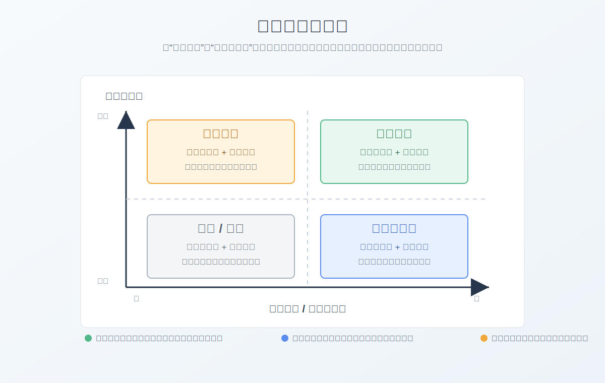

这本书是我2018年买的，那个时候刚开始工作，技术上一点根基没有，考虑过转去当产品经理。后来随着项目做的越来越多，我发现做产品什么时候都可以做，但是如果当时放弃做技术，后面就回不来了。所以当时决策先把自己工程能力提升上来，在公司自己不做专职产品经理，平时要留意产品经理都做什么事情，自己买一些书私下看看，在不断跟产品沟通中逐步去把产品经理的核心能力锻炼出来。到了2026年，不论是中国的科技公司还是美国硅谷的科技公司，能同时做好技术和产品的人都是战略性的人才。与此同时，伴随大模型和Agent的广泛应用，已经对传统软件行业分工产生深刻影响。

传统模式下，产品/设计/研发/测试/部署运维都是分工的，不同部门之间沟通成本极高。往往导致产品研发缓慢，产品特性偏离设计初衷，最终产品成本居高不下而缺乏市场竞争力。而AI所带来生产力提升，目前已经可以让一个普通人自己编写prd，借助AI设计ui，编程到软件发布。相比较而言，一个具备产品能力的技术人员要比一个不懂技术的产品更有价值。因为产品的专业技能任何人学习没有太大的壁垒，而技术存在壁垒，尤其跟硬件物理打交道的领域，需要长时间积累。

我在2026年年初，制定个人的年度发展规划，就说了要自己去打造全新模式团队，去尝试与以往完全不同的研发模式。半年快过去了，其实做了很多尝试。在下半年，我将进入更加硬核的软硬件产品技术研发，其中硬件包括机械电气电子和控制是我不太熟悉的领域，软件方面还好。结合产品思维做一个开源多模态灵巧手，我在上一篇公众号文章中写过这方面内容。

人人都是产品经理这本书我是2017年听一个转行做产品的同学说的。18年就买了，这本书讲的核心是当年的移动互联网产品的一些经验，在2026年看，过时的主要是具体的工具，因为最近十几年AI和互联网的发展成果是十几年前难以想象的。没有过时的是产品从诞生到发展再到死亡的流程没有根本性变化。举个例子，现在办公协作都是使用飞书，再配合AI功能辅助，这是作者写这本书的时候没有的，而作者当年用的工具绝大多数当下基本没人用了。不过工具只是辅助手段，该做的事情还是那些。比如竞品调研，市场分析，产品功能设计，运营策略，数据分析与可视化等等。所以对于没怎么做过产品的人，这本书可以快速补齐产品日常的基本工作内容。也是比较有指导意义的。

在公司里面做研发，都是为了产品服务的，懂一些产品理念，才能明白为什么这样做，做的意义是什么，否则很容易成为技术工具人。而且公司的存在就是为了做产品盈利，如果总是让别人制定规则，自己总是执行者，永远也成不了行业领袖。

# 1.写给1-3岁的产品经理
书里面讲了作者很多的个人经历，以现在的视角看其实没有多大指导意义了。产品经理这个岗位本身其实是一个非常杂的岗位，而且在不同公司和团队承担的职责差异非常大。因此很难用十分精准的语言去描述它。这个岗位又非常多，不论是互联网/AI/机器人行业平时都会看到产品经理的存在。我们平时的生活，也无时无刻地使用各种产品，比如笔记本，手机，各种app和网站，chatgpt等等。相比较于作者写这本书的时候，到了2026年互联网更加普及，任何人或多或少都会对产品经理这个岗位有一定了解。2015年我刚大学毕业的时候，我是一点都不知道产品经理是做什么的。通俗来讲，产品经理需要负责规划产品的生命周期，负责产品上市策略，定价策略，营销策略。在稍微有规模的公司，产品都是一个团队负责，实际的产品经理绝大多数只是负责一个产品的一部分。比如微信，就有专门一个团队负责朋友圈相关的功能，还有一个团队负责小程序。所以到了具体的人除非你是整个事业部老大负责全面工作，否则每个人都是负责一个子系统甚至更小的功能。对于绝大多数人来说先把手头的工作做好远比想的很多重要。

书里面有一段对于产品经理明面上的要求和实际是怎么回事的概括是非常精辟的。

官方说法：全面负责产品的整体实现过程
真相：职责不清楚，任何跟产品相关的问题都是你的，根本闲不下来

官方说法：需要能够承受压力，自我调节，自我激励，综合素质要求高
真相：产品任何方面，团队其他人做的任何事情如果出了问题，产品经理都背锅

官方说法：对市场发展有敏锐洞察力，辅助公司进行战略决策
真相：老板说了算，产品按照老板的想法去落地

官方说法：很强的沟通能力，出色的团队合作精神
真相：产品是各个方面的挤压对象，哪边都不得罪是门艺术

官方说法：关注业界动态，对互联网产品兴趣浓厚
真相：做竞品分析，尝试体验各种竞对产品

最后作者总结了一个个人的对于合适做产品经理的品质，爱生活，有理想，会思考，能沟通。这个标准吧，其实如果做技术也会做的很好。对于互联网产品，尤其toC的产品都是跟大众联系非常密切的，爱生活才能去细节处发现产品的提升点，挖掘好需求。会沟通则更为重要，毕竟产品需要调配何种背景的人共同努力把产品做出来，完善出来。而且绝大多数产品经理不是老板，不是给其他人发工资的人，对别人没有什么可以拿捏的东西，沟通能力是决定一个人做事阻力大不大很重要的能力。

# 2.一个需求的奋斗史

做产品的第一步是获取需求。商业化的产品都要注重用户体验，否则在相对公平的市场竞争环境下，没有人愿意买产品。在中国的话，对于绝大多数的产品经理和绝大多数情况，需求往往都是老板弄来的。稍微研究一下中国能存活三年以上的公司，可以发现老板也许可能一点技术都不懂，但是没有一个是不懂自己公司主营业务的。懂业务就会承接需求，用公司开发的产品或者代理的商品来满足需求。所以至少对于在中国做产品经理而言，老板的意见是决定性的，而且老板是否真正给倾斜资源支持是决定在公司能不能做成事儿的主导性因素。但是需求来了不是所有的都要做，这就涉及需求的排序。公司的资源是有限的，需要把核心资源投入到关键需求中去。下面示意图就是一个需求排序的示例

不论需求是否来自老板(只要公司规模大了之后，需求的细节都是产品经理跟对方客户对接，老板最多牵线搭桥关心一下进度和核心功能)，还是产品经理自己去跟客户或者消费者对接，都涉及需求采集的问题。需求采集本质上是统计学范畴，比如采集尽量不要有偏向性等，这里不过多讲述，感兴趣可以参考一些统计学书籍。采集的方法也很多，比如ToB的业务可以去客户公司拜访或者去客户现场考察交流，对于ToC的产品，需要使用调查问卷或者网络的调查问卷形式，甚至在大数据技术普及后对于一些互联网产品可以直接调用用户的数据进行大数据分析和数据挖掘，借用AI算法分析用户画像。

在需求采集上书中介绍两种方法分为定性和定量。这也是做很多事情常用的方法论。定性的方法比较粗略，但是各种成本都低，适合前期快速验证想法。定量的方法精准但是成本高一些，适合产品形成一定规模后精细化运行来制定策略。

需求对于产品非常重要，产品也应该以用户为中心。但是这并不意味着用户说什么都是合理的需求。有时候用户是纯粹表达不清晰，有时候甚至都不知道自己在说什么。所以这就需要产品经理在提取需求的时候，可以从客户的带有噪声的信息中提取有效的需求。区分一个产品经理是否专业的一个很基本的考察点就是能否比较精准地提取需求。我在开发的过程中也接触过很多产品，好的产品可以把功能细节和为什么要做这样的功能，甚至竞争对手是什么样子的，我们应该做成什么样子才更有竞争力都写的非常清晰。而对于很一般的产品就是纯抄袭对手的产品，然后换皮，为什么要这样根本说不清。甚至有时候抄都抄不明白。造成研发经常大面积返工加班，然后骂产品经理。要明确自己的产品价值核心才行。

由于需求是永远做不完的，书中作者推荐优先保证最核心的，不要什么都做什么都做不出彩。这个原则在很多方面都是正确的。做产品的原则很多时候跟发展自己或者团队的原则是接近的。

# 3.项目的坎坷一生
书里面作者对比了一下，项目经理和产品经理的差异。理论是理论，实际是实际。在不同的公司中二者往往并存，而且区分也是根据公司情况而不同。在公司中绝大多数的需要投入钱和人进行一定时间的活动并且有一定产出的事情都是以项目的形式存在的。甚至我以前待的一些硬件公司压根没有产品经理的岗位都是项目经理。所以归根到底要看公司对岗位的定位。一般来讲，产品经理的生命周期会更长一些，项目尤其IT项目一般都是以月为单位计算的，而产品从立项到设计研发测试投产运营，时间更长。不过凡事都有例外，对于比较火热的互联网产品或者AI产品，几个月就决定生死了。如果做不出来，不到半年的时间，整个项目组就裁掉了。比如在字节跳动，APP工厂，里面孵化了很多app，绝大多数都是几个月不行就下线了。我们比较熟悉的抖音头条那都是卷出来的佼佼者。

对于一个产品项目，从最初的立项开始，就要经历很多生死考验。首先立项要让投钱的人也就是老板们觉得值得，否则直接胎死腹中。那么产品就要做商业计划书。对于产品来说就是BRD---商业需求文档，很类似商业计划书，对于产品的细节描述是比较粗略的，但是要说清楚产品到底什么样子，到底是干嘛的，怎么赚钱，如何盈利，前景如何，甚至要加入竞对的产品对比。所以BRD是描绘产品商业蓝图的。对于我这种研发，接触最多的是PRD---产品需求文档。这是产品过会立项后，组建完团队，开始由产品完善产品功能的细节，并拆分出功能给研发进行评审和指导研发工作的文档。编写PRD有几个好处，比如：在开发出来后产品被用户喷的时候到底是产品设计的问题还是研发实现的问题可以把锅分的比较清晰，在产品评审阶段就尽量把一些致命性问题提前拦截，可以给予研发在开发功能中方向指导不至于乱开发等等。稍微规范一点的PRD一般要包含修订历史/项目概述/功能范围/用户范围/词汇表/各个子单元详细介绍，甚至可以带一些UML或者状态图。当然理论是理论，实际的产品经理相当大比例是做不到很全面的。我觉得到了AI时代，尤其现在基于大模型的Agent已经完全有能力提供非常强大的功能补全，UI设计，自动消息发布、项目监控等非常多的基础功能，只要产品经理可以自己搭建一套体系或者程序员开发一个给产品用的平台。在多年前，国内的互联网大厂都打通了从产品到代码管理发布测试等一系列的流程。一个云平台就可以搞定所有的。我打算今年做一个web项目，类似于gitlab的docker部署版本，但是可以融合AI功能来构建一种全新的需求设计代码管理集成测试部署的平台，并依托这个平台去做灵巧手项目的软硬件研发。常规的产品经理都需要跟UI深度合作，完成一些界面的原型开发，给GUI或者web前端工程师切图提供素材。我最近在使用claude designer，效果非常惊艳就是太费token。在今年年初一个项目中，我是跟专门的UI设计有所合作的，开会的时候他们共享桌面，我们提新的需求他们当场改也都是使用AI去做了。作为软件的产品经理也是要参与到bug的管理流程的，主要是把问题落实到具体研发身上，并明确问题修复时间。对于bug的管理体系，国内互联网大厂都是有比较健全的。jira那种我多年前也用，目前来说已经落伍了。对于相对成熟的产品或者产品线，由于团队人非常多，避免大家没完没了地在相同的问题上犯错误，流程化建设是很有必要的。辩证地看，流程只会越来越繁琐，最终扼杀创新。这个世界上任何事物都是不绝对的，追求一定的好就一定要承受对等的代价，决策的依据是要满足当前的战略目标。

如果在一个人员比较多的大团队中，一定要明确权责，否则不论团队成员如何精英最后的结果一定是一团糟。这是人性。而且权责要尽早说清楚。

# 4.我的产品我的团队
在有一定规模的公司中，产品经理都是一个团队，不止一个人。除了最上面的老大，其他的产品往往都是单独负责一个产品线或者功能线。产品经理并不是整个团队的领导，不负责给研发测试运营等打绩效，所以跟人打交道，需要把职责界限明确。而且要在初期就把信息公开来避免后面扯皮。对于人员功能比较复杂的大型产品研发团队，要对不同的分系统设置接口人，提高团队沟通效率。一个团队中不同的角色有时候会存在利益冲突，比如互联网产品的运营，由于直接承受公司高层对于点击量浏览量使用量的要求，会追求相对短期的目标，来提高相关数据指标。但是对于一个希望长期运行的产品，短期这种通过一些营销模式暴增的用户会很快流失掉，甚至影响产品在客户中的评价。或者有的产品经理非常push研发功能上线，因为竞争对手已经上线了，但是也许其并没有看到竞争对手在几年前就已经布局，经过长期积累才达到现在的影响力。疯狂的push会让研发加班，甚至导致bug非常多。产品需要考虑去协调用更现实的利益去激励团队。书中作者分享了他个人博客的运营案例，我就不说什么了，毕竟我也是知乎大V，很多文章都是百万起步的阅读量，甚至对国外有影响力。我最近在运营自己的公众号，后面会登陆小红书和海外平台。我肯定是不虚作者的。

公司的产品本质是商品，这点很重要。由于我个人是研发技术出身，对于商业化和市场没有太多的经验。比如说定价和营销，尤其对于软件产品，中国消费者普遍没有付费意愿。很多公司也是直接使用盗版软件。所以想把产品卖出去获得市场占有率甚至赚钱，很多互联网产品就不得已要走量然后卖用户数据或者卖广告赚钱。或者对于一些产品，是厂家直销还是分销找代理商。一旦涉及分销，商业上的门道就更多了。这个领域我不是专业的。没有办法给太多专业性的建议。

# 5.别让灵魂跟不上脚步
现实中一旦说价值观这种东西，往往给人一种很虚伪的感觉。但是不论个人还是团队，做一些事情都是按照一定价值观去做的。所以价值观是客观存在的，只不过在很多场面话上说的太多而实际行动又跟言论不符合，才让人敬而远之。对于团队的价值观的塑造，也是不像做一个功能那样清晰可见可量化的。我待过很多团队，对比发现对于不同的领导者，团队呈现的气质完全不同，能不能打硬仗直接可以通过一些做事的风格看出来。我就在想为什么会出现这样的差异，通过分析我发现，在比较务实的团队中，团队的领导是可以树立非常正向的价值观的，而这种价值观是可以让做出满足价值体系的人获得真实的利益的，而且是不需要等待太久就会给明确的反馈的。产品其实非常需要开会，现实中也是经常拉会，对齐目标等。现在有AI会议纪要可以直接自动生成，还是很方便的。会议的话，一个会议就解决一个问题，不要没完没了开太长，否则谁都吃不消。

# 6.产品经理的自我修养
这一章纯粹是作者个人观点，不过我觉得也有一定意义。比如说作者认为爱生活才能爱产品。产品都是给人用的，不管是直接使用还是间接使用。热爱生活，才会关心生活，才会去关注并且去解决问题，用产品去解决问题就是产品经理的职责。比如支付宝上各种便民缴费的功能，当时做的时候非常苦而且不怎么赚钱，阿里还是坚持做了下去，现在方便了很多人缴费。这就是生活中的一个痛点。尤其做ToC的互联网产品，就是为了让用户方便的。比如汽车的发明就是为了提高出行效率。比如我现在做的具身智能，我就是想造一个可以在家里帮助我做饭做家务的机器人，让我从家务中解放出来。只要能做出来，就可以方便数以亿计的人，并改变世界。这就是我当下的追求。我为什么要做多模态灵巧手，不就是为了后续给机器人完成灵巧操作的嘛。他说有理想就不会变成咸鱼，我现在立志做可以走进千家万户的机器人，不就是理想嘛，否则每天上班混混日子，就成为真的咸鱼了，哪有女孩会喜欢我。他说会思考就能活到老学到老。我更是如此啊。今年到写这篇文章为止，我看完了十本书

阅读与写作讲义

架构简洁之道

中华帝国的衰落

代码简洁之道

C++代码简洁之道

重构，改善既有代码的设计

一九八四

奇思妙想15位计算机天才及其重大发现

深入理解rpc框架原理与实现

人人都是产品经理

我实际看的书籍和文档论文要比上面列出来的还要多得多，我列出来的只是我完整看完并且写了少则几千多则数万字的读书笔记。有的书我看了但是没写读书笔记都没有列出来。这里面大部分的读书笔记我挂在了个人公众号，一些人文社科的没放出来。

最后作者写了能沟通，在什么山头唱什么歌。这一点我做的不够好，甚至比较差劲。作为产品经理，现实团队中什么类型的人都有，为了可以推进，需要灵活变通跟人打交道，是需要一些沟通技巧的。沟通只是目的，目的只有一个就是把事情做成。
