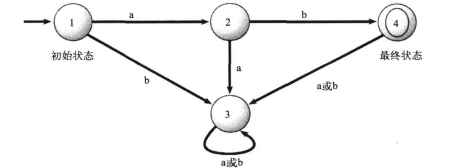

# 奇思妙想：15位计算机天才及其重大发现

这本书是我在疫情刚开始的时候买的，那个时候自己工作经验有一些，但是也不算可以全栈式的独当一面。很多东西也都在学习过程中。在那个时间点我当时还没意识到但是后续经历的一些事情让我现在意识到的一些经验，比如说跟对一个正确的人远远比自己一个人单纯的努力重要的多。什么是正确，没有绝对标准，但是经历很多事情后，我觉得是有一些特征的。比如有的人带着我进入计算机视觉算法的大门，在此之前我无论怎么看书看代码始终无法突破一些束缚，感觉很空没法落地。这时候出现一个中科院自动化所的博士，也是国内AI这块非常知名院士的高徒手把手教我怎么设计能落地的视觉算法。当时我做的算法水平依然比不上cvpr上的很多论文，可是有了这个过程后，我基本可以比较自信，只要资源给够就能设计出超过很多AI顶会论文水准的算法，而且可以落地真正的产生价值。当我缺乏软件基础的时候，就出现了一个清华计算机的博士手把手教我怎么去编译大型软件配置网络设计模块。但是我做的技术水准依然远比不上一流的开源软件，但是从此之后我就知道怎么去学习改进并且逐步接近甚至超越那个标杆了，而且是不再需要其他人指导自己就能进化。再没有获得这个指导之前不论我怎么努力也是无法突破这层限制的。当我完成软件工程的初步进化想看一看国际上一流水准的大厂标准化的技术体系是什么样的时候，又出现一个清华计算机系的前辈，带着我去参观实践自动驾驶复杂的软件体系和亲自构建自己的devops体系。我当时的水准只能在体系中独立做某一个模块的基础功能，但是自从有了这个经历，我就可以自己在云端搭建SIL/HIL来构建自己的仿真测试体系。当时我个人的水准跟什么google肯定比不了，但是从此之后，我就坚信只要我有对方一半的资源，就能做出来超越对方的产品体系。在没有经历见识这套软件体系之前不论我怎么看书怎么努力都是无法达到的。

所以什么是正确的人？依然没有一个精准的标准。但是之前很多的经历中我提炼了一些经验和看人标准，来快速识别哪些人对我来说是正确的。这样我才能制定策略把时间精力投入到正确的人身上。

我个人不论是2018年刚开始工作还是疫情期间或者当下，每个月都在快速的成长。看书算是基础中的基础，可以让我静下心来，花一段时间去感受一位作者多年积累的经验。仅仅看所带来的成长是肤浅的，所以我每隔一段时间，就要把自己的最近的成长通过一些项目去验证到底能不能落地。书的内容相对社会发展存在一定的滞后性，尤其对于一些比较新的内容。但是也有一些书籍是可以经受住时间考验的，不论十年还是二十年后，依然可以给读者很大的启发。

在刚开始疫情的时候，我就想自己如果在技术有所追求和品味，就应该去看看一些曾经的领域先驱做了哪些事情，纵使自己未来不一定能达到这个高度，也可以让自己有足够的眼界去分辨不同的人到底什么段位，不要被社交媒体几个洗脑文案就忽悠了，仿佛遍地是天才一样。

另外一个好处就是可以相对客观的去观察一些先驱做技术的方法论，并去启发自己日常工作。甚至让自己更自信，坚信自己在未来也可以做出很大的技术革新尤其在AI这一块。所以当时就买了这本书。

以前在抖音上经常看很多的清华姚班天才的视频，现实中我其实接触过一些，感觉的确聪明也的确优秀。但从成就上还缺乏积累。

眼光要高才有可能分辨正确方向

眼光要高才有可能区分好坏

眼光要高才有动力去改变自己

到了真正做事的时候，要脚踏实地。做事不踏实，数学推导一个小的过程错误整个结论都会失效；航天工程上一个小小的螺丝钉没拧紧或者一行代码bug就会把火箭炸了。人际交往中如果人不靠谱就很难真正维护好长期的友谊。

这本书的作者是纽约大学科朗数学研究所的教授，书中的主要内容角色15人中有11位获得了图灵奖，另外四位也是计算机领域知名的先驱，按照这本书的出版时间，里面说的25年后就是当下，正好可以验证一下预言准确性如何。书中预测P与NP问题得到解决，实际上没有实现；新的编程语言会出现很多但是可以挑战面向对象的不多，这个预测只能说部分准确，比如新的语言go，rust其实在语言机制上是摒弃了一些面向对象的特性的，不过像C++变成了大杂烩，函数式编程/泛型编程/过程式编程/面向对象编程都被融合到一个语言里面去了；计算机跟物理结合，帮助快速实现从设计到生产，这个基本实现了尤其在机械电子领域；关于人工智能的预测部分准确，目前实现了脑机接口和ai与虚拟现实结合，但是他没想到AI发展已经远远超出其预期了

# 1.约翰*巴克斯

图灵奖获得者；发明了Fortran编程语言；发明BNF范式；提出函数式编程

Fortran这个语言我是在读大三的时候知道的，那个时候我从火箭发动机专业转到GNC和图像方向去了。舍友都没转，他们学CFD都要先学习Fortran90。那是2013年了，我当时看着他们拿着厚厚的古老的书，一时间也不知道说什么好。这个语言是第一个高级编程语言，专门用于做数值计算的。所以在20世纪被大量用于各种物理计算，比如核物理/气象/流体等。我当时一问才知道，他们课题组遗留的Fortran代码动不动就几十万行。实在是恐怖。有一个专业第一的同学，就被安排去把Fortran转成C重新写一遍代码

BNF范式在设计编程语言的时候非常有用，用来定义编程语言/指令集或者通信协议的形式化数学符号。比如要设计一门新的编程语言，一般需要词法分析器和语法分析器配合：Lex/Flex 负责把源代码切成 token，Yacc/Bison 负责按文法规则把 token 组装成语法树。我以前使用过 Yacc，首先要做的工作就是用 BNF 范式描述语言的文法规则，再用工具生成对应的 C 代码。另外一个用法是设计通信协议，为了消除自然语言带来的歧义性，使用ABNF来定义请求头和数据包格式。这个是非常基础的规范才这么用，我在项目中从来没这么用过，就直接定义字段和消息了。

函数式编程在他那个年代并没有获得太大的实用价值，因为那个时候计算机的算力不强。进入21世纪后，函数式编程范式基本被所有现代编程语言支持了。这种范式在并发编程中，可以避免数据共享导致的并发错误。现在函数式编程已经非常广泛了，比如我在设计一些高性能库的时候，会用到 C++ 的编译期计算（constexpr / 模板元编程）——编译期不允许有副作用，输入确定则输出确定，这其实就是一种被编译器强制执行的函数式编程范式。

# 2.约翰*麦卡锡

图灵奖得主，发明了lisp语言。这个语言在人工智能发展的前50年都是这块的主力编程语言。我以前看一本书《计算机程序的构造和解释》里面用的就是lisp语言的方言scheme语言写的。语言本身语法比较简单，而且很贴近数学。不过进入到21世纪尤其最近十几年，AI这块用的技术路径跟这个基本没啥关系了。这个语言很早就出来了，所以在进行编程语言机制设计方面还是有开拓性的，比如递归和条件表达式，后世的所有高级编程语言都会支持这些。

麦卡锡主持开了一个会议—-达特茅斯会议，这个会算是人工智能起点。我在《人工智能简史》这篇文章中详细写了这个会议内容和影响。后世尤其现在的AI算法依然在当时设定的框架内。

# 3.艾伦*C凯

图灵奖得主，完善并系统化了面向对象编程思想，并设计编程语言Smalltalk。Smalltalk这个语言已经基本没人用了，但是面向对象的编程思想是几乎所有大型软件得以构建的基础。目前主流的编程语言大多数也都支持面向对象编程范式，比如C++/java/C#/python/rust/javascript等。

艾伦*C凯在六十年代就根据摩尔定律推出会在八十年代出现个人电脑。后面他在施乐工作，乔布斯去施乐参观看到了图形界面，让其快速认识到商业价值。再往后苹果的故事就广为人知了。

# 4.艾兹赫尔*W*戴克斯彻

图灵奖获得者。提出Dijkstra 最短路径算法，这个算法即使是现在依然在广泛使用，比如手机地图的导航计算，自动驾驶机器人路径规划等。另外他提出临界区和p，v操作。写过多线程，多进程并发程序的，都应该知道对于共享数据要进行保护，避免一个线程在修改共享数据的时候，另外一个线程操作共享数据。否则中间的状态是未定义行为。现代计算机CPU提供原子操作，操作系统在原子操作之上实现信号量与互斥。并且在系统编程接口和编程语言标准库中对这些进行了封装，比如互斥元等。

在操作系统中有一个不可绕过的问题就是死锁。这个问题是通过哲学家晚餐引申出来的。在进行软件或者通信硬件设计的时候，很容易由于不注意在复杂系统中产生死锁行为。我在面试的时候也经常问死锁的问题，如何在机制上解决。举个计算机网络的例子，如果在一个局域网中的计算机都使用共享的一条网线，每次只能有一条消息发出，那么如果所有的计算机同时发送消息，就会同时失败。如果某台计算机总拥有优先权，那么就会有其他计算机饥饿。一个比较简单的办法就是使用随机算法让不同的计算机在随机时间后重发，来尽量避免死锁。

在软件工程领域，他发现goto的有害性。这是从软件质量工程角度考虑的。我在前段时间，看过一个比较知名智驾公司C++代码中存在这种代码，导致程序非常难修改和调试。当时我就觉得软件负责人可以原地开除了。但是现实却是人家活的好好的，这样的代码就流入到很多国产汽车上了。

他对于年轻科学家提出过一些建议：不要和同事竞争；尝试做能力范围内最难的事情；选择科学上健康，有意义的研究主题，科学操守绝对不妥协。这是非常值得我借鉴的，即使我目前不在学术圈。

另外这一章开头，介绍了一些他母亲对他的一些忠告，我觉得对于数学学习非常有意义。学会数学的公式并运用自如，如果需要5行以上的证明某件事，就说明方法错了。这话不绝对，可也是很好的验证自己对于数学学习掌握情况的方法，很简洁。我业余时间喜欢研究点数学，一点爱好。

# 5.迈克尔*O拉宾

图灵奖得主，提出非确定性有限自动机。有限状态机是计算机中非常常见的设计模式，几乎涉及到状态转换的地方都会用到。比如说机器人行动状态控制，GUI组件的交互状态控制，后台服务的状态控制，嵌入式设备如微波炉/彩电等状态控制，字符串的正则匹配

确定性有限自动机是说接受确定的输入，每个状态有确定的转换关系。比如下图中，1状态是初始状态，4状态是最终状态，只有输入ab才能到达最终状态。其他的输入都无法被接受

上述的确定性有限自动机只能接受ab，无法接受abab，ababab这种有限的ab组成的字符串。下图的自动机在最终状态4上加了转到2的状态转移，就可以接受ab，abab，ababab等无限的输入。

但是上述自动机无法接受abab无限且abba，abbaba无限的字符串。下图的自动机在保留了支持ab无限字符串的基础上，加入了abba后ba无限的通路。这样就可以用一个自动机实现对两种模式的无限字符串的支持。仔细观察下图就会发现，在初始状态1，存在两个输入为a的状态转换。这种就是非确定性有限自动机。

在数学上存在定理可以保证非确定性有限自动机可以转化为确定性有限自动机，如下图所示。跟上图对比可以发现确定性有限自动机的状态更多，如果是非常复杂的系统这个特征会更加明显。所以在一些编译器的设计上，会优先使用非确定性有限自动机，再通过算法在实现层转为确定性有限自动机去真正工作。这种非确定性有限自动机在语言翻译/文献检索和文字处理上应用非常广泛。

他的另一个核心贡献是把随机性引入算法设计。比如研究单向函数，就是说一个函数如果从正向计算式非常好计算的，但是知道计算结果想逆推出x是非常困难的。这种函数可以用来设计加密算法。像我们平时用的非对称式加密，就是把公钥直接使用非安全网络传播，因为基于公钥去逆向破解私钥的计算量是非常大的。

# 6.高纳德

图灵奖得主，算法分析书中那些时间复杂度/组合分析/随机分析都是被他系统推动的。另外他写了一个系列的书《计算机程序设计艺术》，这本书让我记忆犹新。我写代码基本都是工作之后自学的，读书的时候看过算法导论感觉还行。工作不久后在网上闲逛，当时也是想找新的工作，就看到比尔盖茨说如果你觉得自己编程很厉害，去读 Knuth 的《计算机程序设计艺术》……如果你能把整套读完，请把简历寄给我。于是我自己下载了已经出版的所有版本pdf，有空就看。相比较而言，算法导论已经算非常好读了。这本书里面全部都是数学，各种数学证明推导，课后题按照难度进行了分级，最开始的都非常基础，只要能看懂正文的内容就无脑做，到了中间就开始有一定难度了，有时候一道题需要想一天。最后的几道题很多都是写这本书的时候整个计算机界的未解之谜。好像从这本书发表到现在，也只有少数几道未解之谜被后世的人解决，绝大多数至今仍未解决。我看这本书看的非常慢，为了理解里面的数学证明需要额外补充很多数学知识。到现在为止这本书我没看完。我曾经考虑过设计AI来解决里面的问题，不过这是一个长期工程，毕竟claude 和 chatgpt也没做到呢，我也不急。不过这本书的确给我测试AI提供了一个非常好的基准。

他在写这本书的时候发现当时的排版系统不够精美，所以自己做了tex，可以编写出非常精美的学术论文排版。现在经常写论文的都会用tex的变种，学术期刊基本都会提供模板。

这套书的的前面系列很早就出版了，而且由于当时没有什么算法分析的标准教材，很多大学把这本书当作教材用。国内很多清北老师编写的算法书籍早期都是参考这本书的风格和内容写出来的。只不过这本书实在太难了，后续就把难的内容删减了，再补充一些其他方面的算法内容。

# 7.罗伯特*E陶尔扬

图灵奖得主。提出和很多应用广泛的图算法。比如在电路设计软件中线路的布局需要检测是否交叠，如果存在但是检测不出来，实际生产出来的电路板就会短路。这就需要判断一个图是否边不交叠，同时又维持连接关系。他使用深度优先搜索算法Hopcroft–Tarjan Planarity Testing Algorithm进行判断，极大降低了算法复杂度。这个算法证明还有点复杂，简易说明的参考论文Hopcroft–Tarjan Planarity Testing Algorithm。另外一个贡献就是查并集和分摊理论，我在看普林斯顿大学的那本算法书的时候，很多算法都是用这套进行分析的，这本书比算法导论简单一些。他与很多研究者合作，用深度优先搜索和复杂度分析不断压低算法开销，把强连通分量、平面图判定、并查集等经典问题首次推进到线性或近线性时间。与发明一个新问题相比，我更喜欢这种工作方式：把已有问题不断压低复杂度，直到逼近理论极限。我理想中的算法工程师就应该做这样的工作。

# 8.莱斯利*兰伯特

图灵奖得主。主要的贡献在分布式上。提出面包店算法，证明了即使硬件不提供任何同步支持，仅靠分布式/多线程之间的消息，也可以在软件层面上构建绝对安全的信任和同步机制。另外他提出兰伯特时钟，说明了分布式系统中绝对的物理时间没有意义，真正重要的是事件之间的因果关系。还有一项贡献至今影响整个学术界，就是他为tex加了宏系统，拓展成了latex。目前的学术圈论文，基本不会直接使用tex，而是使用学术期刊提供的latex模板。他对形式化验证也非常看重。像我之前做软件开发项目基本都是使用软件测试的方法去保证软件质量。但是对于一些高可靠性的复杂系统仅仅测试是不够的，一般都会做形式化验证。我看过一些编译器为了验证准确性加了形式化验证方法。

# 9.史蒂芬*古克和里奥尼德*列文

古克是图灵奖得主，列文独立做出了成果但是由于在苏联，西方长期先知道的古克，后面才承认列文的贡献，只是没给他图灵奖。他们的贡献是提出NP完全理论基础。原始论文不长，但是我看不懂。

P问题是可以在多项式时间内求解的问题。NP问题是给定一个候选答案后，可以在多项式时间内验证其正确性。NPC问题是NP中最困难的一类问题，它既属于NP，又满足所有NP问题都可以在多项式时间归约到它。如果任何一个NPC问题被找到多项式时间算法，则所有NP问题都能转化为它求解，因此：则NP=P。

对于很多NPC问题，目前没有发现多项式时间算法，因此工程上常使用启发式方法或近似算法，毕竟找到解后验证还是很容易的。像求解机械臂的逆运动学解，求解很多控制问题，为了实时性都会使用这种方法。

# 10.弗雷德里克*P*布鲁克斯

图灵奖得主。他主要做偏工程方面研究，在IBM主持开发了System/360家族系列计算机。那个时候计算机不通用，不同品牌的电脑需要把软件按照他们电脑的指令集重新写一遍。而System/360系列不需要这么做。其实就现在也有这种情况，比如下载一个飞书，会区分windows，mac，linux，区分是x86-64还是arm，区分是安卓还是鸿蒙。只不过现代的高级编程语言都支持这些硬件架构和操作系统，理论上一套应用代码通过交叉编译就可以部署到不同的体系架构和操作系统上。只不过如果软件中代码使用了底层平台相关的代码比如调用了系统api或者指令集优化代码，就需要专门做适配和底层抽象。他后面又主持了OS/360操作系统研发，在经历这种超大型复杂软件研发后，写出了软件工程领域非常有名的《人月神话》。我觉得这本书很好，不过由于历史久远，一些内容是需要与时俱进的。

# 11.伯顿*J*史密斯

这位不是图灵奖获得者。他主要是做并行计算和高性能计算，超级计算机的。它设计的异构元素处理器HEP。因为cpu的计算是很快的，但是io操作慢，之前的设计都是让cpu傻等io返回数据。他的改进就是让cpu切换其他线程任务，在io数据没有回来之前执行其他任务来提高cpu使用效率和整个系统的吞吐量。而且是在计算机体系架构层面上做，也就是硬件实现。这个思路对于后面的计算机体系架构设计影响很大。另外的贡献就是设计数据并行计算的超级计算机。由单核走向多核。当前AI的所有模型训练和推理都是使用这样的思路。只不过目前不在cpu上而是在gpu上，主要就是cuda。

# 12.W*丹尼尔*希利斯

这位不是图灵奖获得者。他受到生物学启发，认为智能是需要大量神经元并行计算的。他认为智能可以来自海量简单计算单元的协同工作，因此设计了由大量处理单元组成的并行超级计算机。站在2026年视角看，这是很有先见之明的，因为现在的AI也是如此，只不过把简单重复度高的大量计算放在gpu或者AI专用芯片上面了。另外他认为可以发展硅基生命，通过在计算机上进行仿真来减少进行真实生物实现的时间，甚至可以去创新新的生物体。这是非常超前的理念，因为到了2026年，像deepmind/openai等前沿AI研究机构正在非常重视这方面的研究。我在前段时间也接触了一些。前几年AI预测蛋白质结构已经可以达到非常高的精度了，这意味着未来通向硅基生命的道路已经敞开了。

# 13.爱德华*A*费根鲍姆

图灵奖得主。他做了第一个专家系统DENDRAL，可以根据质谱数据预测分子结构。这个AI在特定领域已经接近专家水准。后面又做了MYCIN，可以根据症状和化验结果给出医学建议。实际上他干的这些事，后面AI获得发展就有人在这些领域用新的方法试试。比如前些年的AI1.0深度学习的时代，我就做过一些项目，根据CT数据做组织分割，病因诊断。在一些特定任务上，模型已经达到甚至超过专家水平。到了2026年，依然有很多人在基于大模型做AI for Science。比如预测蛋白质分子来加速药物研发等等。他做专家系统的时候，依赖的是领域知识。现在的大模型如果想做的精准，也是需要高质量的领域数据。最开始的LLM使用的是整个人类互联网上的数据训练的模型。那么像chatgpt这样的对话程序人类已经很难分辨到底是不是真人了。但是像在具身智能这种物理AI行业，数据获取成本就非常高了，尤其要获取多模态感知数据和动作数据。很多人说现在的AI模型数据很重要，其实我觉得真正重要的不是数据而是知识。只不过知识是作为隐变量藏在高质量数据中的。

# 14.道格拉斯*B*莱纳特

这位不是图灵奖获得者。不过在读书的时候就开始搞AI编程。在那个年代当然搞不出来什么，但是使用的形态与现在claude code cli几乎一致。开发的AM系统可以自动发现数学规律。cyc项目就是把大量人类社会的尝试构建在数据库中。当时的AI主流是基于规则的，维护成本高且泛化效果不好。但是这个思路直到现在做AI依然是有指导意义的。而且现在AI系统使用的数据量远远大于cyc的数据量。
