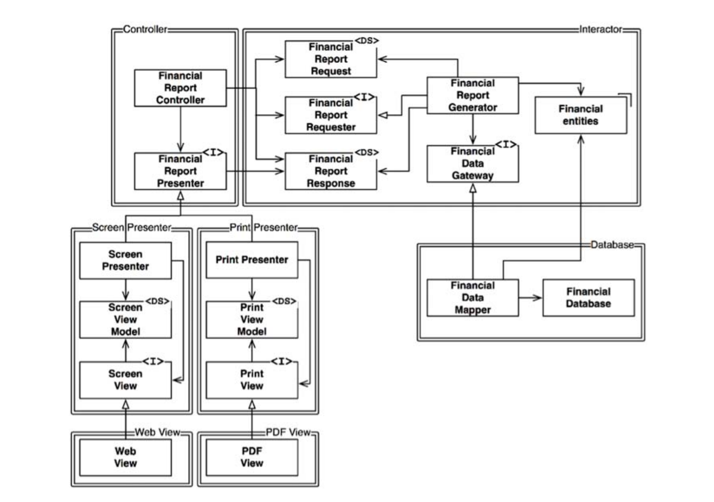

# 架构简洁之道

这本书是我2021年买的，当时正好工作三年左右，开始从开发简单的零散功能转向完整软件体系架构设计。那个时候还没有AI大模型辅助，写业务逻辑基本也就是抄代码，无非技术好点的去外网或者github抄，技术差点的用百度在csdn中抄，再套上自己的业务逻辑就交差了。由于我看软件方面的书比较多，就发现现实中遇到的情况跟书里写的差别非常大，现实中的技术水平太差。而我看的书基本都是世界领域最顶级的作者写的专著。

再2021年我对全球的软件行业非常不满了。我特别讨厌面试用leetcode去做服从性测试，不刷题大概率无法在面试中快速做出题目，刷题对于开发项目基本没用，纯纯浪费时间；从美国硅谷带中国中关村，大量的从业者实际上每天都在无意义的乱卷，做出来的软件产品简直是一坨屎，与此同时却要支付高昂的研发经费。另一方面我又发现，github上存在很多质量非常高的开源代码，而且这些优秀的开源代码比商业公司里面闭源代码质量高得多。

我当时就有一个疑问，为什么花了重金的商业化开发团队的代码质量比不过开源的，甚至很多开源组件在一个商业化开发团队中就没人能写得出来同等水平的代码。从那个时候开始，我就基本不看公司的代码了，如果公司的代码被我认为技术水准太低。转而去看优秀的开源项目，因为代码质量的问题，我曾经多次跟领导爆发过激烈争吵，不过从来没有真正解决过。后面我想想，很多人饭碗就在于此，我不是老板，在公司的确不能多要求什么的。修炼自己，自己未来去做真正优秀的软件，注定改变不了就算了。

单就软件架构这块，以前看大型项目真的很费劲，随便一个大型项目就几百万行起步的代码。想一口气把所有吃透是很费劲的。后面看了UE5和阿波罗自动驾驶中间件系统的代码，再工作一段时间后，觉得其实也就那么回事，绝大多数模块其实都是按照固定接口规则去写就行了。看透一两个核心模块，再把最底层最核心的部分看一下，就基本可以看明白架构体系了。

当前AI编程发展还是很快的，2024年AI编程还只是可以做一些局部模块，到了2025年便开始全面在程序员中扩散了。在我写这篇文章的时候也就是2026年上半年，基本上几乎所有科技公司都在借助AI写代码了。我也是重度使用AI编程的工程师。不过在这个过程中我发现，AI编程是存在明显的界限的。这个界限一方面是模型基础能力本身的界限，一方面是使用者去构建基于AI的软件开发能力的界限。前者非常好理解，Claude的模型就是当前最牛逼的AI编程模型。用这个就是比其他模型强。后者对使用者要求更高了，因为基础模型的局限性，需要使用者根据自己需求去设计满足自己需求的Agent，而不仅仅是跟模型对话。这一点在目前几乎是高手与普通选手的分水岭。尤其在更高的抽象层和更大的上下文项目上，也就是大型软件项目和软件体系架构层面上。AI只是保证了可以按照你的要求去生成代码，但是没有保证软件的工程质量和软件可信度。

大概在十年前我开始接触软件工程，在那个时候就经常听教授说什么软件置信度。因为在那个时候，没有AI生成的代码，都是人写的，但是就算是人写的也不是百分之百可靠的，依然需要去评价软件置信度。所以当前的AI编程还很初级，并没有把复杂的过去几十年积累的大量软件工程实践融入到AI中，这也是未来两年AI编程发展的重点内容。

但是不管怎么发展，是人写代码还是AI写代码，作为软件的基本，代码和架构依然十分重要。其实这本书已经算比较老的书了，尤其对一些新的软件架构介绍的不是很全面。不过也还算基础吧。这本书的序言一是陈皓写的，这个人就是网名左耳朵耗子，前两年去世了的一个程序员，因为以前写了很多技术文章被很多程序员学习而知名。在此还是表示惋惜。在他的序中把写代码的人分为程序员/工程师/架构师，很多互联网大厂也是这样划分的。尤其架构师是需要很多代码经验和项目经验积累才能培养出来的。

架构设计对于软件是非常重要的，因为软件的功能都是快速变化的，如果架构设计不合理或者落后，就会严重影响后续的软件迭代。也就是说架构是很影响研发成本的。

# 1.概述

软件架构的底层细节与高层架构信息是密不可分的。设计架构的目标是为了用最小的人力成本满足构建和维护系统的需求。测试驱动开发是有效提升系统稳定性和长远提升开发速度的方法。尤其对于代码量越来越多的大项目，没有TDD简直四噩梦。

# 2.从基础构件开始：编程范式

软件架构设计不能脱离代码。编程范式其实有很多，主要的有面向过程，面向对象，函数式编程。当然除了书中写的，泛型编程/数据流编程/并发编程/响应式编程等也会经常用到。

goto语句会导致模块无法被递归拆成更小可证明单元。这个事情已经被证明了大半个世纪了，但是实际上我曾经在一些商业化大型项目中仍然看到过这样的代码。并不是用来解决什么特殊问题，纯粹是技术差导致的。但是就是这样的代码，运行在很多国内豪车上面。这是一个非常扯淡的事情。但是就是真实发生了。面向过程的编程范式，被证明只要使用顺序结构/分支结构/循环结构就可以构造任意的程序。这个结论非常重要，我以前做逆向工程，就是把二进制转成C语言，就是依赖这个结论找数学完备的公式硬转，虽然可能会冗余，但是是可以把程序找到等价的结构的。另外这个数学的证明也意味着，一个庞大的程序是在数学上确定可以被分解为多个更小的代码结构的。这也是软件架构可以被用来设计进而让程序更健壮的数学基础。

另一个非常常见的就是面向对象。这个也是在公司里面程序员每天都在面对的。核心就是封装/继承/多态。C++中的多态是通过虚函数实现的。类的虚函数都被存在一个虚表中，对类的调用就是先查这个表，衍生类的构造函数负责把衍生类的虚函数地址加载到整个对象的虚表中。虚表中存的就是函数指针。这些特性对于架构设计才是真正非常核心关键的。比如说接口就是所有设计模式和架构设计的核心，来避免依赖。

函数式编程有一个很重要的点，就是对于同样的输入有同样的输出。这在并发编程中非常重要。因为并发编程中的竞争死锁问题最终都是由于可变的共享数据导致的。如果数据是不可变的，就可以从根本上解决这些问题。rust以安全性著称，在设计编程语言的语法上就非常注重这一点。

良好的架构设计应该将状态修改的部分和不需要求改的部分隔离成单独组件，再用合适的机制来保护可变量。架构师应该把大部分处理逻辑归于不可变组件中，可变组件中的逻辑越少越好。

文中举了个例子，就是银行的应用程序，在存取款的时候会同时修改余额记录。余额就是可变变量。常见的办法就是用锁去改，另外一种方法是按照事务去记录，余额可以用事务的累加计算出来。这样存储的复杂度高一些，但是没有可变变量了，每次操作都是单独的一次记录。这就是事件溯源。

# 3.设计原则

书里面写了五种结构设计原则，简记就是solid

分别是单一职责原则/开闭原则/里氏替换原则/接口隔离原则/依赖反转原则。都是非常常见的架构设计原则了。

单一职责原则强调任何一个软件模块都应该只对一类行为者负责。原则虽然是这样，实际的软件架构不可能完美满足这一点。不论如何，让一个模块的代码可以专职做清楚一件事情是架构中非常基础且重要的，把大量代码逻辑都揉到一个里面后面没人敢改代码。

开闭原则是希望软件的新功能可以使用原来的代码进行拓展，而不是直接在原来代码上修改。如果延申一个小小的功能，就对原来代码进行大幅度修改，就是系统架构设计的失败。其实在设计上就是要活用接口特性

依赖关系尽量都是单向的

接口隔离原则就是说设计架构的时候，如果类中很多功能并不给调用者用，就做一下接口的抽象，把不需要的代码隔离出来。

依赖反转原则是说代码依赖抽象而不是具体实现。因为软件经常要更改，依赖具体实现下一次更改代码就很容易改出问题，而依赖抽象的接口就可以避免这个问题，新的类型和对象都是新写的，原来的架构不变，只是换了新的对象。实际上在设计软件架构时，架构师需要花费大量精力来设计接口。

# 4.组件构建原则

组件是整个软件系统中单独可以部署的最小实体。举个简单例子一个大型程序不可能所有代码都放在一个可执行文件中，如果是java会生成一堆jar包，如果是C语言体系语言会生成一堆dll或者so文件。在设计软件架构的时候，根据我的习惯一般每个动态库都是一个单独的模块。这都不绝对，不用语言差别很大。重定位和链接器是实现这种内存中动态加载模块和代码分块的基础技术。写过C/C++的都应该在调试中经历过第三方库链接不上等问题。设计架构的时候那些类应该放在一起，他这里说的复用/发布等同原则就是说发的包每个包都要有复用性。这个如果做过自动驾驶或者一些大型app都会深有体会OTA。在接口设计和架构设计上还要考虑二进制兼容等问题。共同闭包原则也是说一个组件的类不应该存在多个变更原因。共同复用原则是说不要让一个组件去依赖不需要的东西。简而言之就是朝向高内聚低耦合方向设计。只不过这个目标不绝对而已。

组件的耦合程度是有一些可以用于计算的指标的。一个基本的架构设计原则就是组件之间不要形成环形依赖。整个软件的组件依赖关系要是有向无环图。这样设计的原因是如果形成环形依赖，如下图

Entities和Authorizer之间存在环形依赖。那么当有人修改Entities，另一部分人修改Authorizer不同的修改代码合在一起就会产生兼容性问题，两边没有协调。而且一旦形成环，组件的独立维护，单元测试，发布都会变得非常困难。但是从业务逻辑上它们的确存在依赖关系。一个解决方案是在一个组件中设计抽象接口，把依赖反转过来。这样就打破了环形依赖

当然另外一种方法是把它们依赖的东西单独成一个组件，如下

要不要单独弄一个新的组件是需要结合业务需求来做综合判断的。

稳定依赖原则是说，系统的依赖关系应该指向更稳定的方向。也就是说业务模块可以快速变动，但是基础架构要稳定，否则大量依赖此的模块都要频繁更改。衡量一个组件变更新稳定性的量化指标，有一种简单的计算方法

模块的入向依赖Fan-in，模块的出向依赖Fan-out

模块稳定性指标I=Fan-out/(Fan-in + Fan-out)

I=0意味着没有依赖外部组件，最稳定；I=1意味着依赖其他所有外部组件，最不稳定

由此可以建立一个主序模型，A是抽象程度

左下角痛苦区的模块是需要考虑重构的。这个区域的组件不能拓展，组件不是抽象的。如果的确是设计问题就应该重构，不过也有例外。比如数据库表，就是基础的被很多组件依赖，但是自身又不依赖外部组件。右上角的无用区无限抽象又依赖大量外部组件，是没有实际意义的。位于主序线上的被认为是良好的设计。但是实际中不可能所有组件都严格在这条线上。所以参数D指标用来量化系统设计与主序列的契合程度。

Z=1是一个标准差。可以设计软件系统在一个标准差或者两个标准差内。对于不满足的组件进行报警。

之所以写上面关于架构量化的内容，我认为跟AI编程是存在联系的。因为现在AI编程往往对于架构设计的设计能力非常差劲。代码一多或者对话一多，就开始积累屎山。但是我认为这只是当前的局限性，一年到两年内，code agent的更抽象和宏观层面的掌控能力会变强。依据就是可以使用上面的类似方法去量化架构体系，在设计专门用于架构设计的agent来优化软件架构。

# 5.软件架构

书中对于软件架构师的职责描述非常准确。软件架构师需要是程序员，而且必须是坚持在一线的程序员，绝对不要听从那些说软件架构师从代码中解放出来专心解决高阶问题的伪建议。软件架构师应该是能力最强的一群程序员，他们通常会在自身接受到编程任务的额同时，逐渐领导整个团队整个团队向一个能够最大化生产力的系统设计方向前进。或许软件架构师不是代码量最多的，但是他们必须不停的承接编程任务。如果不亲身承受因为系统设计带来的麻烦，就不会体会到设计不佳所带来的痛苦，接着就会逐渐迷失正确的设计方向。

软件架构的设计，需要考虑开始的便捷性/部署的方便性与正确性。另外软件维护也是成本非常高的，我在中国很多公司发现，很多老板都是把软件开发当成一次性买卖，开发完就直接裁员了，当成一个项目做。新的需求来了，发现没人能改，再招人。尤其对于一些长周期项目，对于维护的重要性和成本严重估计不足，导致项目往往做到最后烂尾。软件架构设计及还需要考虑硬件无关性或者跨平台特性。不要把代码和具体的实现写死，就算要用，也要做好抽象才好。

架构设计的独立性，是追求软件功能可以满足用例需求。事实上即使架构设计的很烂，也可以满足用例需求，只不过后期测试维护部署的成本高昂。架构设计一般是要做分层处理的，比如常规app会拆解成ui界面/应用独有的业务逻辑/领域普适的业务逻辑/数据库等。当然随着软件功能变得越来越多，架构与分层会更加复杂。比如我在做自动驾驶或者具身智能机器人的时候，不仅涉及到应用层，还有操作系统层，RT中间件层等等。

架构设计中划分边界是把组件进行隔离。比如常见的web前后端分离，因为前端经常变化，如果前后端都耦合在一起，变更代码就会牵扯很多代码，而架构设计的目的之一就是降低代码变更的成本，思路也很简单，用抽象接口进行隔离。前端就是gui只不过是使用了web技术栈而已。除此之外一旦软件功能丰富，往往就不是一次性把所有功能都完整集成到一个程序中，而是通过第三方插件的形式，进行功能创新和继承。程序员使用最多的vscode之所以可以一开源出来就超越大量经典ide，原因就是极其丰富的插件体系。大概十几年前刚开始接触编程的时候，我第一次使用linux系统，当时系统自带的ide主要是vim和emacs。但是系统自带的只是最基础功能，想真正用起来需要配置大量插件，对于初学者那个时候还没有ai真的很难搞。后面我碰到vscode，点几个按钮就自动安装好了，就再也不用vim和emacs了。

有了架构的边界，具体实现的时候有哪些方法呢？如果是单体程序，其实划分的只是内部模块动态库或者静态库。边界以抽象接口或者常规接口方式提供。部署的时候，如果是静态链接，就都打包都一个可执行文件中；如果是动态链接，就以动态库的形式存在。除此之外再单体程序中可以使用多线程，线程之间也可以作为划分模块边界的方式，使用线程间通信的方法；有多线程就有多进程，进程间通信方式就多了去了，rpc，socket，管道，共享内存等等。如果是很复杂的软件，比如自动驾驶。机器人，大型模拟系统等都是使用多进程架构，这样便于资源隔离和状态监测，提高系统稳定性等。由多进程进一步演化就是服务的形式，只不过服务如果不都是部署再同一台物理机上，通信延迟是需要额外考虑的问题，大型互联网服务都是分布式的。这个就很复杂了。

不管怎么设计架构，都要保证组件的可测试性，尤其是独立可测试性。真正成型的软件都是几十万行代码起步，为了保证软件质量，单元测试是非常重要的。所以在架构设计的时候就要考虑单元测试，像自动驾驶模块比较多，还要考虑集成测试，场景测试，仿真测试等一系列测试，软件架构设计的也是分布式的。在一个软件中，存在不同测试难度的部分。比如常规的逻辑代码，使用少量测试数据即可编写测试用例。但是对于GUI程序，就不太方便测试。当然时代在发展，到2026年伴随AI发展，GUI的测试技术已经很完善了，比如QT就自带了GUI测试工具。不过大型程序有上下文，对于测试粒度还是要进行有效划分才好。

对于架构设计的边界，facade模式包装一下也是非常常用的方式。对于开发嵌入式系统程序，由于嵌入式本身贴近硬件的特点，设计架构需要考虑硬件抽象和实时问题。