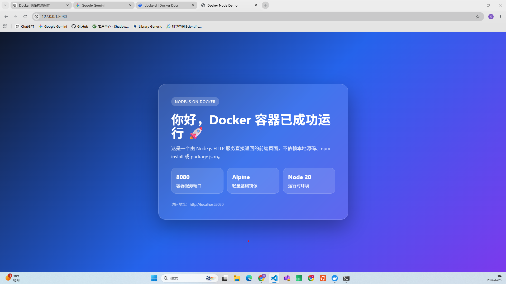
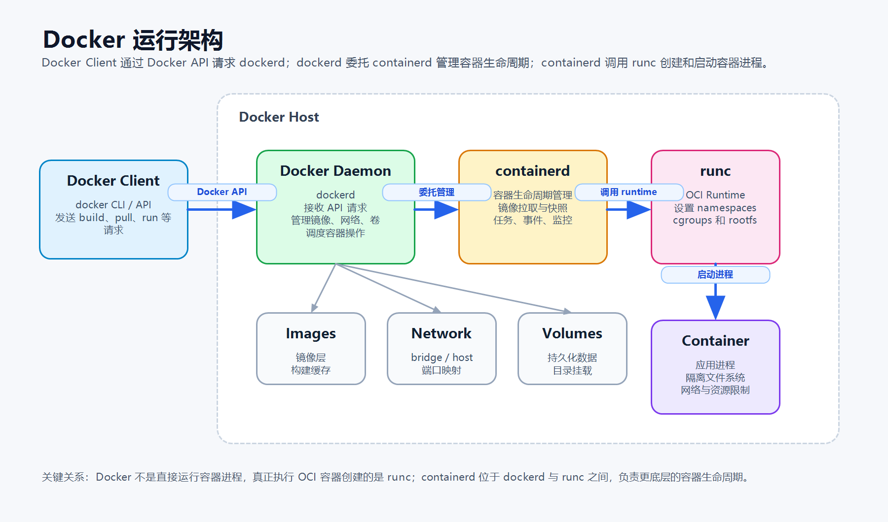
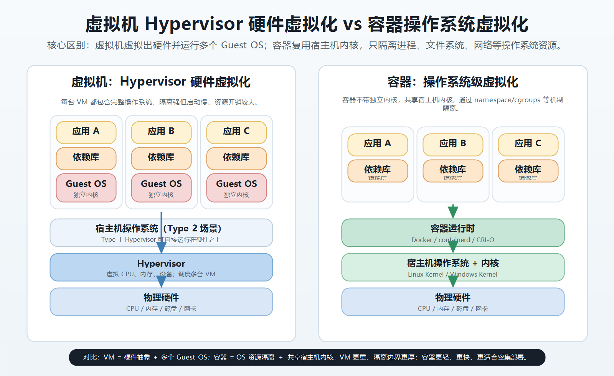
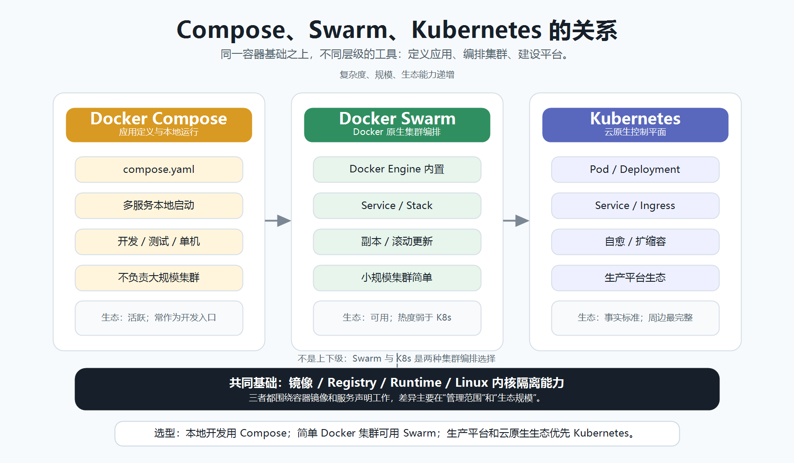
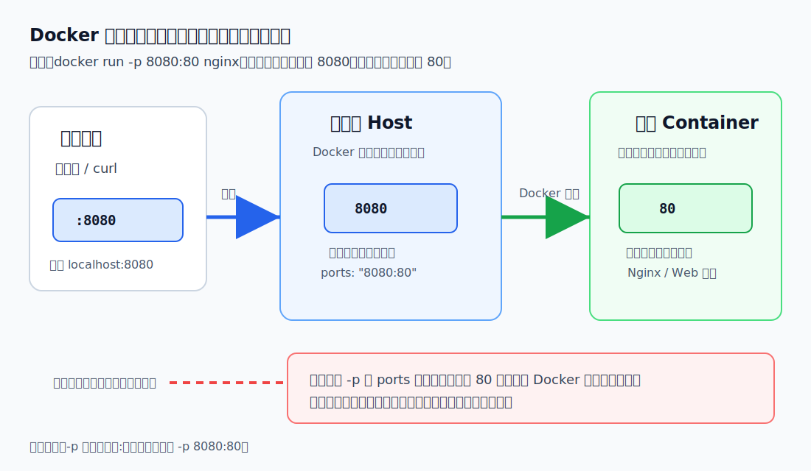
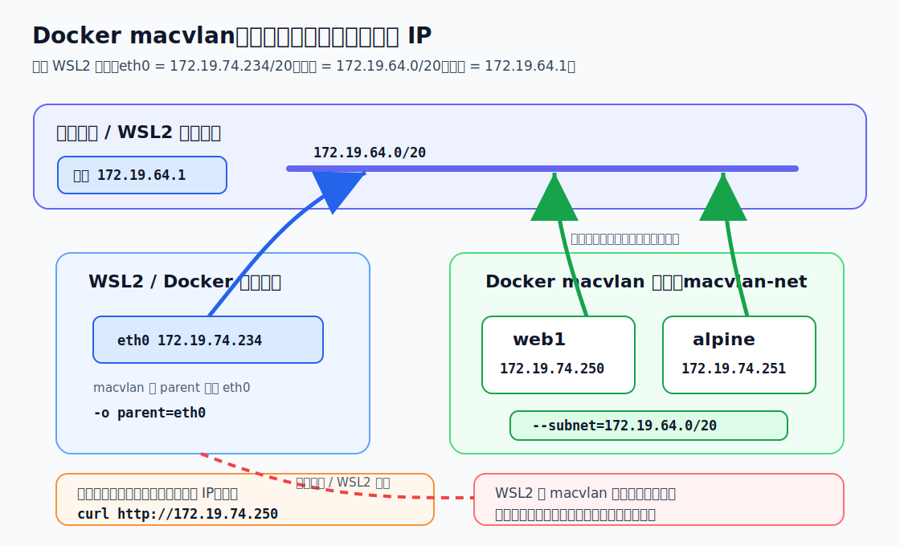

我是从 2018 年工作后才听说 Docker 的。那个时候我做模型训练工作，就经常听软件工程师同事说制作 Docker 镜像之类的，不过当时不太懂他们说的内容。毕竟刚开始工作的时候我连操作系统的书籍都没看过，想要真正理解虚拟化容器的确有点难。当时他们应该是做训练服务器的环境镜像。直到 2021 年，我开始进入百度接触自动驾驶，才发现容器技术在互联网行业已经是非常基础的工具了。不论是研发/测试还是运维，平时的工作都需要使用大量容器作为基础设施。在此之前我做 C++ 的一些软件研发，就非常反感开发环境的变动，以及编译出来的可执行文件在系统部署时经常缺少动态库、依赖或者库版本不匹配等问题。看到阿波罗系统的设计，包括我们做的自动驾驶测试体系，我才发现这正是容器的核心应用场景之一。后面我做云开发，做 Security DevOps 平台，开始在云端跑自动化的环境隔离、CPU 分配、网络配置的 runner 任务，我才开始算是正式接触 Docker，当时就买了这本书看一下。那个时候没有大模型，软件开发模式还是以去官网看官方文档为主，我也是如此。云原生其实最适合用 Go 开发，我当时不会这门语言，基本上一周速通就开始写业务代码。因为 Docker 就是用 Go 开发的，调用起来比较方便。如果使用其他语言，都是用 HTTP 接口进行调用，而且 Go 部署起来也很方便，服务就是一个静态编译的可执行文件。扔到服务器上就能跑，还能管理分布式集群。

再往后我基本所有 Linux 的开发都是在 Docker 中完成的，毕竟宿主机的 Linux 就一个，如果随便安装不同版本的软件环境，冲突之后会出现各种繁琐的问题，而应用层放在 Docker 中就完全不用担心这些问题，甚至带 GUI 的软件或者 Web 前后端，我也都是部署在 Docker 里面，或者自己 commit 一个新的镜像重复使用。再往后我自己做 AI 推理部署，也都是部署到 Docker 中，调用宿主机的 CUDA，跟系统原生性能相比会略有降低，但是影响不大。当我看到身边的一些同事还在直接向系统路径里安装软件，而且不管版本问题的时候，我也是震惊了。这就是一个很基础的软件工程能力。

当然 Docker 比较大，如果追求更精简可以使用 runc，只保留最核心的功能，在云端使用消耗资源更小，只是一些常规的 Docker 接口不能用。我搞机器人经常要用 ROS，当然 ROS2 不同版本已经做了很好的隔离，不过我依然喜欢在专门的 ROS2 容器中安装配置不同的软件。

除了环境隔离，Docker 本身也可以对应用进行隔离，来避免崩溃影响整个系统等。现在有 Codex 或者 Claude Code 辅助，相比于前些年，这种系统工具的使用和问题解决方便了很多。以前还需要背一些常用的命令，现在根本不需要，只要把命令的用途和参数弄清楚，直接让 AI 写一些脚本命令就行。出了一些常规问题，AI 排查得也非常快。

# 1. Docker 简介
在 Docker 容器流行之前，如果想在操作系统上跑其他的操作系统环境，比如在 Windows 上跑 Linux，需要使用虚拟机。虚拟机相比于容器更重，会占用更多的系统资源。我在刚工作的时候，在 Windows 电脑上开发 Linux 和嵌入式应用都是使用虚拟机。不过后来 Windows 上的 WSL 已经可以很好地跑 Linux 环境了，再配上 Docker 容器简直如虎添翼。不过虚拟机也不会退出历史舞台，只是很多轻量级场景不再是必须。

K8s 是构建于容器之上的容器编排工具。Docker 是一个容器运行时，不过也可以在 K8s 中替换为其他的容器运行时。Docker 运行需要 Daemon，这在系统安全上存在被攻击的风险，而后起之秀 Podman 就不需要 Daemon。只不过 Podman 没有 Docker 那么大的流行度。很多软件都会发行 Docker 容器，但是不一定支持其他的容器，有时候需要自己制作容器镜像。

我是在 Windows 上写的文章，Docker 也安装在 Windows 上，不过我喜欢使用 Linux 环境，所以安装了 WSL2。已经安装好的 Docker 可以挂载到 WSL2 的 Linux 上。然后我就在 Ubuntu 的命令行敲 docker 命令就行。甚至可以在里面装个 Claude 的 CLI，就可以直接用 AI 对话去驱动 Docker 指令。比如我查看一下 Docker 的系统信息：
```shell
gaoming2@gaoming:~$ docker system info
Client:
 Version:    29.4.0
 Context:    default
 Debug Mode: false
 Plugins:
  agent: Docker AI Agent Runner (Docker Inc.)
    Version:  v1.42.0
    Path:     /usr/local/lib/docker/cli-plugins/docker-agent
  ai: Docker AI Agent - Ask Gordon (Docker Inc.)
    Version:  v1.20.2
    Path:     /usr/local/lib/docker/cli-plugins/docker-ai
  buildx: Docker Buildx (Docker Inc.)
    Version:  v0.33.0-desktop.1
    Path:     /usr/local/lib/docker/cli-plugins/docker-buildx
  compose: Docker Compose (Docker Inc.)
    Version:  v5.1.1
    Path:     /usr/local/lib/docker/cli-plugins/docker-compose
  debug: Get a shell into any image or container (Docker Inc.)
    Version:  0.0.47
    Path:     /usr/local/lib/docker/cli-plugins/docker-debug
  desktop: Docker Desktop commands (Docker Inc.)
    Version:  v0.3.0
    Path:     /usr/local/lib/docker/cli-plugins/docker-desktop
  dhi: CLI for managing Docker Hardened Images (Docker Inc.)
    Version:  v0.0.2
    Path:     /usr/local/lib/docker/cli-plugins/docker-dhi
  extension: Manages Docker extensions (Docker Inc.)
    Version:  v0.2.31
    Path:     /usr/local/lib/docker/cli-plugins/docker-extension
  init: Creates Docker-related starter files for your project (Docker Inc.)
    Version:  v1.4.0
    Path:     /usr/local/lib/docker/cli-plugins/docker-init
  mcp: Docker MCP Plugin (Docker Inc.)
    Version:  v0.40.3
    Path:     /usr/local/lib/docker/cli-plugins/docker-mcp
  model: Docker Model Runner (Docker Inc.)
    Version:  v1.1.29
    Path:     /usr/local/lib/docker/cli-plugins/docker-model
  offload: Docker Offload (Docker Inc.)
    Version:  v0.5.82
    Path:     /usr/local/lib/docker/cli-plugins/docker-offload
  pass: Docker Pass Secrets Manager Plugin (beta) (Docker Inc.)
    Version:  v0.0.25
    Path:     /usr/local/lib/docker/cli-plugins/docker-pass
  sandbox:  (Docker Inc.)
    Version:  v0.12.0
    Path:     /usr/local/lib/docker/cli-plugins/docker-sandbox
  sbom: View the packaged-based Software Bill Of Materials (SBOM) for an image (Anchore Inc.)
    Version:  0.6.0
    Path:     /usr/local/lib/docker/cli-plugins/docker-sbom
  scout: Docker Scout (Docker Inc.)
    Version:  v1.20.3
    Path:     /usr/local/lib/docker/cli-plugins/docker-scout

Server:
 Containers: 0
  Running: 0
  Paused: 0
  Stopped: 0
 Images: 0
 Server Version: 29.4.0
 Storage Driver: overlayfs
  driver-type: io.containerd.snapshotter.v1
 Logging Driver: json-file
 Cgroup Driver: cgroupfs
 Cgroup Version: 2
 Plugins:
  Volume: local
  Network: bridge host ipvlan macvlan null overlay
  Log: awslogs fluentd gcplogs gelf journald json-file local splunk syslog
 CDI spec directories:
  /etc/cdi
  /var/run/cdi
 Discovered Devices:
  cdi: docker.com/gpu=webgpu
 Swarm: inactive
 Runtimes: io.containerd.runc.v2 nvidia runc
 Default Runtime: runc
 Init Binary: docker-init
 containerd version: dea7da592f5d1d2b7755e3a161be07f43fad8f75
 runc version: v1.3.4-0-gd6d73eb8
 init version: de40ad0
 Security Options:
  seccomp
   Profile: builtin
  cgroupns
 Kernel Version: 6.18.33.1-microsoft-standard-WSL2
 Operating System: Docker Desktop
 OSType: linux
 Architecture: x86_64
 CPUs: 20
 Total Memory: 15.48GiB
 Name: docker-desktop
 ID: 896fd126-5a26-4f38-90cf-258251abdbe8
 Docker Root Dir: /var/lib/docker
 Debug Mode: false
 HTTP Proxy: http.docker.internal:3128
 HTTPS Proxy: http.docker.internal:3128
 No Proxy: hubproxy.docker.internal
 Labels:
  com.docker.desktop.address=unix:///var/run/docker-cli.sock
 Experimental: false
 Insecure Registries:
  hubproxy.docker.internal:5555
  ::1/128
  127.0.0.0/8
 Live Restore Enabled: false
 Firewall Backend: iptables
```
从上面可以看到，比较新的 Docker 中默认已经安装了 AI Agent 的 Runner。

# 2. Docker 使用
Docker 的安装按照官网或者用大模型的 CLI 直接弄就行。Docker 的存储配置会直接影响 Docker 的运行性能。如果是 Linux 环境，可以查看 `/etc/docker/daemon.json` 来配置。

拉取镜像
```shell
gaoming2@gaoming:~$ docker pull ubuntu:latest
latest: Pulling from library/ubuntu
d1f56e4c7f2f: Pull complete
81e2f2053c8f: Pull complete
107e4f1717f2: Download complete
Digest: sha256:53958ec7b67c2c9355df922dd08dbf0360611f8c3cdb656875e81873db9ffdba
Status: Downloaded newer image for ubuntu:latest
docker.io/library/ubuntu:latest
gaoming2@gaoming:~$ docker images
                                                                                                    i Info →   U  In Use
IMAGE           ID             DISK USAGE   CONTENT SIZE   EXTRA
ubuntu:latest   53958ec7b67c        160MB         45.3MB
```

Docker 中每一个镜像或者容器都有一个专属 ID，可以直接对 ID 进行操作来操纵容器或者镜像。

镜像就相当于一个 Linux 的文件系统，以及里面配置的一些环境依赖。真正运行的是容器，一个镜像可以产生多个容器，容器之间彼此独立。

上面例子拉取的是 Ubuntu 的镜像，如果启动一个容器：
```shell
gaoming2@gaoming:~$ docker run -it ubuntu:latest /bin/bash
root@c29d6a2a594b:/#
```
这样就进入到容器系统中了，`-it` 是以交互的方式进入，可以进行命令行操作，否则容器中没有执行的任务，启动后就会停止。对于这种以脚本交互方式连接的容器，直接 Ctrl+D 就可以关闭连接并且关闭容器。Ctrl+P+Q 可以退出交互，但是维持容器运行。

以shell交互的方式连接上一个正在运行的容器,容器的名字和id都是匹配的，用哪个都行
```shell
gaoming2@gaoming:~$ docker container exec -it c29d6a2a594b bash
root@c29d6a2a594b:/# ls
bin  boot  dev  etc  home  lib  lib64  media  mnt  opt  proc  root  run  sbin  srv  sys  tmp  usr  var
```

通过stop和rm可以停止或者删除某个容器。Docker的命令和参数很多，文章中不会每个都讲，可以参考官方文档或者使用大模型辅助即可。

上面直接拉取镜像的方式获得镜像后，可以通过脚本交互启动进入容器后，手动执行一些安装依赖的命令，然后把容器打包成新的镜像发布。也可以编写Dockerfile文件，在里面写清楚需要拉取什么镜像，拉取镜像后需要安装什么软件依赖以及对容器中的文件进行什么操作来启动容器

下面就是一个Dockerfile
```docker
FROM node:20-alpine

WORKDIR /app

EXPOSE 8080

CMD ["node", "-e", "\
const http = require('http'); \
http.createServer((req, res) => { \
  res.end('hello docker\\n'); \
}).listen(8080, '0.0.0.0', () => { \
  console.log('server running on 8080'); \
});"]
```
从一个官方镜像开始构建并启动一个nodejs的界面对外提供服务。

```shell
gaoming2@gaoming:~/projects/test_docker$ docker image build -t test:v0.0.1 .
[+] Building -8.5s (6/6) FINISHED                                                                        docker:default
 => [internal] load build definition from Dockerfile                                                               0.0s
 => => transferring dockerfile: 296B                                                                               0.0s
 => [internal] load metadata for docker.io/library/node:20-alpine                                                  0.0s
 => [internal] load .dockerignore                                                                                  0.0s
 => => transferring context: 2B                                                                                    0.0s
 => CACHED [1/2] FROM docker.io/library/node:20-alpine@sha256:fb4cd12c85ee03686f6af5362a0b0d56d50c58a04632e6c0fb8  0.1s
 => => resolve docker.io/library/node:20-alpine@sha256:fb4cd12c85ee03686f6af5362a0b0d56d50c58a04632e6c0fb8363f609  0.1s
 => [2/2] WORKDIR /app                                                                                             0.1s
 => exporting to image                                                                                             0.6s
 => => exporting layers                                                                                            0.3s
 => => exporting manifest sha256:0e3f8ce428b92be73b72051ab879e97f953a64e9f143faf7bfe3e7a9ff9eb3bd                  0.0s
 => => exporting config sha256:7ffcb3f27d93ed386802805a6bc2af8a58f805aa626355b8d2f8529f95a0b031                    0.0s
 => => exporting attestation manifest sha256:b21a557f74b6cb96ccfc3205db73b01e30d0765166f1f0fdc1887a8c4071aadb      0.1s
 => => exporting manifest list sha256:f0b097468bc746bb9c52934263aa62ad6ec8e0dc3ba511edb555c682e32f7ad3             0.1s
 => => naming to docker.io/library/test:v0.0.1                                                                     0.0s
 => => unpacking to docker.io/library/test:v0.0.1                                                                  0.1s
gaoming2@gaoming:~/projects/test_docker$ docker images
                                                                                                    i Info →   U  In Use
IMAGE           ID             DISK USAGE   CONTENT SIZE   EXTRA
test:v0.0.1     f0b097468bc7        193MB         48.4MB
ubuntu:latest   53958ec7b67c        160MB         45.3MB    U
```
在Dockerfile路径下执行上述构建镜像的命令就可以生成一个新的镜像，有我们在命令中设置的版本号信息。

运行容器
```shell
docker run --rm -p 8080:8080 test:v0.0.1
```
直接访问8080端口就可以看到服务的返回信息，上面的命令中--rm是当容器停止就删除容器。

如果觉得上面返回的信息在界面上太丑就换一个漂亮的界面
```docker
FROM node:20-alpine

WORKDIR /app

EXPOSE 8080

CMD ["node", "-e", "\
const http = require('http'); \
const html = `<!doctype html> \
<html lang='zh-CN'> \
<head> \
<meta charset='utf-8'> \
<meta name='viewport' content='width=device-width, initial-scale=1'> \
<title>Docker Node Demo</title> \
<style> \
*{box-sizing:border-box} \
body{margin:0;min-height:100vh;display:flex;align-items:center;justify-content:center;font-family:-apple-system,BlinkMacSystemFont,'Segoe UI',Arial,sans-serif;background:linear-gradient(135deg,#0f172a,#2563eb,#7c3aed);color:#fff} \
.card{width:min(720px,92vw);padding:48px;border-radius:28px;background:rgba(255,255,255,.12);box-shadow:0 30px 80px rgba(0,0,0,.35);backdrop-filter:blur(18px);border:1px solid rgba(255,255,255,.22)} \
.badge{display:inline-block;padding:8px 14px;border-radius:999px;background:rgba(255,255,255,.18);font-size:14px;letter-spacing:.08em;text-transform:uppercase} \
h1{font-size:48px;margin:24px 0 12px;line-height:1.08} \
p{font-size:18px;line-height:1.7;color:rgba(255,255,255,.86)} \
.grid{display:grid;grid-template-columns:repeat(3,1fr);gap:14px;margin-top:28px} \
.item{padding:18px;border-radius:18px;background:rgba(255,255,255,.13);border:1px solid rgba(255,255,255,.16)} \
.item strong{display:block;font-size:22px;margin-bottom:6px} \
.footer{margin-top:30px;font-size:14px;color:rgba(255,255,255,.7)} \
@media(max-width:640px){h1{font-size:34px}.card{padding:32px}.grid{grid-template-columns:1fr}} \
</style> \
</head> \
<body> \
<main class='card'> \
<span class='badge'>Node.js on Docker</span> \
<h1>你好，Docker 容器已成功运行 🚀</h1> \
<p>这是一个由 Node.js HTTP 服务直接返回的前端页面，不依赖本地源码、npm install 或 package.json。</p> \
<section class='grid'> \
<div class='item'><strong>8080</strong>容器服务端口</div> \
<div class='item'><strong>Alpine</strong>轻量基础镜像</div> \
<div class='item'><strong>Node 20</strong>运行时环境</div> \
</section> \
<div class='footer'>访问地址：http://localhost:8080</div> \
</main> \
</body> \
</html>`; \
http.createServer((req, res) => { \
  res.writeHead(200, {'Content-Type':'text/html; charset=utf-8'}); \
  res.end(html); \
}).listen(8080, '0.0.0.0', () => { \
  console.log('beautiful page running on 8080'); \
});"]
```
运行访问界面如下：




## 2.1 Docker的架构
Docker、containerd 和 runc 的关系可以简单理解为下面这张图：



在早期的Docker版本中Daemon的功能大而全，但是非常不适合拓展，且伴随集成的功能太多，运行性能也大幅下降。后续对Daemon进行了拆分，让containerd负责容器的生命周期管理，runc负责容器的创建。runc符合OCI运行时标准。这个标准的制定是为了防止Docker一家独大形成垄断，可以让其他符合标准的容器运行时进行替换。在系统领域，不论是容器技术，还是操作系统或者虚拟机，都有类似的机制。

Docker拉取镜像的仓库分为官方和非官方两种，默认安装后使用的是官方仓库，官方仓库的好处是镜像有Docker官方审查，更安全，有完善的文档。但是在国内使用不太方便，容易被墙。非官方的仓库没有官方的那些保障，我使用google的镜像源其实质量也是可以的。镜像仓库可以通过修改配置文件设置。

可以使用CLI的方式搜索镜像
```shell
gaoming2@gaoming:~$ docker search ngnix
NAME                   DESCRIPTION    STARS     OFFICIAL
userxy2015/ngnix       ngnix          18
theburi/ngnix          ngnix          0
ssvreddy/ngnix                        0
alamalhoda/ngnix                      0
bharath2012/ngnix                     0
accuknoxns/ngnix                      0
sitek/ngnix            Just ngnix     0
snehagupta83/ngnix     Test setup     0
jenorish/ngnix                        0
ganeshghube23/ngnix                   0
harshjain12/ngnix                     0
sunlitweb/ngnix                       0
covenant/ngnix                        0
aquasmita/ngnix                       0
starlkj/ngnix          tde test       0
050544117/ngnix                       0
selaworkshops/ngnix                   0
jhuiting/ngnix                        1
sachinar/ngnix                        0
alp1ne/ngnix                          0
visheshpapreja/ngnix                  0
praticeuser/ngnix      For Ngnix      0
claclin73/ngnix        Ngnix 1.15.7   0
diegograssato/ngnix                   0
prad8018441/ngnix                     0
```
我一般都是使用GUI的程序在里面检索。

查看镜像细节信息
```shell
gaoming2@gaoming:~$ docker image inspect ubuntu:latest
[
    {
        "Id": "sha256:53958ec7b67c2c9355df922dd08dbf0360611f8c3cdb656875e81873db9ffdba",
        "RepoTags": [
            "ubuntu:latest"
        ],
        "RepoDigests": [
            "ubuntu@sha256:53958ec7b67c2c9355df922dd08dbf0360611f8c3cdb656875e81873db9ffdba"
        ],
        "Comment": "Add rock control metadata",
        "Created": "2026-06-10T03:29:33.588447386Z",
        "Config": {
            "Env": [
                "PATH=/usr/local/sbin:/usr/local/bin:/usr/sbin:/usr/bin:/sbin:/bin"
            ],
            "Cmd": [
                "/bin/bash"
            ],
            "Labels": {
                "org.opencontainers.image.created": "2026-06-10T03:30:57.931695+00:00",
                "org.opencontainers.image.description": "The Ubuntu container image maintained by Canonical\n\nUbuntu is a Debian-based Linux operating system that runs from the desktop to the cloud, to all your internet connected things.\nIt is the world's most popular operating system across public clouds and OpenStack clouds.\nIt is the number one platform for containers; from Docker to Kubernetes to LXD, Ubuntu can run your containers at scale.\nFast, secure and simple, Ubuntu powers millions of PCs worldwide.\n",
                "org.opencontainers.image.title": "ubuntu",
                "org.opencontainers.image.version": "26.04"
            }
        },
        "Architecture": "amd64",
        "Os": "linux",
        "Size": 41575098,
        "RootFS": {
            "Type": "layers",
            "Layers": [
                "sha256:e8c084c1b320c172e8be941d735d77298e49986014213a8282c9b533ee216a61",
                "sha256:ab0ae19b58df847c6f0e4beb31f759a4dac2cc42288a6bda6f467eea4584c541"
            ]
        },
        "Metadata": {
            "LastTagTime": "2026-06-25T02:20:56.793044057Z"
        },
        "Descriptor": {
            "mediaType": "application/vnd.oci.image.index.v1+json",
            "digest": "sha256:53958ec7b67c2c9355df922dd08dbf0360611f8c3cdb656875e81873db9ffdba",
            "size": 6694
        },
        "Identity": {
            "Pull": [
                {
                    "Repository": "docker.io/library/ubuntu"
                }
            ]
        }
    }
]
```
## 2.2 Docker容器
容器会共享宿主机的内核和操作系统。

虚拟机与容器虚拟化差异示意图



上图中对比了虚拟机和容器技术的差异，准确来说，虚拟机是硬件的虚拟化，而容器是操作系统的虚拟化。不过这些概念本身也在发展变化，比如我现在使用的windows上的WSL，我虽然也可以使用容器，但是在操作系统的更底层，其实是存在一个虚拟机的。这是微软做的比较好的地方，相比直接在windows上使用一些vmware的虚拟机，很流畅没有什么卡顿。容器是共享操作系统的cpu，核心等资源的。

我以前做云端devops平台，相当于给软件开发跑测试系统，就是要给每个runner任务配置不同的cpu数量，绑定核心甚至控制对外通信流量等。现在我在做具身智能方向，给AI模型提供基础设施，搭建数据流水线，配置训练，仿真，评测体系甚至软件在环等都需要容器技术作为最底层支持的。

Docker常规的容器操作命令比如run/exec/stop/rm/start/inspect都是非常常用的功能，这里不再过多介绍了。

## 2.3 应用容器化
很多的应用程序或者服务程序，为了避免互相干扰环境或者方便配置系统资源，可以使用将应用打包成一个Docker镜像，然后在容器中运行的方式来把应用容器化。具体的方法我在前面那个打包nodejs的例子中已经演示了。

其实我平时开发也都是在容器中自己搭建DEV Docker，然后attach进去开发的。好处就是环境配置坏了或者出什么问题，再起一个容器或者镜像就行了，不至于折腾宿主机这种单一的环境。

需要注意的是Docker的镜像是包含多个层的，每个层都有单独的哈希值，是根据其二进制内容生成的，这样做的好处是可以避免被篡改内容。下面就是我自己做的镜像的inspect信息，可以很清楚地看到是当前镜像包含四层。

```shell
gaoming2@gaoming:~$ docker inspect f0b097468bc7
[
    {
        "Id": "sha256:f0b097468bc746bb9c52934263aa62ad6ec8e0dc3ba511edb555c682e32f7ad3",
        "RepoTags": [
            "test:v0.0.1"
        ],
        "RepoDigests": [
            "test@sha256:f0b097468bc746bb9c52934263aa62ad6ec8e0dc3ba511edb555c682e32f7ad3"
        ],
        "Comment": "buildkit.dockerfile.v0",
        "Created": "2026-06-25T09:32:18.523213437Z",
        "Config": {
            "ExposedPorts": {
                "8080/tcp": {}
            },
            "Env": [
                "PATH=/usr/local/sbin:/usr/local/bin:/usr/sbin:/usr/bin:/sbin:/bin",
                "NODE_VERSION=20.20.2",
                "YARN_VERSION=1.22.22"
            ],
            "Entrypoint": [
                "docker-entrypoint.sh"
            ],
            "Cmd": [
                "node",
                "-e",
                "const http = require('http'); http.createServer((req, res) => {   res.end('hello docker\\n'); }).listen(8080, '0.0.0.0', () => {   console.log('server running on 8080'); });"
            ],
            "WorkingDir": "/app",
            "ArgsEscaped": true
        },
        "Architecture": "amd64",
        "Os": "linux",
        "Size": 48365750,
        "RootFS": {
            "Type": "layers",
            "Layers": [
                "sha256:29df493baa13de438d6d2ece3a8333032e0b7b9b9d8cce4ee82194da255f61e1",
                "sha256:4983b93ee7967564f02cbf6162b75010ce557404a539fba05ee19a0eae01acbc",
                "sha256:e10358715ead9b47009dd04bcd77ac1c8e247f7249ab06517ff913c473a8e38e",
                "sha256:afa543f85b4685a84338df3e2c429edca49bb372b0f49e0c5cc9724c820ad094",
                "sha256:dbb2463122ab9585ce3d15111eedcaba9ef06593ad61e986935179debd21935a"
            ]
        },
        "Metadata": {
            "LastTagTime": "2026-06-25T09:32:19.101828142Z"
        },
        "Descriptor": {
            "mediaType": "application/vnd.oci.image.index.v1+json",
            "digest": "sha256:f0b097468bc746bb9c52934263aa62ad6ec8e0dc3ba511edb555c682e32f7ad3",
            "size": 856
        },
        "Identity": {
            "Build": [
                {
                    "Ref": "v37bub1egmgzljjuoo614whvl",
                    "CreatedAt": "2026-06-25T09:32:19.159481411Z"
                }
            ]
        }
    }
]
```

书里面提到把开发镜像和生产环境镜像有所区分。这是合理的，开发镜像往往镜像的体积很大，包含大量辅助的工具软件。而生产环境尤其是云端部署，要求尽量小来提高性能并避免被攻击概率。

在构建镜像的时候，Docker会优先检查缓存中是否拥有该层的数据，如果有则直接使用。所以如果环境是干净的，第一次构建镜像时间会比较长，因为需要从远端拉取不同层的镜像数据，而一旦本地有了缓存，则是秒级拷贝非常快。

# 3.Docker Compose
对于一些复杂的应用，往往伴随多个服务。每个服务都是单独一个Docker容器。举个简单的例子，我自己搭建内网个人使用的Gitlab服务，这个本身就是一个Docker镜像，但是运行起来就会发现里面有很多的其他服务，不同的Docker镜像都是使用Compose的yaml配置文件进行组织的。再比如很多开源Agent框架都是使用Web的软件架构体系，前端一个容器，后端微服务每个服务一个镜像，这样设计的好处就是如果后续需要动态增删新的服务，直接编写新的服务节点代码和配置容器就行，然后继续使用yaml进行总体的配置即可。其他的不相关的服务基本不用动，有效解耦。

Compose可以理解为Docker多容器的一个管理解决框架。在比较新的版本中，Docker Compose已经内置在Docker安装中了，不再需要额外安装，书中这部分内容已经过时。




简而言之就是如果是单机多容器就用Docker Compose，如果是多机协同就直接上K8S，Docker Swarm基本就不要用了。

下面是一个docker compose的小demo展示，一个前端服务的容器一个python flask写的后端服务，通过docker-compose.yml文件进行服务配置，并且在每个文件夹下面分别由自己的Dockerfile文件配置镜像组合对外提供服务

目录树如下
```shell
test_compose/
├── docker-compose.yml
├── backend/
│   ├── app.py
│   ├── Dockerfile
│   └── requirements.txt
└── frontend/
    ├── Dockerfile
    ├── index.html
    └── nginx.conf
```

docker-compose.yml负责配置不同容器服务
```yaml
services:
  backend:
    build: ./backend
    container_name: flask-backend
    ports:
      - "5000:5000"

  frontend:
    build: ./frontend
    container_name: web-frontend
    ports:
      - "8080:80"
    depends_on:
      - backend
```
一个前端一个后端，做了容器命令和端口映射以及容器之间的依赖关系，让compose去编排。

在这个配置下，前端依赖后端，所以我先分析后端的模块

后端的requirements.txt是需要的python包，app.py中是flask写的具体后端的路由服务。Dockerfile中是后端容器具体的镜像，需要进行安装和拷贝文件的配置以及启动容器开启服务的命令。

app.py

```python
from flask import Flask, jsonify
from flask_cors import CORS

app = Flask(__name__)
CORS(app)

count = 0

@app.route("/api/count", methods=["GET"])
def get_count():
    return jsonify({"count": count})

@app.route("/api/increment", methods=["POST"])
def increment():
    global count
    count += 1
    return jsonify({"count": count})

@app.route("/api/reset", methods=["POST"])
def reset():
    global count
    count = 0
    return jsonify({"count": count})

if __name__ == "__main__":
    app.run(host="0.0.0.0", port=5000)

```

Dockerfile

```docker
FROM python:3.12-slim

WORKDIR /app

COPY requirements.txt .
RUN pip install --no-cache-dir -r requirements.txt

COPY app.py .

EXPOSE 5000

CMD ["python", "app.py"]

```

requirements.txt
```txt
flask
flask-cors
```


前端的容器做的事情就是直接拉一个nginx的反向代理容器，然后把nginx的配置文件和html文件拷贝进去，配置后端的URL和端口信息。html中自带了js的函数，来动态响应界面交互逻辑。

Dockerfile
```docker
FROM nginx:alpine

COPY index.html /usr/share/nginx/html/index.html
COPY nginx.conf /etc/nginx/conf.d/default.conf

EXPOSE 80

```

index.html
```html
<!DOCTYPE html>
<html lang="zh-CN">
<head>
  <meta charset="UTF-8" />
  <title>Compose Demo</title>
</head>
<body>
  <h1>Docker Compose 累加 Demo</h1>

  <p>当前计数：<span id="count">0</span></p>

  <button onclick="increment()">+1</button>
  <button onclick="resetCount()">重置</button>

  <script>
    const apiBase = "/api";

    async function loadCount() {
      const res = await fetch(`${apiBase}/count`);
      const data = await res.json();
      document.getElementById("count").innerText = data.count;
    }

    async function increment() {
      const res = await fetch(`${apiBase}/increment`, {
        method: "POST"
      });
      const data = await res.json();
      document.getElementById("count").innerText = data.count;
    }

    async function resetCount() {
      const res = await fetch(`${apiBase}/reset`, {
        method: "POST"
      });
      const data = await res.json();
      document.getElementById("count").innerText = data.count;
    }

    loadCount();
  </script>
</body>
</html>

```

nginx.conf
```conf
server {
    listen 80;

    location / {
        root /usr/share/nginx/html;
        index index.html;
    }

    location /api/ {
        proxy_pass http://backend:5000/api/;
    }
}

```

在docker-compose.yml文件的当前路径下执行命令
```shell
docker compose up --build
```
来启动compose应用

访问服务
```shell
http://localhost:8080
```

启动compose应用
```shell
docker compose up
```

后台启动compose 应用
```shell
docker compose up -d
```

停止compose应用
```shell
docker compose stop
```

重启compose应用
```shell
docker compose restart
```
删除compose应用
```shell
docker compose down
```
连同数据卷一起删除
```shell
docker compose down -v
```

查看compose应用服务状态
```shell
docker compose ps
```
其实从使用端来看，compose的存在就是像使用单一容器一样去使用多个编排好的容器。

Docker Swarm不用看

# 4.Docker网络
Docker本地的网络在Linux系统使用的是bridge，对于单机网桥模式，使用默认网桥，可以使用ip ping通，但是不能进行dns解析。可以自己设置网桥

```shell
 docker network create -d bridge localnet
```
上述代码设置了localnet网桥，如果在启动容器的时候，让容器使用该网桥
```shell
 docker container run -it --name c1 --network localnet alpine sleep 1d
 docker container run -it --name c2 --network localnet alpine sh
```
上述代码启动了两个容器，其中第二个进入到终端，此时如果在c2容器ping c1是可以ping通的
```shell
/ # ping c1
PING c1 (172.18.0.2): 56 data bytes
64 bytes from 172.18.0.2: seq=0 ttl=64 time=0.067 ms
64 bytes from 172.18.0.2: seq=1 ttl=64 time=0.080 ms
64 bytes from 172.18.0.2: seq=2 ttl=64 time=0.104 ms
64 bytes from 172.18.0.2: seq=3 ttl=64 time=0.247 ms
```
这是因为c2容器运行了一个本地的DNS解析器，该解析器将请求转发到Docker内部的DNS服务器中，DNS服务器中记录了容器启动时通过--name指定的名字与容器之间的映射。进而解析出ip。


Docker 端口映射的核心是把宿主机的某个端口发布出来，再由 Docker 转发到容器内部真正监听的端口。例如 `-p 8080:80` 或 compose 里的 `"8080:80"`，左边的 `8080` 是宿主机对外暴露的端口，右边的 `80` 是容器内部服务监听的端口。




## macvlan demo

macvlan 的作用是让容器直接接入宿主机所在的二层网络。使用 bridge 网络时，容器通常躲在宿主机后面，需要通过端口映射对外提供服务；使用 macvlan 时，容器可以拿到和宿主机同网段的独立 IP，看起来就像网络里的一台独立主机。

当前这台 WSL2 环境的网络信息如下：

```shell
ip addr
```

关键信息：

```text
网卡：eth0
WSL2 IP：172.19.74.234/20
广播地址：172.19.79.255
```

```shell
ip route
```

关键信息：

```text
default via 172.19.64.1 dev eth0
172.19.64.0/20 dev eth0 proto kernel scope link src 172.19.74.234
```

所以这台机器上创建 macvlan 网络时，应该使用：

```text
网段：172.19.64.0/20
网关：172.19.64.1
父网卡：eth0
```

创建 macvlan 网络：

```shell
docker network create -d macvlan \
  --subnet=172.19.64.0/20 \
  --gateway=172.19.64.1 \
  -o parent=eth0 \
  macvlan-net
```

参数含义：

- `-d macvlan`：创建 macvlan 类型的 Docker 网络。
- `--subnet=172.19.64.0/20`：容器要加入的网段，来自当前 WSL2 的 `ip route`。
- `--gateway=172.19.64.1`：当前 WSL2 的默认网关。
- `-o parent=eth0`：把 macvlan 挂到 WSL2 的 `eth0` 网卡下面。
- `macvlan-net`：Docker 网络名称。

启动一个 nginx 容器，并给它分配同网段 IP。当前 WSL2 自己的 IP 是 `172.19.74.234`，所以容器不能再用这个 IP。下面示例暂用 `172.19.74.250`，实际执行前要确认这个 IP 没有被占用。

```shell
docker run -d --name web1 \
  --network macvlan-net \
  --ip 172.19.74.250 \
  nginx:alpine
```

查看容器 IP：

```shell
docker inspect web1 | grep IPAddress
```

在另一个容器中验证同一个 macvlan 网络里的容器互通：

```shell
docker run -it --rm \
  --network macvlan-net \
  --ip 172.19.74.251 \
  alpine sh
```

进入 alpine 后访问 nginx 容器：

```shell
wget -qO- http://172.19.74.250
```

如果返回 nginx 的 HTML 页面，说明 macvlan 网络内部是通的。

清理 demo：

```shell
docker rm -f web1
docker network rm macvlan-net
```

macvlan 适合以下场景：容器需要直接暴露在网络中、需要独立 IP、或者某些老系统要求服务必须运行在固定 IP 上。普通 Web 应用开发环境通常没必要使用 macvlan，bridge 网络加端口映射更简单。


下面这张图对应当前 WSL2 环境中的 macvlan demo：`eth0` 是父网卡，WSL2 自身 IP 是 `172.19.74.234/20`，macvlan 容器使用同一网段中的独立 IP，例如 `172.19.74.250` 和 `172.19.74.251`。



# 5.Docker卷与持久化数据
Docker中容器中的数据一般是非持久化的，也就是如果容器被删除，里面的数据也会被删除。如果想容器被删除后，指定的数据依然保存在磁盘上，可以使用卷进行持久化。

创建一个卷的方式比较简单
```shell
docker volume create myvol
```
检查一下
```shell
gaoming2@gaoming:~$ docker volume ls
DRIVER    VOLUME NAME
local     myvol
gaoming2@gaoming:~$ docker volume inspect myvol
[
    {
        "CreatedAt": "2026-06-27T13:15:01Z",
        "Driver": "local",
        "Labels": null,
        "Mountpoint": "/var/lib/docker/volumes/myvol/_data",
        "Name": "myvol",
        "Options": null,
        "Scope": "local"
    }
]
```
```shell
docker volume prune
```
命令会删除未被引用的卷。

```shell
gaoming2@gaoming:~$ docker container run -dit --name voltainer --mount source=bizvol,target=/vol alpine
f07522c7fac0e6f4447d09fe6dc7ee0a9b87e722df34a8d69218a6710cf9e3bc
```
上面的指令是启动一个容器，把卷bizvol挂载到根目录下的/vol位置，那么脸上容器向/vol写入数据，比如

```shell
echo "saasas" >/vol/test
```
然后把容器删了，卷bizvol的数据依然存在

由于我使用的是WSL2中操作的Docker，本质上Docker其实在Windows里面的虚拟机里面，所以真正卷挂载的地方跟纯Ubuntu是不一样的。

得先进入到Docker的Daemon的路径下
```shell
wsl -d docker-desktop
```
然后进到这个路径下就可以找到卷的数据了

```shell
docker-desktop:/mnt/docker-desktop-disk/data/docker/volumes/bizvol/_data
```

在Dockerfile中可以使用VOLUME指令来部署卷

Docker Stack是构建在Docker Swarm上的，生态一般，没有什么学习的必要，当前真正的生产环境都是使用K8S。我后面会写关于K8S的使用和源码的一些原理的文章。

