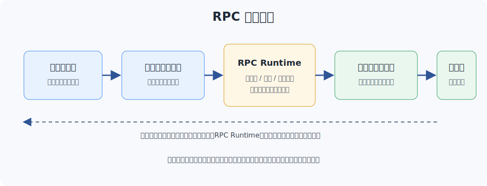
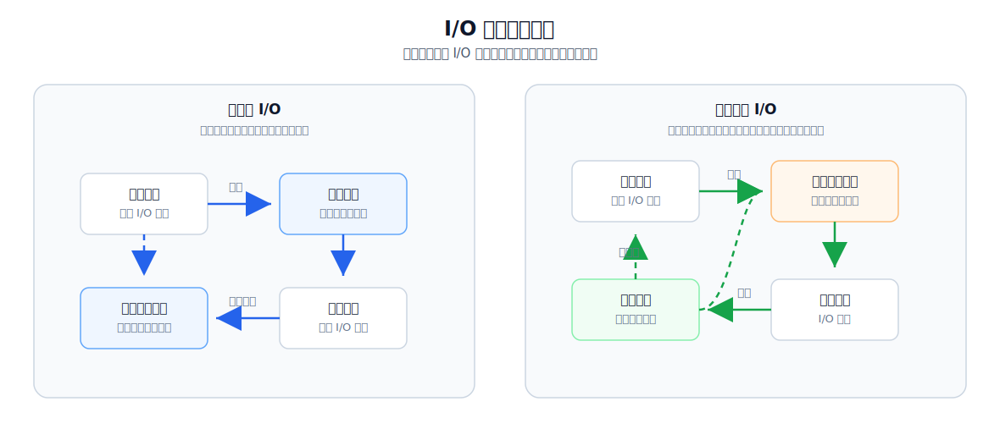
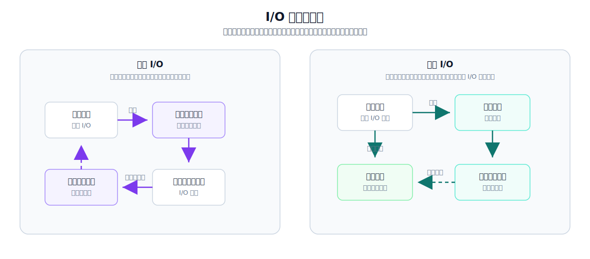

RPC 是当前应用软件开发中非常基础的进程间通信方式。我最早接触 RPC 是在 2018 年刚开始工作的时候，当时我们开发的机械臂视觉系统分为两个独立的软件：机械臂运动控制与仿真可视化软件，以及机器视觉算法软件。但是，机器视觉项目往往需要同时使用这两个软件。视觉软件接入相机数据，进行 2D/3D 视觉算法的识别定位，并把计算结果发送给机器人软件，进而控制真实机器人运动。当时使用的就是 gRPC。

对于这种跨进程通信，可选方法也比较多，比如管道、命名管道、信号、消息队列、信号量、共享内存、套接字等。我在实际开发中经常使用消息队列实现生产者-消费者模式；共享内存作为大量数据本机高性能通信的方式也不错，不过需要特定的优化和封装才好用，比如我在做自动驾驶中间件，或者设计大流量数据异构计算体系的时候，就使用过这种方法；套接字则更加基础，基于 TCP/UDP 自定义应用层协议后，可以用于本机或者跨机器通信，只不过套接字做应用层通信比较底层，对于一些需要快速对接开发的业务来说，如果没有封装，开发量会比较大。RPC 框架相比上述这些方法，尤其在跨机器通信的分布式应用中，由于封装了底层通信细节，可以快速接入业务需求，因此在云端服务开发或者应用软件开发领域使用得非常多。像我以前做自动驾驶 RT 中间件时，中间件体系本身就要对上层应用提供 RPC 调用接口。

我从 2021 年开始做云端服务开发，之前基本都是写 C++ 和机器人相关的软件，后面做 DevOps 时，大型服务都运行在服务器上。而且，当时写这种服务还切换了语言，现学的 Go。不过这段经历也挺好，拓展了我的技术视野和技术方向。比如现在做具身智能机器人的公司，软件体系实际上都比较落后，都希望招聘到会搭建 CI/CD 体系、自动化测试体系，甚至可以做模型算法评测体系的工程师。之所以要建设这套体系，就是因为手动方式效率太低，会造成巨大的时间和研发成本开销。而建立起比较完善的体系，可以大幅加快研发进度，快速推进技术产品迭代和落地，从而获得竞争优势。在最近这两年的 AI 能力加持下，使用更为先进的 Agent 体系，就能让少数几个人产生远超过去一个大团队的技术产出。

我是 2021 年买的这本书，不过当时没太看。那个时候还不到 30 岁，人比较年轻气盛，经常干一些风险很高的事情。比如我比较熟悉 C++ 开发，但是开发云服务明显 Go 更适合，我就在完全不懂这门语言的情况下，一边自学一边开发功能。那个时候没有 AI Coding 加持，也能一个星期上手并开发独立服务。到了 2026 年，其实这些东西都不算什么了，因为现在在 AI 加持下，不懂编程的歌手都能用 AI 做个 App。反正运行是可以跑出功能了，至于懂不懂里面的逻辑你别管！这本书的作者是 Dubbo 的核心贡献者，技术水准是在线的。Dubbo 这个框架在 Java 开发中用得非常广泛，我以前做一些安防监控类项目时，后台用 Java 写，就用了这个框架。这本书更多介绍的是 RPC 框架怎么设计，而不是具体 RPC 框架怎么使用。想学 gRPC 怎么使用，可以参考 https://grpc.io/，GitHub 上也有源码示例：https://github.com/grpc/grpc/tree/master/examples。

# 1. 初识 RPC
RPC 技术很早就出现了，上个世纪 80 年代 Nelson 的博士论文《Implementing Remote Procedure Calls》中，基本就奠定了现代 RPC 的基础框架。主要分为 5 个部分，分别是服务调用方、调用方本地存根、RPC Runtime、服务端本地存根和服务端。

RPC 的服务发现有两种方式，一种是直连，一种是注册中心。直连就是把地址和端口号固定好，然后调用方和服务方按照约定好的地址和端口号通信。但是，如果在云端生产环境中使用，这种方式过于死板。一旦服务发生变更，就需要同时更新调用端代码，这对于一些互联网应用来说并不合理。注册中心通常配合云端微服务架构使用，用于实现服务发现。服务提供者需要把地址和端口注册到注册中心，服务调用者则从注册中心获取对应的服务信息。这样的架构体系非常易于扩展。

# 2. 初识 RPC 框架
Dubbo 是阿里开源的 RPC 框架，主要在 Java 开发中使用。这个框架除了提供基础的 RPC 功能外，还提供服务治理能力。前面说过，对于云原生开发，微服务架构是目前最常用的。云端服务一旦多了，如何更高效地配置服务、增删服务、保持服务的稳定性等，就是服务治理需要考虑的问题。这个框架主要用于 Java Web 后端。

gRPC 是 2015 年 Google 开源的 RPC 框架，也是我使用最多的 RPC 框架。在开发机器人应用软件时，比如 PC 端和嵌入式端，我都会用到它。gRPC 的核心使用 C++ 实现，所以性能非常高。在功能上，gRPC 基本只提供 RPC 相关功能，不像 Dubbo 还提供服务治理功能。gRPC 使用 Google 自研的 Protocol Buffers 做序列化方案。PB 这个库咋说呢，兼容性非常差，如果 C++ 项目调用的库使用了不同版本的 PB，集成起来非常痛苦。gRPC 中的错误码遵循 Google API 中定义的错误码规范，而这套错误码规范与 HTTP 的错误码有对应关系，这样 gRPC 服务产生的异常可以被快速定位，并且规范的错误码也能让沟通更加顺畅。我想说的是，在大型软件设计中，这种统一的错误码体系非常重要，它是一种规范，可以更加高效地定位问题。目前 gRPC 支持大多数主流编程语言，所以在跨语言通信调用上非常方便。

gRPC 是 Google 出品的，但是他们声称 g 是 great 的意思。bRPC 是百度出品的，但是他们声称 b 是 best 的意思。我觉得都不是表面的意思，他们也不承认。

Thrift 是 Facebook 开源的 RPC 框架，不过这个我没用过不太懂。

# 3. 远程通信方式
RPC 的底层通信需要使用系统提供的 socket 网络编程。不同操作系统的接口不一样，不过都有类似的缺点，就是使用起来比较麻烦，不利于快速开发业务侧的网络应用。Java 对 socket 有封装，但是日常开发如果使用原生那套接口也不方便。所以诞生了很多 Java 网络编程框架。书里面介绍的有 Netty、Mina、Grizzly。这里面我只接触过 Netty，也是之前做安防项目的时候，Java 开发使用这个框架进行一些网络开发。C++ 的话，一般可以使用 ASIO 做常规的 socket 通信库，毕竟 C++ 这门语言现在连 socket 都没进标准库。

在操作系统的概念里，用户进程所在的区域是用户空间，系统进程所在的区域是内核空间。系统的内存空间被划分为用户空间和内核空间。这样做数据分离可以保证操作系统的稳定性和安全性。用户进程的数据放在用户空间，与系统进程隔离。应用层的软件没有办法直接使用内核空间的数据，需要把数据从内核空间拷贝到用户空间。如果用户想要使用系统资源或者系统数据，必须调用系统 API，也就是系统调用。

操作系统的 I/O 操作可以分为阻塞式和非阻塞式，也可以分为同步和异步，两者划分的着重点不同。

阻塞式 I/O 是指使用 I/O 的进程需要等待 I/O 结果，在结果返回之前不能做其他事情。非阻塞式 I/O 是指进程可以在结果返回之前继续做其他事情。阻塞和非阻塞针对的是 I/O 操作的发起者，也就是用户进程。用户发起 I/O 操作后，会由用户态转为内核态，内核数据在完成复制操作后执行 I/O 操作，操作完成后需要从内核态转回用户态，并执行复制数据的操作。如果是同步 I/O，数据在复制到用户空间的过程中，用户线程会阻塞。如果是异步 I/O 操作，内核会直接复制数据到用户空间，在完成复制操作后通知用户进程 I/O 操作完成，不会造成用户线程在复制数据时阻塞。

不同操作系统都提供了多种 I/O 模型的系统调用，可以根据需求选择使用。还是之前提到过的问题，操作系统 API 毕竟比较底层，不便于在快速开发中直接使用。I/O 和网络框架把这些细节封装好，业务开发时直接调用，才是实际业务开发中的常态。

## I/O 阻塞与非阻塞示意图

## I/O 同步与异步示意图

