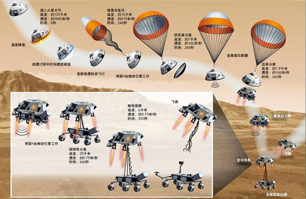

# 火星零距离
好奇号火星车

spaceX的火箭

在太空领域如果有人提出什么新的想法，大家听了后都说不错，那么就证明这个想法根本算不上创新。真正的创新事物会引起反对声浪，人们会批评这根本不切实际，疯子才会这么想。

## 推荐序
马斯克一直想去火星定居，但是想法被很多人认为不切实际，在财务自由以后，他就在分析为什么不切实际，发现主要是火箭成本太高。所以他开始学习火箭知识，跟全世界的火箭专家交流探讨如何把火箭的成本降低到足够商业化的程度。其中的一条技术路径就是设计可重复使用的运载火箭

## 1.着陆
空中起重机，负责着陆前把好奇号的速度从21240km/h降到到每小时2.7km/h

探索是人类的天性，数千年来，我们不断探索，这是人类最好的一面。

## 2.l布拉德伯里高地

着陆点被命名为布拉德伯里的原因是为了纪念火星纪事的作者。以他的名字命名。

## 3.准备就绪

## 4.河流

## 5.火星新面貌

马林太空科学系统公司https://www.msss.com/

1965年水手4号

## 6.寻找有机物

# 7.宜居之地

# 8.异常现象

# 9.石头的故事

# 10.驾驶好奇号

# 11.应许之地

# 12.火星上的太空生物学

# 13.人类登录火星

# 14.反思

